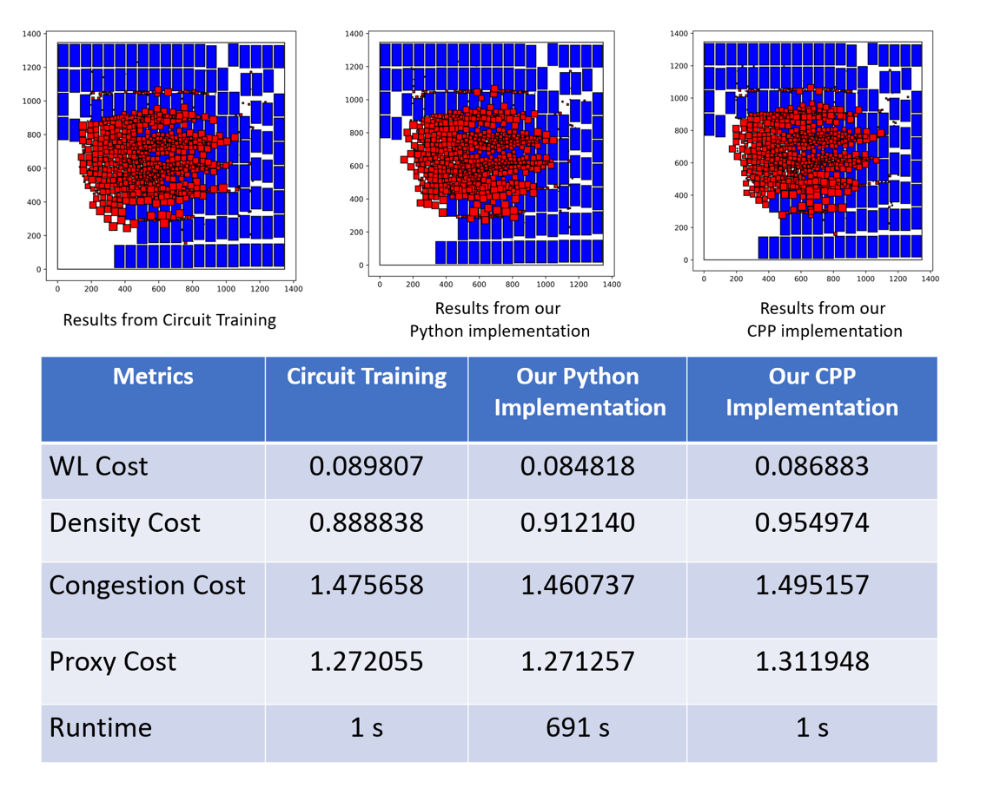

# Force-directed placement
**Force-directed placement** is used to place center of standard cell clusters onto
the center of the grid cells.

## **Information provided by Google**
The Methods section of the [Nature paper](https://www.nature.com/articles/s41586-021-03544-w.epdf?sharing_token=tYaxh2mR5EozfsSL0WHZLdRgN0jAjWel9jnR3ZoTv0PW0K0NmVrRsFPaMa9Y5We9O4Hqf_liatg-lvhiVcYpHL_YQpqkurA31sxqtmA-E1yNUWVMMVSBxWSp7ZFFIWawYQYnEXoBE4esRDSWqubhDFWUPyI5wK_5B_YIO-D_kS8%3D) provides the following information.

* “(1) We group millions of standard cells into a few thousand clusters using hMETIS, a partitioning technique based 
on the minimum cut objective. Once all macros are placed, we use an FD method to place the standard cell clusters. 
Doing so enables us to generate an approximate but fast standard cell placement that facilitates policy network optimization.”

* “We discretize the grid to a few thousand grid cells and place the centre of macros and standard cell clusters onto the centre of the grid cells.”

* **“Placement of standard cells.** To place standard cell clusters, we use an approach similar to classic FD methods. 
We represent the netlist as a system of springs that apply force to each node, 
according to the weight×distance formula, causing tightly connected nodes to be attracted to one another. 
We also introduce a repulsive force between overlapping nodes to reduce placement density. 
After applying all forces, we move nodes in the direction of their force vector. To reduce oscillations, we set a maximum distance for each move.”

## **Our implementation**
Our force-directed placer takes a clustered netlist as input and generates the locations for standard-cell clusters. During the force-directed placement, all the hard macros and IO ports are fixed.  Only the standard-cell clusters can be moved but the standard-cell clusters are not necessarily placed onto the centers of gridcells.  At the beginning, all the standard-cell clusters will be placed at the center of the canvas. \[[code](https://github.com/TILOS-AI-Institute/MacroPlacement/blob/5addfc904527d764ee67429811c868c5eeb605d4/CodeElements/FDPlacement/FD.py#L1130)\]

In the force-directed placement, there are two types of forces between nodes: attractive force and repulsive force. 
  * The attractive force is ONLY applied to the nodes connected by nets. For the two-pin net connecting pin $P1$ of macro $M1$ and $P2$ of macro $M2$, the attractive force applied to $M1$ and $M2$ is calculated as $f_x = k_a * abs(P1.x - P2.x)$ and $f_y = k_a * abs(P1.y - P2.y)$, where $k_a$ is the attractive factor. If one of pins is an IO port, $k_a$ is the attractive factor times io factor. The attractive force is along the straight line joining $P1$ and $P2$. All the multi-pin nets are decomposied into two-pin nets using the start model. \[[code](https://github.com/TILOS-AI-Institute/MacroPlacement/blob/5addfc904527d764ee67429811c868c5eeb605d4/CodeElements/FDPlacement/FD.py#L1105)\]
  * The repulsive force is ONLY applied to the nodes overlapped with each other.  If two macros are not overlapped, there is no repulsive force between them. For the two macros $M1$ and $M2$ overlapped with each other, the repulsive force applied to $M1$ and $M2$ is calculated as $f_x = F * abs(M1.x - M2.x) / distance(M1, M2)$ and $f_y = F * abs(M1.y - M2.y) / distance(M1, M2)$, where $F$ is the maximum move distance specified by the users.
If $distance(M1, M2) = 0.0$, then $f_x = F$ and $f_y = F$. The repulsive force is along the straight line joining $M1$ and $M2$. For the cases where multiple macros are overlapped together, we calculate the repulsive forces between each pair of macros in sequence. \[[code](https://github.com/TILOS-AI-Institute/MacroPlacement/blob/5addfc904527d764ee67429811c868c5eeb605d4/CodeElements/FDPlacement/FD.py#L1082)\]
  
  
After calculating all the attractive forces and repulsive forces, all the forces are normalized as following:
   * f_x = f_x / f_x_max * max_move_distance
   * f_y = f_y / f_y_max * max_move_distance

Here f_x_max (f_y_max) is the absolute value of f_x (f_y) which has the maximum absolute value.  max_move_distance is the maximum move distance specified by users. \[[code](https://github.com/TILOS-AI-Institute/MacroPlacement/blob/5addfc904527d764ee67429811c868c5eeb605d4/CodeElements/FDPlacement/FD.py#L1137)\]
 
After normalization, the standard-cell clusters are moved based on the forces exerted on them.  The move which will push the standard-cell clusters outside of canvas will be canceled.

## **Experimental results**
We have tested our codes on the Ariane133 (NanGate45).  The experimental results are presented below.

Figure 1. results for Ariane133 (NanGate45).  

