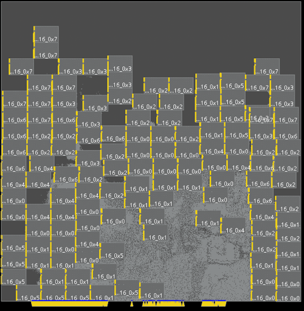

# LEF/DEF and Bookshelf (OpenDB, RosettaStone) translators

Convert netlists in other formats (e.g. LEF/DEF or Bookshelf) to netlist in protocol buffer (Protobu) format. Also, convert Protobuf format to LEF/DEF.

We initially implemented three different types of conversions based on [OpenDB](https://github.com/The-OpenROAD-Project/OpenROAD/tree/master/src/odb).

* **LEF/DEF -> Protocol Buffer Format** :  In this conversion, users need to provide the def file and corresponding lefs. Here is [an example](https://github.com/TILOS-AI-Institute/MacroPlacement/blob/main/CodeElements/FormatTranslators/test/LefDef2ProtocolBufferFormat/test2.py). Note that the example that we provide is the Ariane design implemented in NanGate45.  The netlist and corresponding def file with placed instances are generated by [Genus iSpatial](https://github.com/TILOS-AI-Institute/MacroPlacement/tree/main/Flows/NanGate45/ariane133) flow. Here the macro placement is automatically done by the Genus and Innovus tools.

*  **Bookshelf -> Protocol Buffer Format** : In this conversion, users can directly convert a netlist in Bookshelf format to a corresponding netlist in protocol buffer format. Here is [an example](https://github.com/TILOS-AI-Institute/MacroPlacement/blob/main/CodeElements/FormatTranslators/test/Bookshelf2ProtocolBufferFormat/test1.py).
In this example, we use the *superblue19* testcase from [DAC 2012 Routability-Driven Placement Contest and Benchmark Suite](http://archive.sigda.org/dac2012/contest/dac2012_contest_benchmarks.html#head-designs).

*  **Bookshelf -> LEF/DEF -> Protocol Buffer Format** :  In this conversion, users can first map a netlist in Bookshelf format to some technology node (e.g., NanGate45 or ASAP7), then convert the netlist to a corresponding netlist in protocol buffer format. Here is [an example](https://github.com/TILOS-AI-Institute/MacroPlacement/blob/main/CodeElements/FormatTranslators/test/Bookshelf2ProtocolBufferFormat/test3.py). In this example, we use the *superblue19* testcase from [DAC 2012 Routability-Driven Placement Contest and Benchmark Suite](http://archive.sigda.org/dac2012/contest/dac2012_contest_benchmarks.html#head-designs). The technology node used in this example is NanGate45.  After running the scripts, you will have both *.plc* file (netlist in protocol buffer format) and *.def*, *.lef* files (netlist and fake lefs in NanGate45).

Note that we use part of the codes from [RosettaStone](https://github.com/ABKGroup/RosettaStone), which supports the integration of academic Bookshelf benchmarks into real open-source technologies (ASAP7, NanGate45, SKY130HD, SKY130HS). (See the branch **Bookshelf -> LEF/DEF -> Protocol Buffer Format**.)

As reported in the [IEEE DATC RDF-2024 paper](https://vlsicad.ucsd.edu/Publications/Conferences/412/c412.pdf) [https://doi.org/10.1145/3676536.3697136](https://doi.org/10.1145/3676536.3697136), a fourth conversion is from Protobuf to LEF/DEF.

- **Protobuf -> LEF/DEF Format** : The Protobuf format captures connection
 information and some physical information, such as cell sizes and locations,
 port locations, and macro pin locations. However, when generating Protobuf from
 LEF/DEF, we lose many pieces of information such as: (i) the specific standard
 cell pins to which nets are connected, and their locations; (ii) if a standard
 cell has multiple output pins, then all of them are merged into a single output
 pin, and all the nets driven by these output pins are merged into a single net;
 (iii) the Protobuf format does not include the cell-site definition; and
 (iv) metal layer information. Therefore, when generating LEF/DEF from Protobuf,
 we make the following assumptions: (i) all standard cell pins are placed at the
 center of the corresponding cells, which does not induce any warning or error
 messages due to pin overlap either in the commercial tools or in OpenROAD;
 (ii) the smallest standard cell height is the row height;
 (iii) the GCD (Greatest Common Divisor) of all standard cell widths is the site
 width; (iv) the pitch of metal layers is the site height divided by 7.5 (in
 other words, we assume (for now – whether 6 vs. 7.5 “matters” when there is no
 publishable PDK for routing is perhaps “an exercise for the reader”) that
 standard cells have a height of 7.5 tracks); (v) we add vias with the width and
 spacing equal to half the pitch; and (vi) we repeat the layer definition
 (mentioned in iv) with alternating vertical and horizontal directions and
 create a 5-layer metal stack in our fake LEF.
  - We have converted the
  [Protobuf netlist](https://storage.googleapis.com/rl-infra-public/circuit-training/netlist/ariane.circuit_graph.pb.txt.gz)
  of the Ariane design available in the Circuit Training repository to LEF/DEF
  format. Below is a visualization of the converted netlist. Additionally, we
  have generated CT-Ariane X2 and X4 versions in Protobuf format. The
  corresponding Protobuf files are available [here](./test/CTAriane).

  

    
    
<strong>Visualization of the LEF/DEF generated from the Protobuf of
    <a href="https://storage.googleapis.com/rl-infra-public/circuit-training/netlist/ariane.circuit_graph.pb.txt.gz">CT-Ariane</a>
    available in the Circuit Training repository.</strong>

  

