# **Our Progress: A Chronology**
## Table of Contents
  - [Introduction](#introduction)
  - [Our progress](#our-progress) and major milestones
    - [Publicly available commercial SP&R flow](#June6)
    - [Ariane133 macro placement using Circuit Training](#circuit-training-baseline-result-on-our-ariane133-nangate45_51)
    - [Replication of proxy cost](#August25)
    - [NVDLA macro placement using Circuit Training](#circuit-training-baseline-result-on-our-nvdla-nangate45_68)
  - [Pinned questions](#pinned-to-bottom-question-list)

## **Introduction**
[MacroPlacement](../../) is an open, transparent effort to provide a public, baseline implementation of [Google Brain’s Circuit Training](https://github.com/google-research/circuit_training) (Morpheus) deep RL-based placement method.  In this repo,  we aim to achieve the following.  
- We want to enable anyone to perform RL-based macro placement on their own design, starting from design RTL files.
- We want to enable anyone to train their own RL models based on their own designs in any design enablements, starting from design RTL files.
- We want to demystify important aspects of the Google Nature paper, including aspects unavailable in Circuit Training and aspects where the Nature paper and Circuit Training clearly diverge, in order to help researchers and users better understand the methodology.
- We want to apply learnings from the community’s collective experiences with the Google Brain team’s arXiv result, Nature paper and Circuit Training repo – and demonstrate how communication of research results might be improved in our community going forward. A clear theme from the past months’ experience:  “There is no substitute for source code.”  

In order to achieve the above goals,  our initial focus has been on the following efforts.  
- **Generating correct inputs and setup for Circuit Training.** Since Circuit Training uses protocol buffer format to represent designs, we must translate standard LEF/DEF representation to the protocol buffer format. We must also determine how to correctly feed all necessary design information into the [Google Brain’s Circuit Training](https://github.com/google-research/circuit_training)  flow, e.g., halo width, canvas size, and constraints.  If we accomplish this, then we can run [Google Brain’s Circuit Training](https://github.com/google-research/circuit_training) to train our own RL models or perform RL-based macro placement for our own designs.
- **Replicating important but missing parts of the [Google Nature paper](https://www.nature.com/articles/s41586-021-03544-w).** Several aspects of Circuit Training are not clearly documented in the Nature paper, nor in the code and scripts that are visible in Circuit Training. Over time, these have included hypergraph-to-graph conversion; gridding, grouping and clustering; force-directed placement; various hyperparameter settings; and more. As we keep moving forward, based on our experiments and continued Q&A and feedback from Google, we will summarize the miscorrelations between the Google Nature paper and [Google Brain’s Circuit Training](https://github.com/google-research/circuit_training), as well as corrective steps. In this way, the Circuit Training methodology and the results published in the Nature paper can be better understood by all.

## **Our Progress**

**June 6 - Aug 5:** We have developed and made publicly available the SP&R [flow](../../Flows/) using commercial tools Cadence Genus and Innovus, and open-source tools Yosys and OpenROAD, for [Ariane](../../Testcases/ariane136/) (two variants – one with [136 SRAMs](../../Testcases/ariane136/) and another with [133 SRAMs](../../Testcases/ariane133/)), [MemPool tile](../../Testcases/mempool/) and [NVDLA](../../Testcases/nvdla/) designs on [NanGate45](../../Enablements/NanGate45/), [ASAP7](../../Enablements/ASAP7/) and [SKY130HD](../../Enablements/SKY130HD/) open enablement. We applaud and thank Cadence Design Systems for allowing their tool runscripts to be shared openly by researchers, enabling reproducibility of results obtained via use of Cadence tools. This was an important milestone for the EDA research community. Please see Dr. David Junkin’s [presentation](https://open-source-eda-birds-of-a-feather.github.io/doc/slides/BOAF-Junkin-DAC-Presentation.pdf) at the recent DAC-2022 “Open-Source EDA and Benchmarking Summit” birds-of-a-feather [meeting](https://open-source-eda-birds-of-a-feather.github.io/).  

The following describes our learning related to testcase generation and its implementation using different tools on different platforms.  
1. The [Google Nature paper](https://www.nature.com/articles/s41586-021-03544-w) uses the Ariane testcase (contains 133 256x16-bit SRAMs) for their experiment. [Here](../../Testcases/ariane136/) we show that just instantiating 256x16 bit SRAMs results in 136 SRAMs in the synthesized netlist. Based on our investigations, we have provided the [detailed steps](../../Testcases/ariane133/) to convert the Ariane design with 136 SRAMs to a Ariane design with 133 SRAMs.
2. We provide the required SRAM lef, lib along with the description to reproduce the provided SRAMs or generate a new SRAM for each [enablement](../../Enablements/).
3. The SKY130HD enablement has only five metal layers, while SRAMs have routing up through the M4 layer. This causes P&R failure due to very high routing congestion. We therefore developed FakeStack-extended P&R enablement, where we replicate the first four metal layers to generate a nine metal layer enablement. We call this [SKY130HD-FakeStack](../../Enablements/SKY130HD/) and have used it to implement our testcases. We also provide a [script](../../Enablements/SKY130HD/lef/genTechLef.tcl) for researchers to generate FakeStack enablements with different configurations.
4. We provide power grid generation [scripts](../../Flows/util/pdn_flow.tcl) for Cadence Innovus. During the power grid (PG) generation process we made sure the routing resource used by the PG is in the range of ~20%, matching the guidance given in Circuit Training.
5. Also we provide an Innovus Tcl [script](../../Flows/util/extract_report.tcl) to extract the metrics reported in Table 1 of “[A graph placement methodology for fast chip design](https://www.nature.com/articles/s41586-021-03544-w)”, **at three stages of the post-floorplanning P&R flow, i.e., pre-CTS, post-CTSOpt, and post-RouteOpt (final)**. This [script](../../Flows/util/extract_report.tcl) is included in the P&R flow. The extracted metrics for all of our designs, on different enablements, are available [here](../../ExperimentalData/).  
  

**June 10:** [grouper.py](https://github.com/google-research/circuit_training/blob/main/circuit_training/grouping/grouper.py) was released in CircuitTraining. **This revealed that protobuf input to the hypergraph clustering into soft macros included the (x,y) locations of the nodes**. (A [grouper.py](https://github.com/google-research/circuit_training/blob/main/circuit_training/grouping/grouper.py) script had been shown to Prof. Kahng during a meeting at Google on May 19.) The use of (x,y) locations from a physical synthesis tool was very unexpected, since it is not mentioned in “Methods” or other descriptions given in the Nature paper. We raised [issue #25](https://github.com/google-research/circuit_training/issues/25#issue-1268683034) to get clarification about this. [**July 10**: The [README](https://github.com/google-research/circuit_training/blob/main/circuit_training/grouping/README.md#faq) added to [the grouping area](https://github.com/google-research/circuit_training/tree/main/circuit_training/grouping) of CircuitTraining confirmed that the input netlist has all of its nodes **already placed**.]  
 
We currently use the physical synthesis tool **Cadence Genus iSpatial** to obtain (x,y) placed locations per instance as part of the input to Grouping. The Genus iSpatial post-physical-synthesis netlist is the starting point for how we produce the clustered netlist and the *.plc file which we provide as open inputs to CircuitTraining. From post-physical-synthesis netlist to clustered netlist generation can be divided into the following steps, which we have implemented as open-source in our CodeElements area:
1. **June 6**: [Gridding](../../CodeElements/Gridding/) determines a dissection of the layout canvas into some number of rows and some number of columns of gridcells.
2. **June 10**: [Grouping](../../CodeElements/Grouping/) groups closely-related logic with the corresponding hard macros and clumps of IOs.
3. **June 12**: [Clustering](../../CodeElements/Clustering/) clusters of millions of standard cells into a few thousand clusters (soft macros).
 
**June 22:** We added our [flow-scripts](../../CodeElements/CodeFlowIntegration/) that run our gridding, grouping and clustering implementations to generate a final clustered netlist in **protocol buffer format**. Google’s [netlist protocol buffer format](https://github.com/google-research/circuit_training/blob/main/docs/NETLIST_FORMAT.md) documentation available in the [CircuitTraining repo](https://github.com/google-research/circuit_training) was very helpful to our understanding of how to convert a placed netlist to protobuf format. Our scripts enable clustered netlists in protobuf format to be produced from placed netlists in either LEF/DEF or Bookshelf format.
 
**July 12:**  As stated in the “What is your timeline?” FAQ response [see also note [5] [here](https://docs.google.com/document/d/1vkPRgJEiLIyT22AkQNAxO8JtIKiL95diVdJ_O4AFtJ8/edit?usp=sharing)], we presented progress to date in this [MacroPlacement talk](https://open-source-eda-birds-of-a-feather.github.io/doc/slides/MacroPlacement-SpecPart-DAC-BOF-v5.pdf) at the DAC-2022 “Open-Source EDA and Benchmarking Summit” birds-of-a-feather [meeting](https://open-source-eda-birds-of-a-feather.github.io/). 
 
**July 26:** Replication of the wirelength component of proxy cost. The wirelength is similar to HPWL where given a netlist, we take the width and height and sum them up for each net. One caveat is that for soft macro pins, there could be a weight factor which implies the total connections between the source and sink pins. If not defined, the default value is 1. This weight factor needs to be multiplied with the sum of width and height to replicate Google’s API. We provide the following table as a comparison between [our implementations](../../CodeElements/Plc_client/) and Google’s API.

<table>
<thead>
  <tr>
    <th>Testcase</th>
    <th>Notes</th>
    <th>Canvas width/height</th>
    <th>Grid col/row</th>
    <th>Google</th>
    <th>Our</th>
  </tr>
</thead>
<tbody>
  <tr>
    <td>Ariane</td>
    <td>Google’s Ariane</td>
    <td>356.592 / 356.640</td>
    <td>35 / 33</td>
    <td>0.7500626080261634</td>
    <td>0.7500626224300161</td>
  </tr>
  <tr>
    <td>Ariane133</td>
    <td>From MacroPlacement</td>
    <td>1599.99 / 1598.8</td>
    <td>50 / 50</td>
    <td>0.6522555375409593</td>
    <td>0.6522555172428797</td>
  </tr>
</tbody>
</table>

**July 31:** The [netlist protocol buffer](https://github.com/google-research/circuit_training/blob/main/docs/NETLIST_FORMAT.md) format documentation also helped us to write this Innovus-based  [tcl script](../../Flows/util/gen_pb.tcl) which converts physical synthesized netlist to protobuf format in Innovus.  [This script was written and developed by ABKGroup students at UCSD. However, the underlying commands and reports are copyrighted by Cadence. We thank Cadence for granting permission to share our research to help promote and foster the next generation of innovators.] We use this post-physical-synthesis protobuf netlist as input to the grouping code to generate the clustered netlist. Fixes that we made while running Google’s grouping code resulted in [this [08/01/2022] pull request](https://github.com/google-research/circuit_training/pull/33). [08/05/2022: Google’s grouping code has been updated based on this [PR](https://github.com/google-research/circuit_training/pull/33).]

**July 22-August 4:** We shared with Google engineers our (flat) [post-physical-synthesis-protobuf netlist (ariane.pb.txt)](https://drive.google.com/file/d/1dVltyKwjWcCAPRRKlcN2CRSeaxuaScPI/view?usp=sharing) of [our Ariane design with 133 SRAMs on the NanGate45 platform](https://drive.google.com/file/d/1BvqqSngFiWXk5WNAFDO8KMPq3eqI5THf/view?usp=sharing), along with the corresponding [clustered netlist and the legalized.plc file (clustered netlist: netlist.pb.txt)](https://drive.google.com/file/d/1dVltyKwjWcCAPRRKlcN2CRSeaxuaScPI/view?usp=sharing) generated using the [CircuitTraining grouping code](https://github.com/google-research/circuit_training). The goal here was to verify our steps and setup up to this point. Also, we provide [scripts](../../Flows/util/) (using both our [CodeElements](../../CodeElements/) and [CT-grouping](https://github.com/google-research/circuit_training/tree/main/circuit_training/grouping)) to integrate the clustered netlist generation with the SP&R flow. 
 
**August 5:** The following table compares the clustering results for [Ariane133-NG45](../../Flows/NanGate45/ariane133/) design generated by the Google engineer (internally to Google) and the clustering results generated by us using [CT grouping code](https://github.com/google-research/circuit_training/tree/main/circuit_training/grouping).

<table>
<thead>
  <tr>
    <th></th>
    <th>Google Internal flow (from Google)</th>
    <th>Our use of CT Grouping code </th>
  </tr>
</thead>
<tbody>
  <tr>
    <td>Number of grid rows x columns</td>
    <td>21 x 24</td>
    <td>21 x 24</td>
  </tr>
  <tr>
    <td>Number of soft macros</td>
    <td>736</td>
    <td>738</td>
  </tr>
  <tr>
    <td>HPWL</td>
    <td>4171594.811</td>
    <td>4179069.884</td>
  </tr>
  <tr>
    <td>Wirelength cost</td>
    <td>0.072595</td>
    <td>0.072197</td>
  </tr>
  <tr>
    <td>Congestion cost</td>
    <td>0.727798</td>
    <td>0.72853</td>
  </tr>
</tbody>
</table>

**August 11:** We received information from Google that when a standard cell has multiple outputs, it merges all of them in the protobuf netlist (example: a full adder cell would have its outputs merged). The possible vertices of a hyperedge are macro pins, ports, and standard cells. Our Innovus-based protobuf netlist generation [tcl script](../../Flows/util/gen_pb.tcl) takes care of this.
 
**August 15:** We received information from Google engineers that in the proxy cost function, the density weight is set to 0.5 for their internal runs.
 
**August 17:** The proxy wirelength cost which is usually a value between 0 and 1, is related to the HPWL we computed earlier. We deduce the formulation as the following:

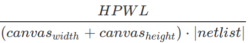

\|netlist\| is the total number of nets and it takes into account the weight factor defined on soft macro pins. Here is [our proxy wirelength](../../CodeElements/Plc_client/) compared with Google’s API:

<table>
<thead>
  <tr>
    <th>Testcase</th>
    <th>Notes</th>
    <th>Canvas width/height</th>
    <th>Google</th>
    <th>Our</th>
  </tr>
</thead>
<tbody>
  <tr>
    <td>Ariane</td>
    <td>Google’s Ariane</td>
    <td>356.592 / 356.640</td>
    <td>0.05018661999974192</td>
    <td>0.05018662006439473</td>
  </tr>
  <tr>
    <td>Ariane133</td>
    <td>From MacroPlacement</td>
    <td>1599.99 / 1598.8</td>
    <td>0.04456188308735019</td>
    <td>0.04456188299072617</td>
  </tr>
</tbody>
</table>

Replication of the density component of proxy cost. We now have a verified density cost computation. Density cost computation depends on gridcell density. Gridcell density is the ratio of the total area occupied by standard cells, soft macros and hard macros to the total area of the grid. If there are cell overlaps then it may result in grid density greater than one. To get the density cost, we take the average of the top 10% of the densest gridcells. Before outputting it, we multiply it by 0.5. Notice that this **0.5 is not the “weight” of this cost function**, but simply another factor applied besides the weight factor from the cost function.

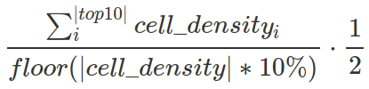

<table>
<thead>
  <tr>
    <th>Testcase</th>
    <th>Notes</th>
    <th>Canvas width/height</th>
    <th>Grid col/row</th>
    <th>Google</th>
    <th>Our</th>
  </tr>
</thead>
<tbody>
  <tr>
    <td>Ariane</td>
    <td>Google’s Ariane</td>
    <td>356.592 / 356.640</td>
    <td>35 / 33</td>
    <td>0.7500626080261634</td>
    <td>0.7500626224300161</td>
  </tr>
  <tr>
    <td>Ariane133</td>
    <td>From MacroPlacement</td>
    <td>1599.99 / 1598.8</td>
    <td>50 / 50</td>
    <td>0.6522555375409593</td>
    <td>0.6522555172428797</td>
  </tr>
</tbody>
</table>

**August 18:** The flat post-physical-synthesis protobuf netlist of [Ariane133-NanGate45](../../Flows/NanGate45/ariane133/) design is used as input to [CT grouping](https://github.com/google-research/circuit_training/tree/main/circuit_training/grouping) code to generate the clustered netlist. We then use this clustered netlist in Circuit Training. [Coordinate Descent](https://github.com/google-research/circuit_training/blob/main/circuit_training/environment/coordinate_descent_placer.py) is (by [default](https://github.com/google-research/circuit_training/blob/9e7097fa0c2a82030f43b298259941fc8ca6b7ae/circuit_training/learning/eval.py#L50-L52)) not applied to any macro placement solution. Here is the [link](https://tensorboard.dev/experiment/eCRHe29LQvi1sdAPD61Q6A/#scalars) to our tensorboard. We ran Innovus P&R starting from the macro placement generated using CT, through the end of detailed routing (RouteOpt) and collection of final PPA / “Table 1” metrics. Following are the metrics and screen shots of the P&R database. **Throughout the SP&R flow, the target clock period is 4ns**. The power grid overhead is 18.46% in the actual P&R setup, matching the 18% [mentioned](https://github.com/google-research/circuit_training/blob/9e7097fa0c2a82030f43b298259941fc8ca6b7ae/circuit_training/environment/placement_util.py#L183-L186) in the Circuit Training repo. **All results are for DRC-clean final routing produced by the Innovus tool**.   
[In the immediately-following content, we also show comparison results using other macro placement methods, collected since August 18.]  
[As of August 24 onward, we refer to this testcase as “Our Ariane133-NanGate45_51” since it has 51% area utilization. A second testcase, “Our Ariane133-NanGate45_68”, has 68% area utilization which exactly matches that of the Ariane in Circuit Training.]

### Circuit Training Baseline Result on “Our Ariane133-NanGate45_51”.

<table>
<thead>
  <tr>
    <th colspan="10">
Macro placement generated by Circuit Training on Our Ariane-133 (NG45), with post-macro placement flow using Innovus21.1
</th>
  </tr>
</thead>
<tbody>
  <tr>
    <td>Physical Design Stage</td>
    <td>Core Area (um^2)</td>
    <td>Standard Cell Area (um^2)</td>
    <td>Macro Area (um^2)</td>
    <td>Total Power (mW)</td>
    <td>Wirelength (um)</td>
    <td>WS  (ns)</td>
    <td>TNS  (ns)</td>
    <td>Congestion (H)</td>
    <td>Congestion (V)</td>
  </tr>
  <tr>
    <td>preCTS</td>
    <td>2560080</td>
    <td>214555</td>
    <td>1018356</td>
    <td>287.79</td>
    <td>4343214</td>
    <td>0.005</td>
    <td>0</td>
    <td>0.01%</td>
    <td>0.02%</td>
  </tr>
  <tr>
    <td>postCTS</td>
    <td>2560080</td>
    <td>216061</td>
    <td>1018356</td>
    <td>301.31</td>
    <td>4345969</td>
    <td>0.010</td>
    <td>0</td>
    <td>0.01%</td>
    <td>0.02%</td>
  </tr>
  <tr>
    <td>postRoute</td>
    <td>2560080</td>
    <td>216061</td>
    <td>1018356</td>
    <td>300.38</td>
    <td>4463660</td>
    <td>0.359</td>
    <td>0</td>
    <td></td>
    <td></td>
  </tr>
</tbody>
</table>

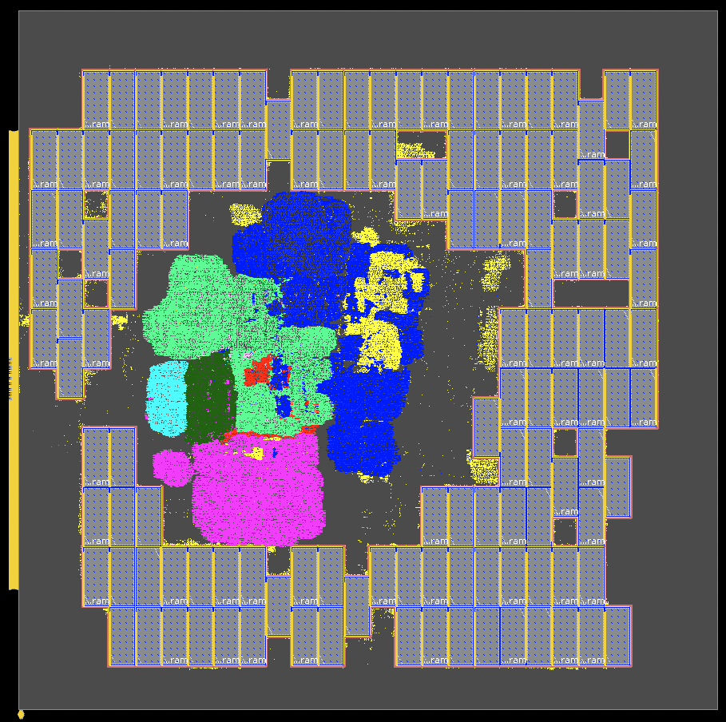
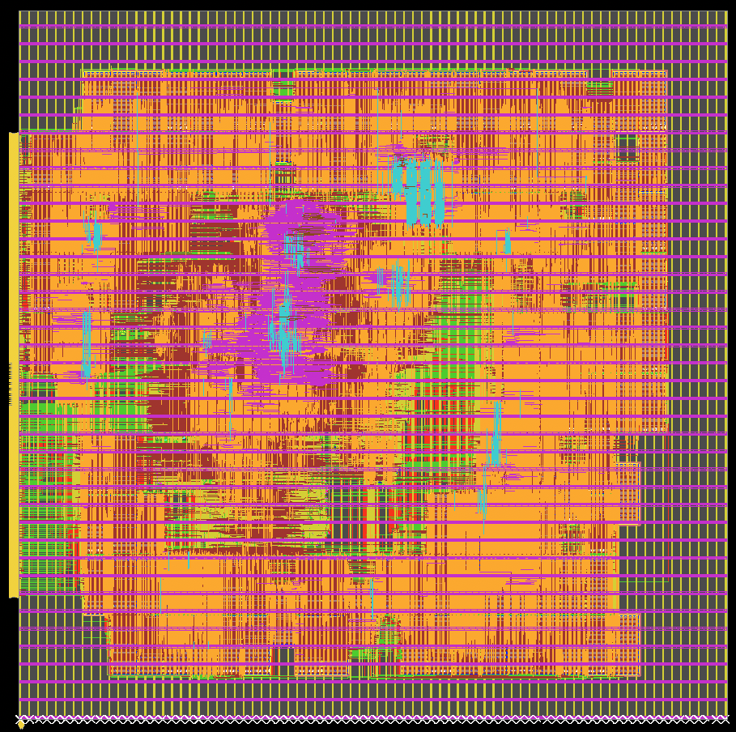

**Comparison 1: “Human Gridded”.** For comparison, a  baseline “human, gridded” macro placement was generated by a human for the same canvas size, I/O placement and gridding, with results as follows.

<table>
<thead>
  <tr>
    <th colspan="10">
Macro placement generated by a human on Our Ariane-133 (NG45), with post-macro placement flow using Innovus21.1
</th>
  </tr>
</thead>
<tbody>
  <tr>
    <td>Physical Design Stage</td>
    <td>Core Area (um^2)</td>
    <td>Standard Cell Area (um^2)</td>
    <td>Macro Area (um^2)</td>
    <td>Total Power (mW)</td>
    <td>Wirelength (um)</td>
    <td>WS  (ns)</td>
    <td>TNS  (ns)</td>
    <td>Congestion (H)</td>
    <td>Congestion (V)</td>
  </tr>
  <tr>
    <td>preCTS</td>
    <td>2560080</td>
    <td>215188.9</td>
    <td>1018356</td>
    <td>285.96</td>
    <td>4470832</td>
    <td>-0.002</td>
    <td>-0.005</td>
    <td>0.00%</td>
    <td>0.00%</td>
  </tr>
  <tr>
    <td>postCTS</td>
    <td>2560080</td>
    <td>216322.9</td>
    <td>1018356</td>
    <td>299.62</td>
    <td>4472866</td>
    <td>0.001</td>
    <td>0</td>
    <td>0.00%</td>
    <td>0.00%</td>
  </tr>
  <tr>
    <td>postRoute</td>
    <td>2560080</td>
    <td>216322.9</td>
    <td>1018356</td>
    <td>298.60</td>
    <td>4587141</td>
    <td>0.284</td>
    <td>0</td>
    <td></td>
    <td></td>
  </tr>
</tbody>
</table>

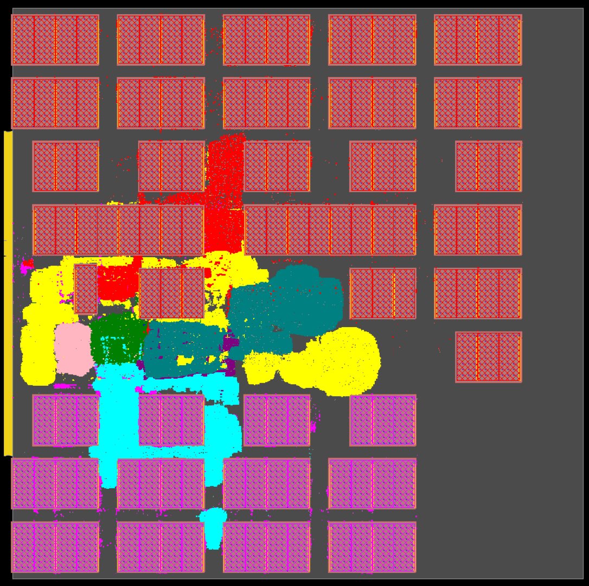

**Comparison 2: RePlAce.** The standalone RePlAce placer was run on the same (flat) netlist with the same canvas size and I/O placement, with results as follows.

<table>
<thead>
  <tr>
    <th colspan="10">
Macro placement generated by RePlAce (standalone, from <a href="https://github.com/mgwoo/RePlAce">HERE</a>) on Our Ariane-133 (NG45), with post-macro placement flow using Innovus21.1
</th>
  </tr>
</thead>
<tbody>
  <tr>
    <td>Physical Design Stage</td>
    <td>Core Area (um^2)</td>
    <td>Standard Cell Area (um^2)</td>
    <td>Macro Area (um^2)</td>
    <td>Total Power (mW)</td>
    <td>Wirelength (um)</td>
    <td>WS  (ns)</td>
    <td>TNS  (ns)</td>
    <td>Congestion (H)</td>
    <td>Congestion (V)</td>
  </tr>
  <tr>
    <td>preCTS</td>
    <td>2560080</td>
    <td>214910.71</td>
    <td>1018356</td>
    <td>288.654</td>
    <td>4178509</td>
    <td>0.003</td>
    <td>0</td>
    <td>0.03%</td>
    <td>0.07%</td>
  </tr>
  <tr>
    <td>postCTS</td>
    <td>2560080</td>
    <td>216006.63</td>
    <td>1018356</td>
    <td>302.013</td>
    <td>4184690</td>
    <td>0.007</td>
    <td>0</td>
    <td>0.05%</td>
    <td>0.08%</td>
  </tr>
  <tr>
    <td>postRoute</td>
    <td>2560080</td>
    <td>216006.63</td>
    <td>1018356</td>
    <td>301.260</td>
    <td>4315157</td>
    <td>-0.207</td>
    <td>-0.41</td>
    <td></td>
    <td></td>
  </tr>
</tbody>
</table>

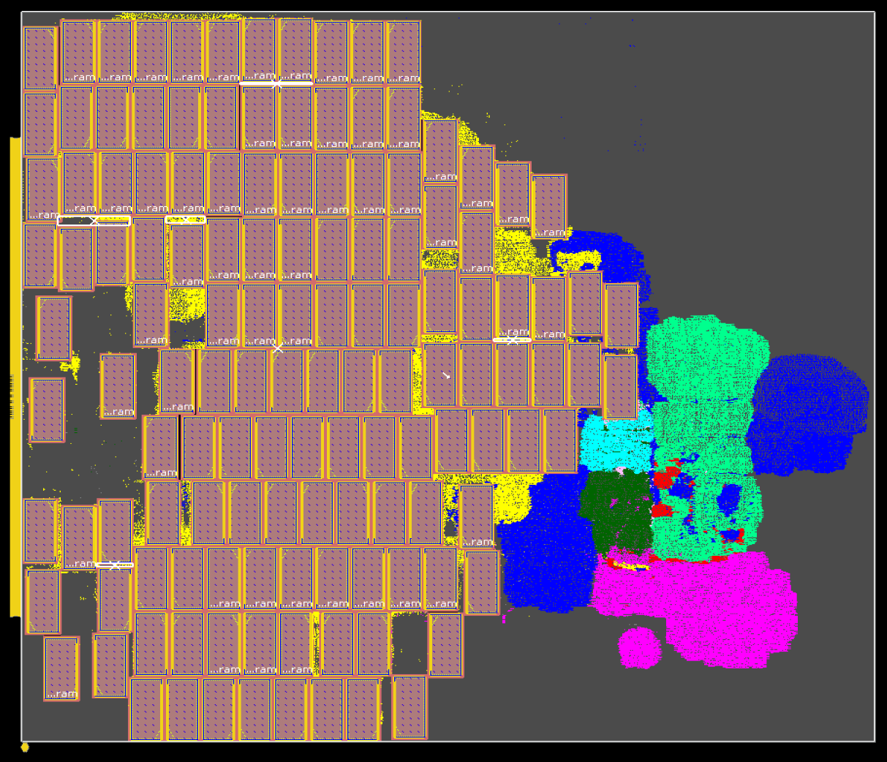
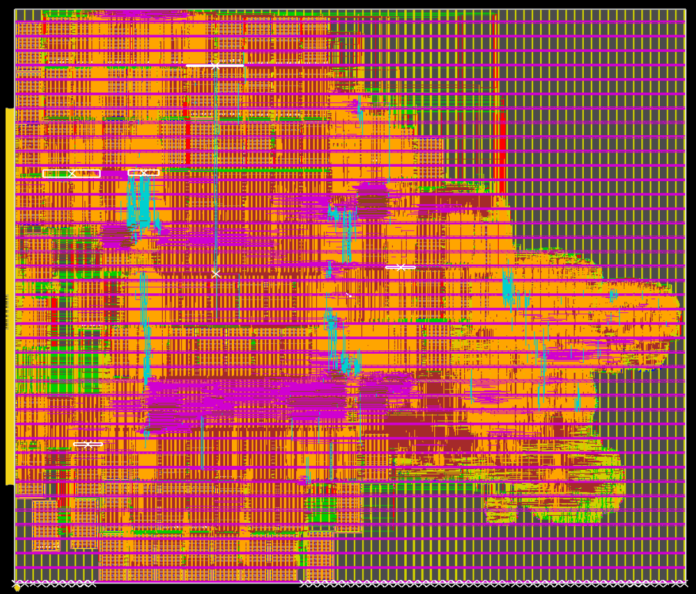

**Comparison 3: [RTL-MP](https://vlsicad.ucsd.edu/Publications/Conferences/389/c389.pdf).**  The RTL-MP macro placer described in [this ISPD-2022 paper](https://vlsicad.ucsd.edu/Publications/Conferences/389/c389.pdf) and used as the default macro placer in OpenROAD was run on the same (flat) netlist with the same canvas size and I/O placement, with results as follows.

<table>
<thead>
  <tr>
    <th colspan="10">
Macro placement generated using <a href="https://vlsicad.ucsd.edu/Publications/Conferences/389/c389.pdf">RTL-MP</a> on Our Ariane-133 (NG45), with post-macro placement flow using Innovus21.1
</th>
  </tr>
</thead>
<tbody>
  <tr>
    <td>Physical Design Stage</td>
    <td>Core Area (um^2)</td>
    <td>Standard Cell Area (um^2)</td>
    <td>Macro Area (um^2)</td>
    <td>Total Power (mW)</td>
    <td>Wirelength (um)</td>
    <td>WS  (ns)</td>
    <td>TNS  (ns)</td>
    <td>Congestion (H)</td>
    <td>Congestion (V)</td>
  </tr>
  <tr>
    <td>preCTS</td>
    <td>2560080</td>
    <td>216420.26</td>
    <td>1018356</td>
    <td>289.435</td>
    <td>5164199</td>
    <td>0.020</td>
    <td>0</td>
    <td>0.04%</td>
    <td>0.05%</td>
  </tr>
  <tr>
    <td>postCTS</td>
    <td>2560080</td>
    <td>217938.32</td>
    <td>1018356</td>
    <td>303.757</td>
    <td>5185004</td>
    <td>0.001</td>
    <td>0</td>
    <td>0.05%</td>
    <td>0.07%</td>
  </tr>
  <tr>
    <td>postRoute</td>
    <td>2560080</td>
    <td>217938.32</td>
    <td>1018356</td>
    <td>302.844</td>
    <td>5306735</td>
    <td>0.104</td>
    <td>0</td>
    <td></td>
    <td></td>
  </tr>
</tbody>
</table>

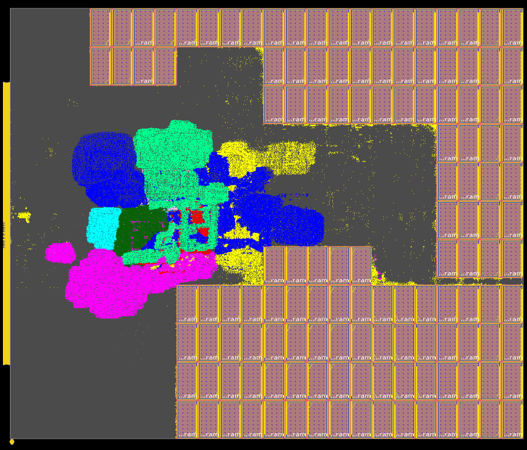
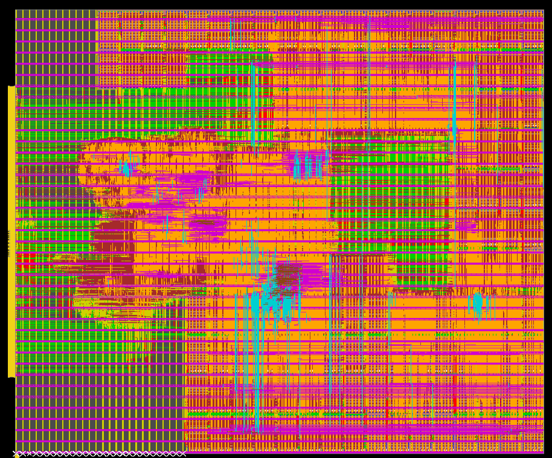

**Comparison 4:** The Hier-RTLMP macro placer was run on the same (flat) netlist with the same canvas size and I/O placement, with results as follows. [The Hier-RTLMP paper is in submission as of August 2022; availability in OpenROAD and OpenROAD-flow-scripts is planned by end of September 2022. Please email [abk@eng.ucsd.edu](mailto:abk@eng.ucsd.edu) if you would like a preprint, not for further redistribution.]

<table>
<thead>
  <tr>
    <th colspan="10">
Macro placement generated using Hier-RTLMP on Our Ariane-133 (NG45), with post-macro placement flow using Innovus21.1
</th>
  </tr>
</thead>
<tbody>
  <tr>
    <td>Physical Design Stage</td>
    <td>Core Area (um^2)</td>
    <td>Standard Cell Area (um^2)</td>
    <td>Macro Area (um^2)</td>
    <td>Total Power (mW)</td>
    <td>Wirelength (um)</td>
    <td>WS  (ns)</td>
    <td>TNS  (ns)</td>
    <td>Congestion (H)</td>
    <td>Congestion (V)</td>
  </tr>
  <tr>
    <td>preCTS</td>
    <td>2560080</td>
    <td>214783.83</td>
    <td>1018356</td>
    <td>288.356</td>
    <td>4397005</td>
    <td>0.005</td>
    <td>0</td>
    <td>0.02%</td>
    <td>0.05%</td>
  </tr>
  <tr>
    <td>postCTS</td>
    <td>2560080</td>
    <td>215911.67</td>
    <td>1018356</td>
    <td>302.176</td>
    <td>4419305</td>
    <td>0.009</td>
    <td>0</td>
    <td>0.04%</td>
    <td>0.06%</td>
  </tr>
  <tr>
    <td>postRoute</td>
    <td>2560080</td>
    <td>215911.67</td>
    <td>1018356</td>
    <td>301.468</td>
    <td>4537458</td>
    <td>0.311</td>
    <td>0</td>
    <td></td>
    <td></td>
  </tr>
</tbody>
</table>

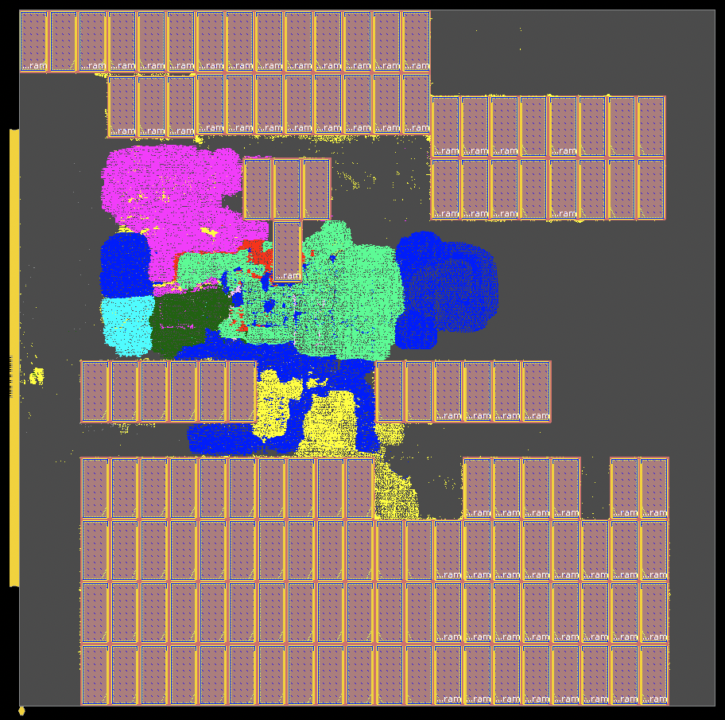
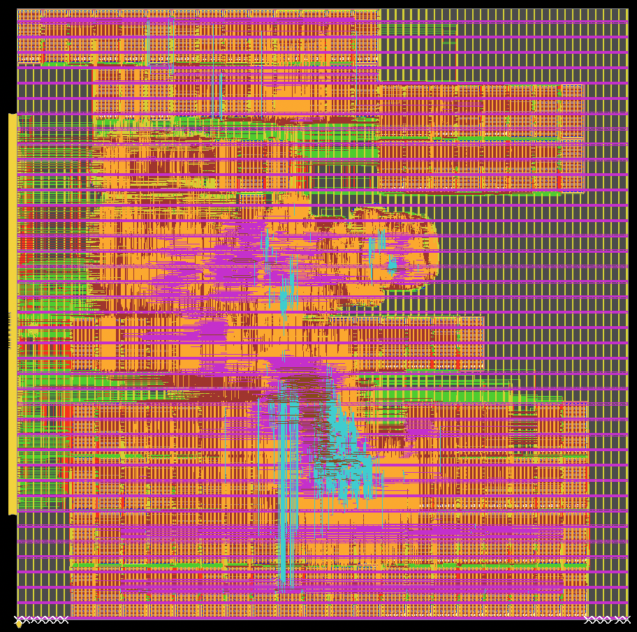

**August 20:** Matching the area utilization. We revisited the area utilization of Our Ariane133 and realized that it (51%) is lower than that of Google’s Ariane (68%). So that this would not devalue our study, we created a second variant,  “**Our Ariane133-NanGate45_68**”, which matches the area utilization of Google’s Ariane. Results are as given below.
  
### **Circuit Training Baseline Result on “Our Ariane133-NanGate45****_68****".**
  
<table>
<thead>
  <tr>
    <th colspan="10">
Macro Placement generated Using CT (Ariane 68% Utilization)
</th>
  </tr>
</thead>
<tbody>
  <tr>
    <td>Physical Design Stage</td>
    <td>Core Area (um^2)</td>
    <td>Standard Cell Area (um^2)</td>
    <td>Macro Area (um^2)</td>
    <td>Total Power (mW)</td>
    <td>Wirelength (um)</td>
    <td>WS  (ns)</td>
    <td>TNS  (ns)</td>
    <td>Congestion (H)</td>
    <td>Congestion (V)</td>
  </tr>
  <tr>
    <td>preCTS</td>
    <td>1814274</td>
    <td>215575.444</td>
    <td>1018355.73</td>
    <td>288.762</td>
    <td>4170253</td>
    <td>0.002</td>
    <td>0</td>
    <td>0.01%</td>
    <td>0.01%</td>
  </tr>
  <tr>
    <td>postCTS</td>
    <td>1814274</td>
    <td>217114.520</td>
    <td>1018355.73</td>
    <td>302.607</td>
    <td>4186888</td>
    <td>0.001</td>
    <td>0</td>
    <td>0.00%</td>
    <td>0.01%</td>
  </tr>
  <tr>
    <td>postRoute</td>
    <td>1814274</td>
    <td>217114.520</td>
    <td>1018355.73</td>
    <td>301.722</td>
    <td>4295572</td>
    <td>0.336</td>
    <td>0</td>
    <td></td>
    <td></td>
  </tr>
</tbody>
</table>

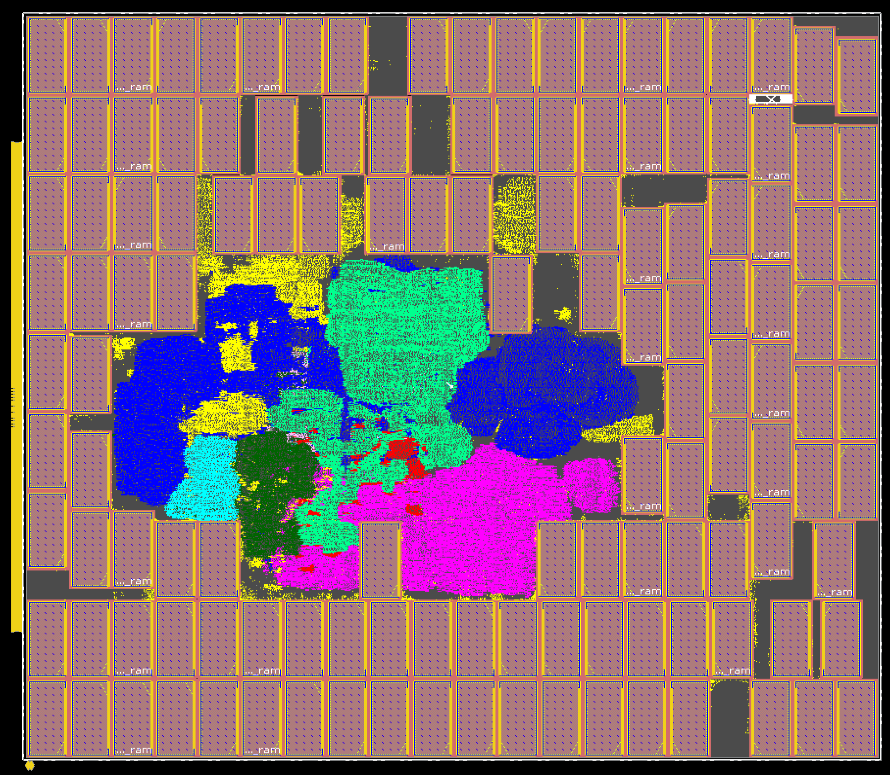
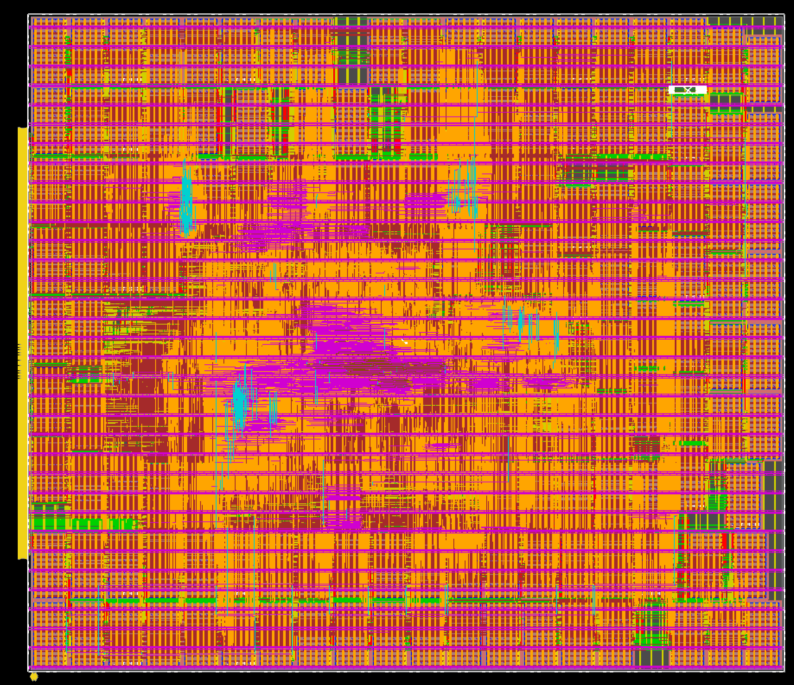

**Comparison 1: “Human Gridded”**. For comparison, a  baseline “human, gridded” macro placement was generated by a human for the same canvas size, I/O placement and gridding.

<table>
<thead>
  <tr>
    <th colspan="10">
Macro Placement generated by human (Util: 68%)
</th>
  </tr>
</thead>
<tbody>
  <tr>
    <td>Physical Design Stage</td>
    <td>Core Area (um^2)</td>
    <td>Standard Cell Area (um^2)</td>
    <td>Macro Area (um^2)</td>
    <td>Total Power (mW)</td>
    <td>Wirelength (um)</td>
    <td>WS  (ns)</td>
    <td>TNS  (ns)</td>
    <td>Congestion (H)</td>
    <td>Congestion (V)</td>
  </tr>
  <tr>
    <td>preCTS</td>
    <td>1814274</td>
    <td>215779</td>
    <td>1018355.73</td>
    <td>289.999</td>
    <td>4545632</td>
    <td>-0.003</td>
    <td>-0.004</td>
    <td>0.09%</td>
    <td>0.15%</td>
  </tr>
  <tr>
    <td>postCTS</td>
    <td>1814274</td>
    <td>217192</td>
    <td>1018355.73</td>
    <td>303.786</td>
    <td>4571293</td>
    <td>0.001</td>
    <td>0</td>
    <td>0.13%</td>
    <td>0.16%</td>
  </tr>
  <tr>
    <td>postRoute</td>
    <td>1814274</td>
    <td>217192</td>
    <td>1018355.73</td>
    <td>302.725</td>
    <td>4720776</td>
    <td>0.206</td>
    <td>0</td>
    <td></td>
    <td></td>
  </tr>
</tbody>
</table>

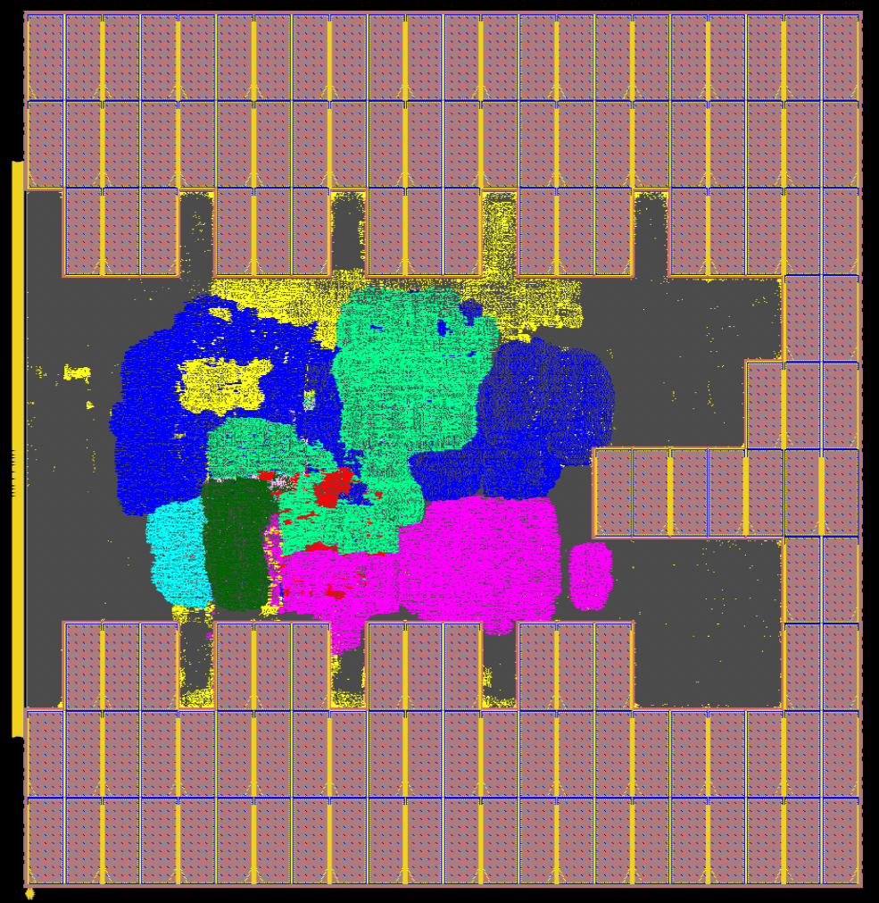
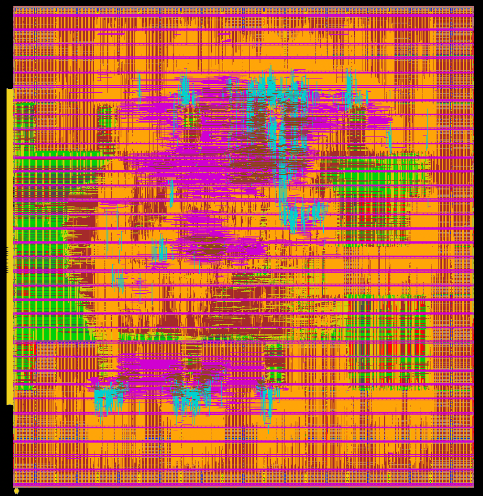

**Comparison 2: RePlAce.** The standalone RePlAce placer was run on the same (flat) netlist with the same canvas size and I/O placement, with results as follows.

<table>
<thead>
  <tr>
    <th colspan="10">
Macro Placement generated Using RePlAce (Util: 68%)
</th>
  </tr>
</thead>
<tbody>
  <tr>
    <td>Physical Design Stage</td>
    <td>Core Area (um^2)</td>
    <td>Standard Cell Area (um^2)</td>
    <td>Macro Area (um^2)</td>
    <td>Total Power (mW)</td>
    <td>Wirelength (um)</td>
    <td>WS  (ns)</td>
    <td>TNS  (ns)</td>
    <td>Congestion (H)</td>
    <td>Congestion (V)</td>
  </tr>
  <tr>
    <td>preCTS</td>
    <td>1814274</td>
    <td>217246</td>
    <td>1018355.73</td>
    <td>292.803</td>
    <td>4646408</td>
    <td>-0.007</td>
    <td>-0.011</td>
    <td>0.07%</td>
    <td>0.13%</td>
  </tr>
  <tr>
    <td>postCTS</td>
    <td>1814274</td>
    <td>218359</td>
    <td>1018355.73</td>
    <td>306.145</td>
    <td>4657174</td>
    <td>0.001</td>
    <td>0</td>
    <td>0.07%</td>
    <td>0.17%</td>
  </tr>
  <tr>
    <td>postRoute</td>
    <td>1814274</td>
    <td>218359</td>
    <td>1018355.73</td>
    <td>305.032</td>
    <td>4809950</td>
    <td>0.082</td>
    <td>0</td>
    <td></td>
    <td></td>
  </tr>
</tbody>
</table>

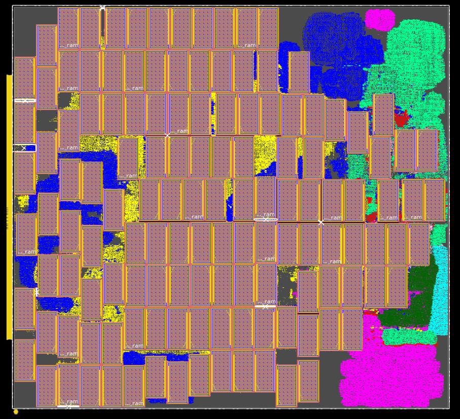
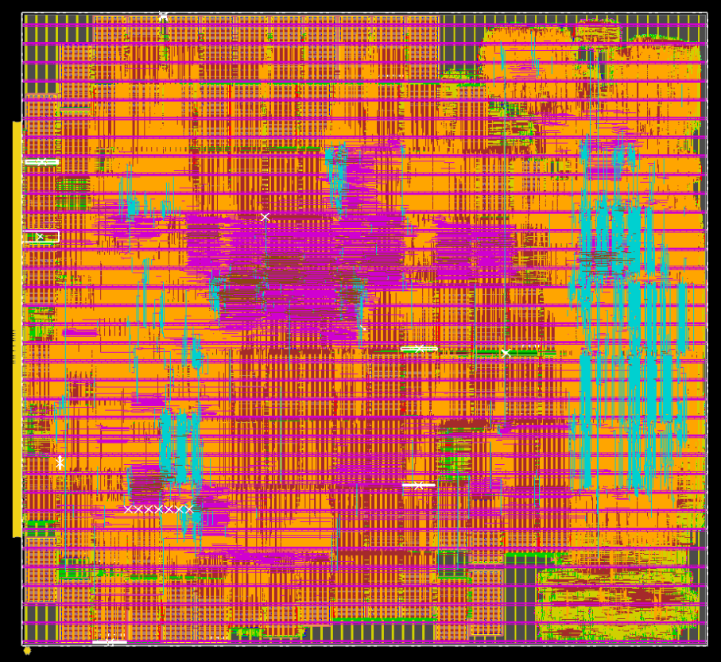

**Comparison 3: [RTL-MP](https://vlsicad.ucsd.edu/Publications/Conferences/389/c389.pdf).**  The RTL-MP macro placer was run on the same (flat) netlist with the same canvas size and I/O placement, with results as follows.

<table>
<thead>
  <tr>
    <th colspan="10">
Macro Placement generated Using RTL-MP (Util: 68%)
</th>
  </tr>
</thead>
<tbody>
  <tr>
    <td>Physical Design Stage</td>
    <td>Core Area (um^2)</td>
    <td>Standard Cell Area (um^2)</td>
    <td>Macro Area (um^2)</td>
    <td>Total Power (mW)</td>
    <td>Wirelength (um)</td>
    <td>WS  (ns)</td>
    <td>TNS  (ns)</td>
    <td>Congestion (H)</td>
    <td>Congestion (V)</td>
  </tr>
  <tr>
    <td>preCTS</td>
    <td>1814274</td>
    <td>217057</td>
    <td>1018355.73</td>
    <td>292.800</td>
    <td>4598656</td>
    <td>-0.001</td>
    <td>-0.001</td>
    <td>0.00%</td>
    <td>0.01%</td>
  </tr>
  <tr>
    <td>postCTS</td>
    <td>1814274</td>
    <td>218045</td>
    <td>1018355.73</td>
    <td>306.475</td>
    <td>4614827</td>
    <td>0.007</td>
    <td>0</td>
    <td>0.00%</td>
    <td>0.01%</td>
  </tr>
  <tr>
    <td>postRoute</td>
    <td>1814274</td>
    <td>218045</td>
    <td>1018355.73</td>
    <td>303.380</td>
    <td>4745004</td>
    <td>0.294</td>
    <td>0</td>
    <td></td>
    <td></td>
  </tr>
</tbody>
</table>

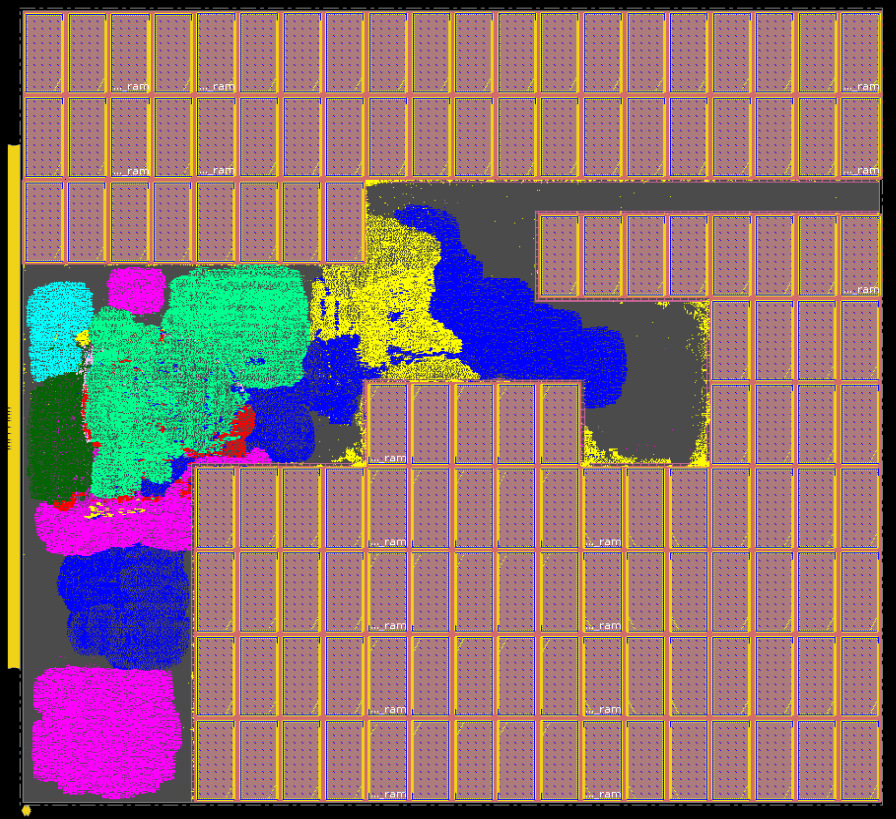
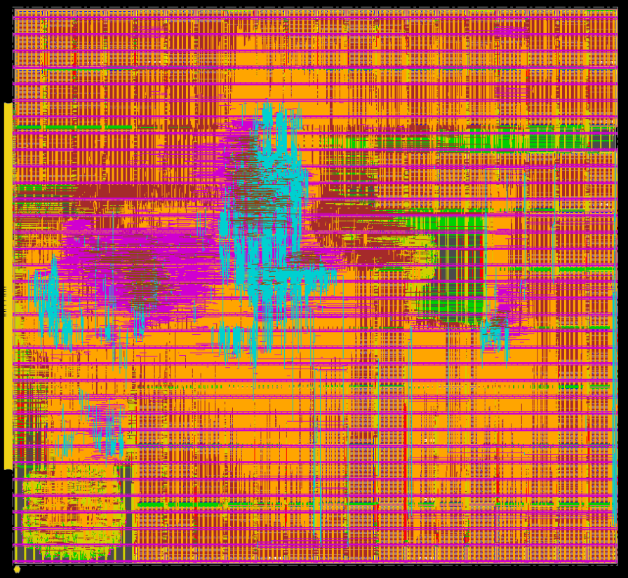

**Comparison 4:** The Hier-RTLMP macro placer was run on the same (flat) netlist with the same canvas size and I/O placement, using two setups, with results as follows.

<table>
<thead>
  <tr>
    <th colspan="10">
Macro Placement generated Using Hier-RTLMP (Util: 68%) [Setup 1]
</th>
  </tr>
</thead>
<tbody>
  <tr>
    <td>Physical Design Stage</td>
    <td>Core Area (um^2)</td>
    <td>Standard Cell Area (um^2)</td>
    <td>Macro Area (um^2)</td>
    <td>Total Power (mW)</td>
    <td>Wirelength (um)</td>
    <td>WS  (ns)</td>
    <td>TNS  (ns)</td>
    <td>Congestion (H)</td>
    <td>Congestion (V)</td>
  </tr>
  <tr>
    <td>preCTS</td>
    <td>1814274</td>
    <td>218096</td>
    <td>1018355.73</td>
    <td>294.035</td>
    <td>4967286</td>
    <td>0.003</td>
    <td>0</td>
    <td>0.10%</td>
    <td>0.12%</td>
  </tr>
  <tr>
    <td>postCTS</td>
    <td>1814274</td>
    <td>219150</td>
    <td>1018355.73</td>
    <td>308.130</td>
    <td>4984385</td>
    <td>0.001</td>
    <td>0</td>
    <td>0.13%</td>
    <td>0.13%</td>
  </tr>
  <tr>
    <td>postRoute</td>
    <td>1814274</td>
    <td>219150</td>
    <td>1018355.73</td>
    <td>307.103</td>
    <td>5137430</td>
    <td>0.387</td>
    <td>0</td>
    <td></td>
    <td></td>
  </tr>
</tbody>
</table>

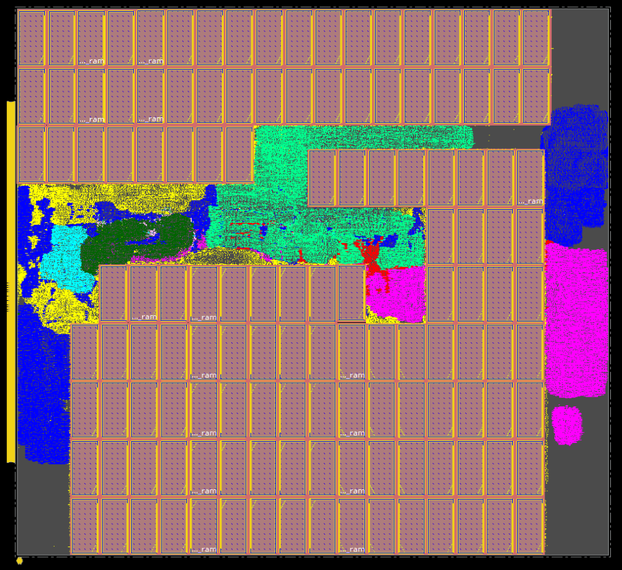

<table>
<thead>
  <tr>
    <th colspan="10">
Macro Placement generated Using Hier-RTLMP (Util: 68%) [Setup 2]
</th>
  </tr>
</thead>
<tbody>
  <tr>
    <td>Physical Design Stage</td>
    <td>Core Area (um^2)</td>
    <td>Standard Cell Area (um^2)</td>
    <td>Macro Area (um^2)</td>
    <td>Total Power (mW)</td>
    <td>Wirelength (um)</td>
    <td>WS  (ns)</td>
    <td>TNS  (ns)</td>
    <td>Congestion (H)</td>
    <td>Congestion (V)</td>
  </tr>
  <tr>
    <td>preCTS</td>
    <td>1814274</td>
    <td>216665</td>
    <td>1018355.73</td>
    <td>291.332</td>
    <td>4917102</td>
    <td>0.001</td>
    <td>0</td>
    <td>0.02%</td>
    <td>0.06%</td>
  </tr>
  <tr>
    <td>postCTS</td>
    <td>1814274</td>
    <td>217995</td>
    <td>1018355.73</td>
    <td>305.089</td>
    <td>4931432</td>
    <td>0.001</td>
    <td>0</td>
    <td>0.03%</td>
    <td>0.05%</td>
  </tr>
  <tr>
    <td>postRoute</td>
    <td>1814274</td>
    <td>217995</td>
    <td>1018355.73</td>
    <td>303.905</td>
    <td>5048575</td>
    <td>0.230</td>
    <td>0</td>
    <td></td>
    <td></td>
  </tr>
</tbody>
</table>

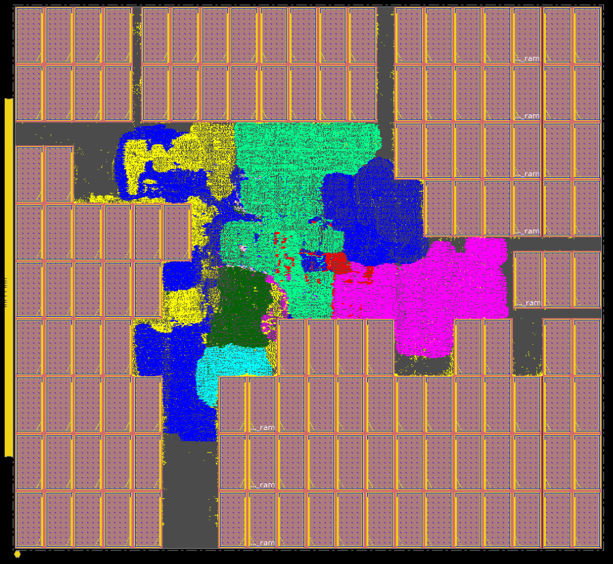
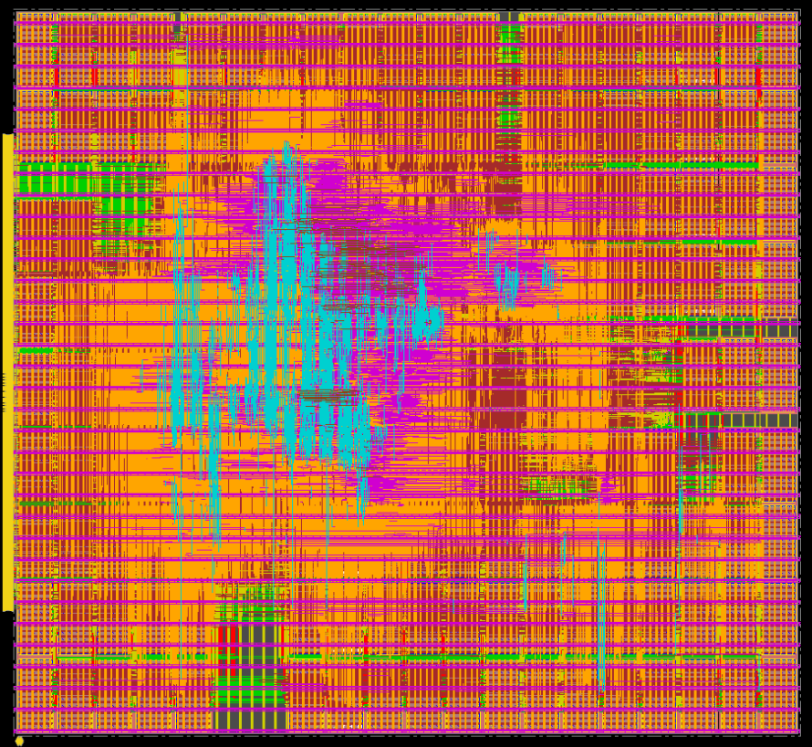

**August 25:** Replication of the congestion component of proxy cost. Reverse-engineering from the plc client API is finally completed, as described [here](https://docs.google.com/document/d/1hM7UbmANkhoGB3-UfFBp8TRDvvVjpmio7cyyjK4a5bI/edit?usp=sharing). A review with Dr. Mustafa Yazgan was very helpful in confirming the case analysis and conventions identified during reverse-engineering.  Replication results are shown below.  With this, reproduction in open [source code](../../CodeElements/Plc_client/) of the Circuit Training proxy cost has been completed.  Note that the description [here](https://docs.google.com/document/d/1hM7UbmANkhoGB3-UfFBp8TRDvvVjpmio7cyyjK4a5bI/edit?usp=sharing) illustrates how the Nature paper, Circuit Training, and Google engineers’ versions can have minor discrepancies. (These minor discrepancies are not currently viewed as substantive, i.e., meaningfully affecting our ongoing assessment.) For example, to calculate the congestion component, the H- and V-routing congestion cost lists are concatenated, and the ABU5 (average of top 5% of the concatenated list) metric of this list is the congestion cost. By contrast, the Nature paper indicates use of an ABU10 metric. Recall: “*There is no substitute for source code*.”

<table>
<thead>
  <tr>
    <th>Name</th>
    <th>Description</th>
    <th>Canvas Size</th>
    <th>Col/Row</th>
    <th>Congestion Smoothing</th>
    <th>Google’s Congestion</th>
    <th>Our Congestion</th>
  </tr>
</thead>
<tbody>
  <tr>
    <td>Ariane</td>
    <td>Google’s Ariane</td>
    <td>356.592 / 356.640</td>
    <td>35 / 33</td>
    <td>0</td>
    <td>3.385729893179586</td>
    <td>3.3857299314069733</td>
  </tr>
  <tr>
    <td>Ariane133</td>
    <td>Our Ariane</td>
    <td>1599.99 / 1600.06</td>
    <td>24 / 21</td>
    <td>0</td>
    <td>1.132108622298701</td>
    <td>1.1321086382282062</td>
  </tr>
  <tr>
    <td>Ariane</td>
    <td>Google’s Ariane</td>
    <td>356.592 / 356.640</td>
    <td>35 / 33</td>
    <td>1</td>
    <td>2.812822828059799</td>
    <td>2.81282287498789</td>
  </tr>
  <tr>
    <td>Ariane133</td>
    <td>Our Ariane</td>
    <td>1599.99 / 1600.06</td>
    <td>24 / 21</td>
    <td>1</td>
    <td>1.116203573147857</td>
    <td>1.1162035989647672</td>
  </tr>
  <tr>
    <td>Ariane</td>
    <td>Google’s Ariane</td>
    <td>356.592 / 356.640</td>
    <td>35 / 33</td>
    <td>2</td>
    <td>2.656602005772668</td>
    <td>2.6566020148393146</td>
  </tr>
  <tr>
    <td>Ariane133</td>
    <td>Our Ariane</td>
    <td>1599.99 / 1600.06</td>
    <td>24 / 21</td>
    <td>2</td>
    <td>1.109241385529823</td>
    <td>1.1092414113467333</td>
  </tr>
</tbody>
</table>

**August 26:** Moving on to understand benefits and limitations of the Circuit Training methodology itself. This next stage of study is enabled by confidence in the technical solidity of what has been accomplished so far – again, with the help of Google engineers.

**Question 1.** How does having an initial set of placement locations (from physical synthesis) affect the (relative) quality of the CT result?  
 
*A preliminary exercise has compared outcomes when the Genus iSpatial (x,y) coordinates are given, versus when vacuous (x,y) coordinates are given. The following CT result is for the “**Our Ariane133-NanGate45_68**” example where the input protobuf netlist to Circuit Training’s grouping code has all macro and standard cell locations set to (600, 600). This is just an exercise for now: other, carefully-designed experiments will be performed over the coming weeks and months.*

<table>
<thead>
  <tr>
    <th colspan="10">
Macro Placement generated using CT (Util: 68%) with a vacuous set of input (x,y) coordinates. The input protobuf netlist to Circuit Training’s grouping code has all macro and standard cell locations set to (600, 600).
</th>
  </tr>
</thead>
<tbody>
  <tr>
    <td>Physical Design Stage</td>
    <td>Core Area (um^2)</td>
    <td>Standard Cell Area (um^2)</td>
    <td>Macro Area (um^2)</td>
    <td>Total Power (mW)</td>
    <td>Wirelength (um)</td>
    <td>WS  (ns)</td>
    <td>TNS  (ns)</td>
    <td>Congestion (H)</td>
    <td>Congestion (V)</td>
  </tr>
  <tr>
    <td>preCTS</td>
    <td>1814274</td>
    <td>216069</td>
    <td>1018355.73</td>
    <td>290.0818</td>
    <td>4615961</td>
    <td>-0.004</td>
    <td>-0.021</td>
    <td>0.01%</td>
    <td>0.03%</td>
  </tr>
  <tr>
    <td>postCTS</td>
    <td>1814274</td>
    <td>217118</td>
    <td>1018355.73</td>
    <td>303.7199</td>
    <td>4619727</td>
    <td>0</td>
    <td>0</td>
    <td>0.01%</td>
    <td>0.02%</td>
  </tr>
  <tr>
    <td>postRoute</td>
    <td>1814274</td>
    <td>217118</td>
    <td>1018355.73</td>
    <td>302.4018</td>
    <td>4738717</td>
    <td>0.171</td>
    <td>0</td>
    <td></td>
    <td></td>
  </tr>
</tbody>
</table>

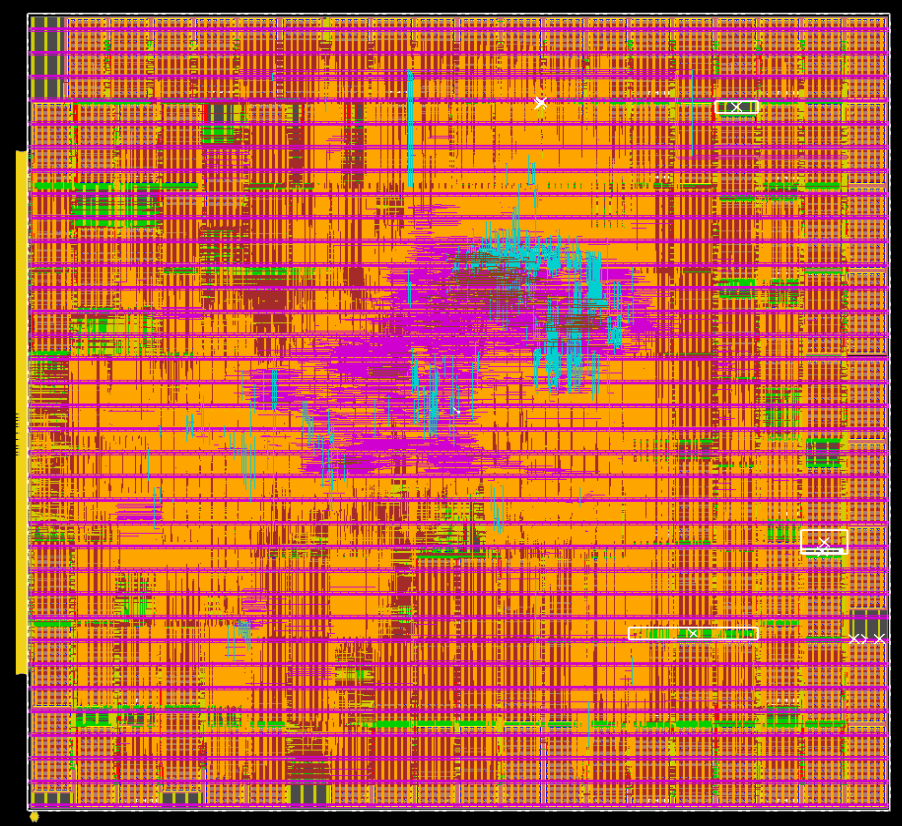
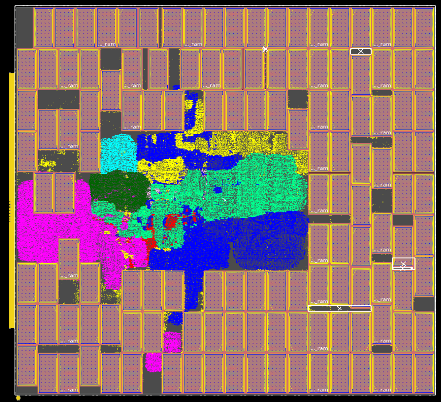

**Update to Question 1 on September 9:** Two additional vacuous placements were run through the CT flow.
- Place all macros and standard cells at the lower left corner i.e., (0, 0).
- Place all macros and standard cells at the upper right corner, i.e., (max_x, max_y),  where max_x = 1347.1 and max_y = 1346.8.
- (0, 0) gives us the best (by a small amount) result among the three vacuous placements. It has been requested that we report variances and p values. We are unsure how to resource such a request. Note that the original baseline result here, using the (x,y) information from physical synthesis, achieves a final routed wirelength of 4295572, around 7% better than the (0, 0) result.
  
The following table and screenshots show results for the (0, 0) vacuous placement.

<table>
<thead>
  <tr>
    <th colspan="10">
Macro Placement generated using CT (Util: 68%) with a vacuous set of input (x,y) coordinates. The input protobuf netlist to Circuit Training’s grouping code has all macro and standard cell locations set to (0, 0).
</th>
  </tr>
</thead>
<tbody>
  <tr>
    <td>Physical Design Stage</td>
    <td>Core Area (um^2)</td>
    <td>Standard Cell Area (um^2)</td>
    <td>Macro Area (um^2)</td>
    <td>Total Power (mW)</td>
    <td>Wirelength (um)</td>
    <td>WS  (ns)</td>
    <td>TNS  (ns)</td>
    <td>Congestion (H)</td>
    <td>Congestion (V)</td>
  </tr>
  <tr>
    <td>preCTS</td>
    <td>1814274</td>
    <td>215520</td>
    <td>1018356</td>
    <td>289.676</td>
    <td>4489121</td>
    <td>-0.006</td>
    <td>-0.007</td>
    <td>0.02%</td>
    <td>0.09%</td>
  </tr>
  <tr>
    <td>postCTS</td>
    <td>1814274</td>
    <td>216891</td>
    <td>1018356</td>
    <td>302.551</td>
    <td>4495430</td>
    <td>0.005</td>
    <td>0</td>
    <td>0.02%</td>
    <td>0.10%</td>
  </tr>
  <tr>
    <td>postRoute</td>
    <td>1814274</td>
    <td>216891</td>
    <td>1018356</td>
    <td>301.322</td>
    <td>4606716</td>
    <td>0.218</td>
    <td>0</td>
    <td></td>
    <td></td>
  </tr>
</tbody>
</table>

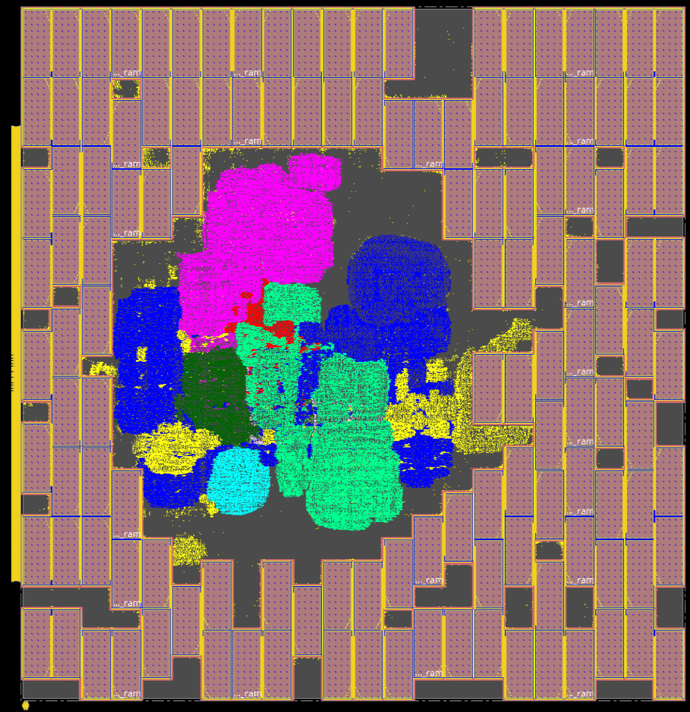
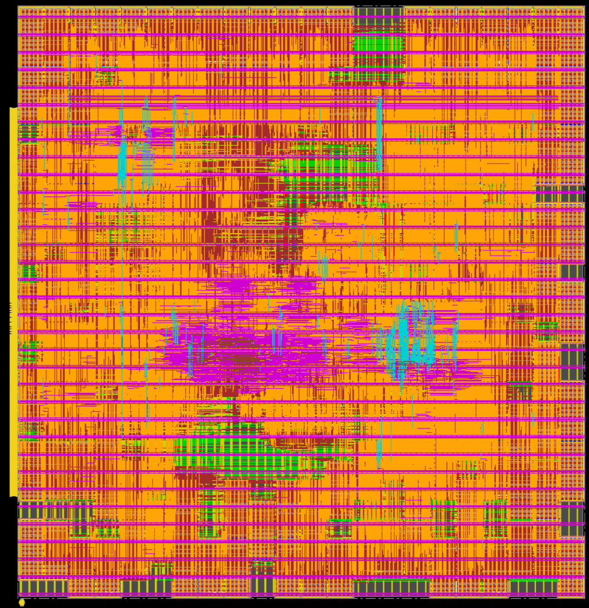

The following table and screenshots show results for (max_x, max_y), where max_x = 1347.1 and max_y = 1346.8.

<table>
<thead>
  <tr>
    <th colspan="10">
Macro Placement generated using CT (Util: 68%) with a vacuous set of input (x,y) coordinates. The input protobuf netlist to Circuit Training’s grouping code has all macro and standard cell locations set to (max_x, max_y) = (1347.1, 1346.8)
</th>
  </tr>
</thead>
<tbody>
  <tr>
    <td>Physical Design Stage</td>
    <td>Core Area (um^2)</td>
    <td>Standard Cell Area (um^2)</td>
    <td>Macro Area (um^2)</td>
    <td>Total Power (mW)</td>
    <td>Wirelength (um)</td>
    <td>WS  (ns)</td>
    <td>TNS  (ns)</td>
    <td>Congestion (H)</td>
    <td>Congestion (V)</td>
  </tr>
  <tr>
    <td>preCTS</td>
    <td>1814274</td>
    <td>214817</td>
    <td>1018356</td>
    <td>288.454</td>
    <td>4530507</td>
    <td>0.002</td>
    <td>0</td>
    <td>0.01%</td>
    <td>0.04%</td>
  </tr>
  <tr>
    <td>postCTS</td>
    <td>1814274</td>
    <td>215844</td>
    <td>1018356</td>
    <td>301.719</td>
    <td>4532853</td>
    <td>0.007</td>
    <td>0</td>
    <td>0.03%</td>
    <td>0.05%</td>
  </tr>
  <tr>
    <td>postRoute</td>
    <td>1814274</td>
    <td>215844</td>
    <td>1018356</td>
    <td>300.763</td>
    <td>4646396</td>
    <td>0.228</td>
    <td>0</td>
    <td></td>
    <td></td>
  </tr>
</tbody>
</table>

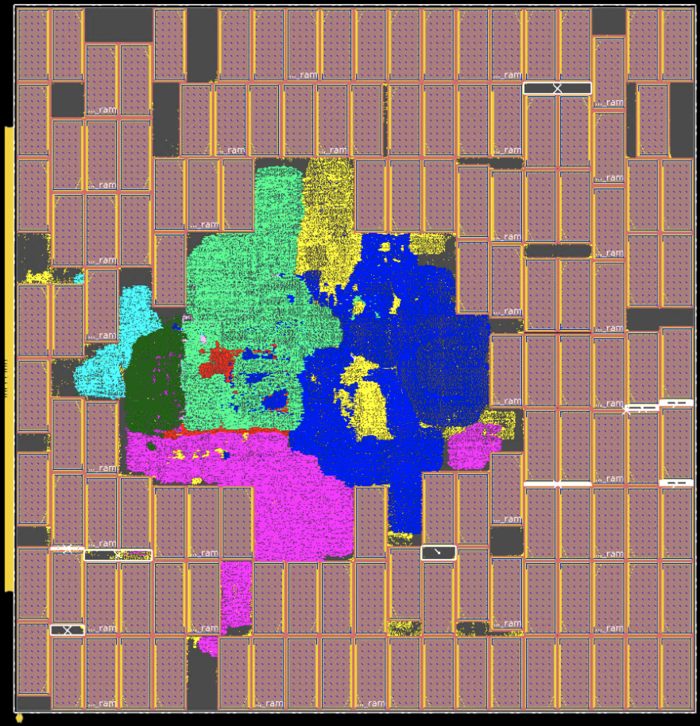

**Question 2.** How does utilization affect the (relative) performance of CT?  

**Question 3.** Is a testcase such as Ariane-133 “probative”, or do we need better testcases?

*A preliminary exercise has examined Innovus P&R outcomes when the Circuit Training macro placement locations for Our Ariane133-NanGate45_68 are **randomly shuffled**. The results for four seed values used in the shuffle, and for the original Circuit Training result, are as follows.*
  
<table>
<thead>
  <tr>
    <th>Metric</th>
    <th>CT_Shuffle_1</th>
    <th>CT_Shuffle_2</th>
    <th>CT_Shuffle_3</th>
    <th>CT_Shuffle_4</th>
    <th>CT_Result</th>
  </tr>
</thead>
<tbody>
  <tr>
    <td>Core_area (um^2)</td>
    <td>1814274.28</td>
    <td>1814274.28</td>
    <td>1814274.28</td>
    <td>1814274.28</td>
    <td>1814274.28</td>
  </tr>
  <tr>
    <td>Macro_area (um^2)</td>
    <td>1018355.73</td>
    <td>1018355.73</td>
    <td>1018355.73</td>
    <td>1018355.73</td>
    <td>1018355.73</td>
  </tr>
  <tr>
    <td>preCTS_std_cell_area (um^2)</td>
    <td>217124.89</td>
    <td>217168.25</td>
    <td>217157.88</td>
    <td>217020.09</td>
    <td>215575.44</td>
  </tr>
  <tr>
    <td>postCTS_std_cell_area (um^2)</td>
    <td>218215.23</td>
    <td>218231.19</td>
    <td>218328.81</td>
    <td>218073.45</td>
    <td>217114.52</td>
  </tr>
  <tr>
    <td>postRoute_std_cell_area (um^2)</td>
    <td>218215.23</td>
    <td>218231.19</td>
    <td>218328.81</td>
    <td>218073.45</td>
    <td>217114.52</td>
  </tr>
  <tr>
    <td>preCTS_total_power (mW)</td>
    <td>292.032</td>
    <td>292.692</td>
    <td>292.676</td>
    <td>292.764</td>
    <td>288.762</td>
  </tr>
  <tr>
    <td>postCTS_total_power (mW)</td>
    <td>305.726</td>
    <td>306.497</td>
    <td>306.120</td>
    <td>306.524</td>
    <td>302.607</td>
  </tr>
  <tr>
    <td>preRoute_total_power (mW)</td>
    <td>304.394</td>
    <td>304.996</td>
    <td>304.711</td>
    <td>305.093</td>
    <td>301.722</td>
  </tr>
  <tr>
    <td>preCTS_wirelength (um)</td>
    <td>5057900</td>
    <td>5069848</td>
    <td>5092665</td>
    <td>5119539</td>
    <td>4170253</td>
  </tr>
  <tr>
    <td>postCTS_wirelength (um)</td>
    <td>5063278</td>
    <td>5079451</td>
    <td>5109801</td>
    <td>5126540</td>
    <td>4186888</td>
  </tr>
  <tr>
    <td>postRoute_wirelength (um)</td>
    <td>5186032</td>
    <td>5194397</td>
    <td>5227411</td>
    <td>5247799</td>
    <td>4295572</td>
  </tr>
  <tr>
    <td>preCTS_WS (ns)</td>
    <td>-0.006</td>
    <td>0.001</td>
    <td>0</td>
    <td>-0.003</td>
    <td>0.002</td>
  </tr>
  <tr>
    <td>postCTS_WS (ns)</td>
    <td>0.002</td>
    <td>0.002</td>
    <td>0.003</td>
    <td>0.002</td>
    <td>0.001</td>
  </tr>
  <tr>
    <td>postRoute_WS (ns)</td>
    <td>0.174</td>
    <td>0.090</td>
    <td>0.219</td>
    <td>0.349</td>
    <td>0.336</td>
  </tr>
  <tr>
    <td>preCTS_TNS (ns)</td>
    <td>-0.010</td>
    <td>0</td>
    <td>0</td>
    <td>-0.019</td>
    <td>0</td>
  </tr>
  <tr>
    <td>postCTS_TNS (ns)</td>
    <td>0</td>
    <td>0</td>
    <td>0</td>
    <td>0</td>
    <td>0</td>
  </tr>
  <tr>
    <td>postRoute_TNS (ns)</td>
    <td>0</td>
    <td>0</td>
    <td>0</td>
    <td>0</td>
    <td>0</td>
  </tr>
  <tr>
    <td>preCTS_Congestion(H)</td>
    <td>0.02%</td>
    <td>0.02%</td>
    <td>0.03%</td>
    <td>0.02%</td>
    <td>0.01%</td>
  </tr>
  <tr>
    <td>postCTS_Congestion(H)</td>
    <td>0.03%</td>
    <td>0.04%</td>
    <td>0.02%</td>
    <td>0.06%</td>
    <td>0.00%</td>
  </tr>
  <tr>
    <td>postRoute_Congestion(H)</td>
    <td></td>
    <td></td>
    <td></td>
    <td></td>
    <td></td>
  </tr>
  <tr>
    <td>preCTS_Congestion(V)</td>
    <td>0.06%</td>
    <td>0.06%</td>
    <td>0.07%</td>
    <td>0.07%</td>
    <td>0.01%</td>
  </tr>
  <tr>
    <td>postCTS_Congestion(V)</td>
    <td>0.07%</td>
    <td>0.07%</td>
    <td>0.08%</td>
    <td>0.08%</td>
    <td>0.01%</td>
  </tr>
  <tr>
    <td>postRoute_Congestion(V)</td>
    <td></td>
    <td></td>
    <td></td>
    <td></td>
    <td></td>
  </tr>
</tbody>
</table>

**September 9:**  
- We have added two more vacuous initial placements to the study of [Question 1](#Question1). 
- We have added an initial study of impact from placement guidance to clustering. See [Question 4](#Question4).  
- We have taken a look at the impact of Coordinate Descent on proxy cost and on Table 1 metrics. See [Question 5](#Question5).
- We have obtained a data point to compare two alternate Cadence flows for obtaining the initial macro placement.  See [Question 6](#Question6).
- We have taken a look at a potential new baseline, which is simply to let the commercial physical synthesis / P&R tool flow run until the end of routing, without any involvement of CT.  See [Question 7](#Question7).
- We have obtained an initial CT result on a second testcase, NVDLA, [here]().
- As this running log is becoming unwieldy, we propose to pin a summary of questions and conclusions to date at the bottom of this document.  We will also add this into our GitHub, as planned.  And, we request that questions and experimental requests be posed as GitHub issues, and that the limited bandwidth and resources of students be taken into account when making these requests. 

**Question 4.** How much does the **guidance** to **clustering** that comes from (x,y) locations matter?
 
We answer this by using hMETIS to generate the same number of soft macros from the same netlist, but only via the npart (number of partitions) parameter. The value of npart in the call to hMETIS is chosen to match the number of standard-cell clusters (i.e., soft macros) obtained in the CT grouping process. Then, to preserve this number of soft macros, we skip the **[break up](https://github.com/google-research/circuit_training/blob/b9f53c25ccdb8e588b12d09bf2b1c94bfa1c2b89/circuit_training/grouping/grouping.py#L721) and [merge](https://github.com/google-research/circuit_training/blob/b9f53c25ccdb8e588b12d09bf2b1c94bfa1c2b89/circuit_training/grouping/grouping.py#L598)** stage in CT grouping.

[Brief overview of break up and merge: (A) **Break up:** During break up, if a standard cell cluster height or width is greater than [*sqrt(canvas area / 16)*](https://github.com/google-research/circuit_training/blob/6a76e327a70b5f0c9e3291b57c085688386da04e/circuit_training/grouping/grouper.py#L138), then it is broken into small clusters such that the height and width of each cluster is less than *sqrt(canvas area / 16)*. (B) **Merge:** During merge, if the number of standard cells is less than the ([average number of standard cells in a cluster / 4](https://github.com/google-research/circuit_training/blob/6a76e327a70b5f0c9e3291b57c085688386da04e/circuit_training/grouping/grouper.py#L178)), then the standard cells of that cluster are moved to their neighboring clusters.] 

We run hMETIS with npart = 810 (number of fixed groups is 153) to match the total number of standard cell clusters when CT’s break up and merge is run. The following table presents the results of this experiment. Outcomes are similar to the original [Ariane133-NG45 with 68% utilization CT result](#circuit-training-baseline-result-on-our-ariane133-nangate45span-stylecolorred68span).  [*The Question 1 study indicates that a vacuous placement harms the outcome of CT, i.e., “placement information matters”. But the Question 4 study suggests that a flow that does not bring in any placement coordinates (i.e., using pure hMETIS partitioning down to a similar number of stdcell clusters) does not affect results by much.*]

<table>
<thead>
  <tr>
    <th colspan="10">
Macro Placement generated using CT (Util: 68%) when the input clustered netlist is generated by running hMETIS npart = 810 and without running break up and merge
</th>
  </tr>
</thead>
<tbody>
  <tr>
    <td>Physical Design Stage</td>
    <td>Core Area (um^2)</td>
    <td>Standard Cell Area (um^2)</td>
    <td>Macro Area (um^2)</td>
    <td>Total Power (mW)</td>
    <td>Wirelength (um)</td>
    <td>WS  (ns)</td>
    <td>TNS  (ns)</td>
    <td>Congestion (H)</td>
    <td>Congestion (V)</td>
  </tr>
  <tr>
    <td>preCTS</td>
    <td>1814274</td>
    <td>215552</td>
    <td>1018356</td>
    <td>288.642</td>
    <td>4188406</td>
    <td>-0.001</td>
    <td>-0.001</td>
    <td>0.02%</td>
    <td>0.12%</td>
  </tr>
  <tr>
    <td>postCTS</td>
    <td>1814274</td>
    <td>216618</td>
    <td>1018356</td>
    <td>302.086</td>
    <td>4196172</td>
    <td>0.002</td>
    <td>0</td>
    <td>0.02%</td>
    <td>0.11%</td>
  </tr>
  <tr>
    <td>postRoute</td>
    <td>1814274</td>
    <td>216618</td>
    <td>1018356</td>
    <td>300.899</td>
    <td>4304113</td>
    <td>0.264</td>
    <td>0</td>
    <td></td>
    <td></td>
  </tr>
</tbody>
</table>

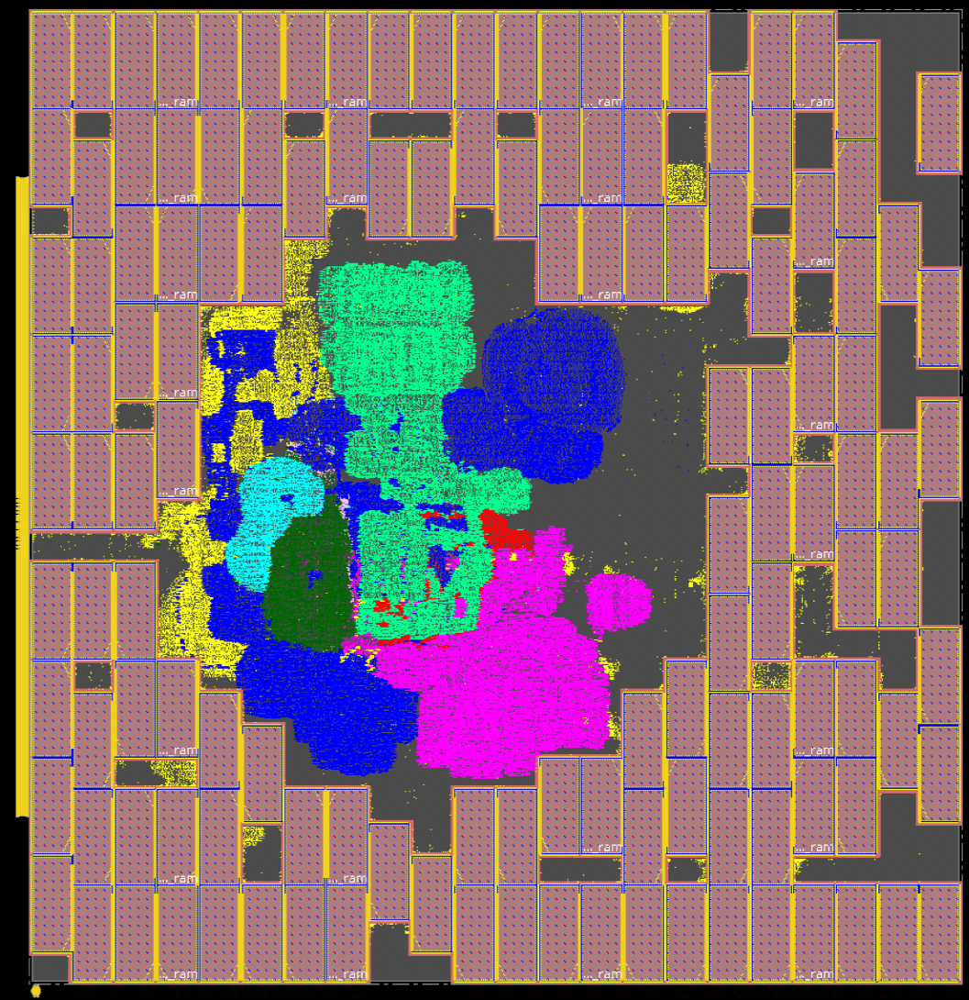
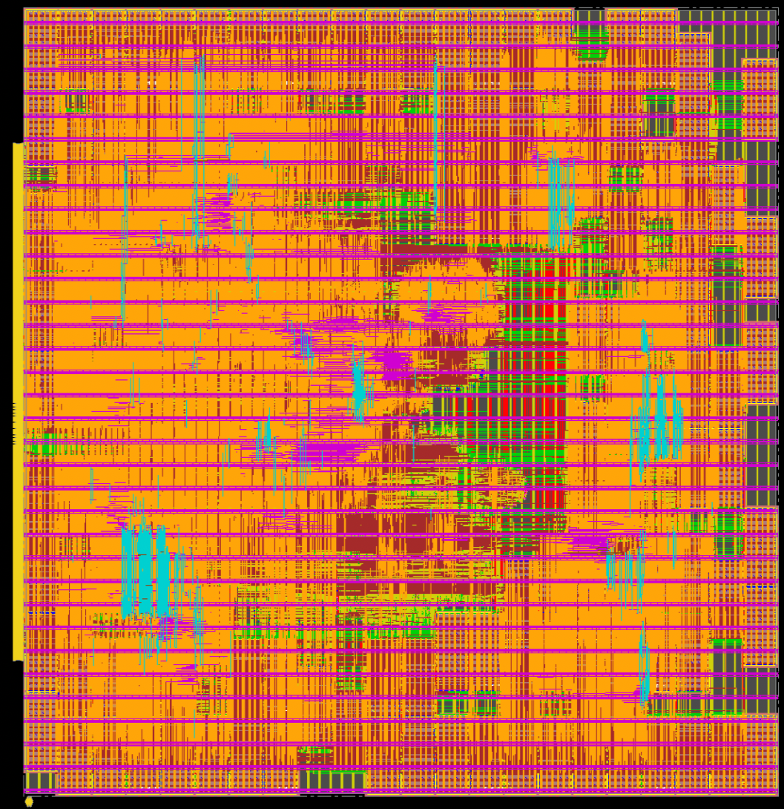

**Question 5.** What is the impact of the Coordinate Descent (CD) placer on proxy cost and Table 1 metric?

In our [August 18](#August18) notes, we mentioned that the default CT flow does NOT run coordinate descent. (Coordinate descent is not mentioned in the Nature paper.) The [result in the CT repo](https://github.com/google-research/circuit_training/blob/main/docs/ARIANE.md#results) shows the impact of Coordinate Descent (CD) on proxy cost for the Google Ariane design, but there is no data to show the impact of CD on Table 1 metrics.

We have taken the CT results generated for Ariane133-NG45 with 68% utilization through the CD placement step. The following table shows the effect of CD placer on proxy cost. The CD placer for this instance improves proxy wirelength and density at the cost of congestion, and overall proxy cost degrades slightly.

<table>
<thead>
  <tr>
    <th colspan="3">
CD Placer effect on Proxy cost for Ariane133
</th>
  </tr>
</thead>
<tbody>
  <tr>
    <td>Cost</td>
    <td>CT w/o CD</td>
    <td>+ Apply CD</td>
  </tr>
  <tr>
    <td>Wirelength</td>
    <td>0.0948</td>
    <td>0.0861</td>
  </tr>
  <tr>
    <td>Density</td>
    <td>0.4845</td>
    <td>0.4746</td>
  </tr>
  <tr>
    <td>Congestion</td>
    <td>0.7176</td>
    <td>0.7574</td>
  </tr>
  <tr>
    <td>Proxy</td>
    <td>0.6959</td>
    <td>0.7021</td>
  </tr>
</tbody>
</table>

  
The following table shows the P&R result for the post-CD macro placement.

<table>
<thead>
  <tr>
    <th colspan="10">
Macro placement generated by applying the Coordinate Descent placement step to Our Ariane-133 (NG45) 68% utilization when the input to the CD placer is the (default setup) CT macro placement. The post-macro placement flow uses Innovus21.1
</th>
  </tr>
</thead>
<tbody>
  <tr>
    <td>Physical Design Stage</td>
    <td>Core Area (um^2)</td>
    <td>Standard Cell Area (um^2)</td>
    <td>Macro Area (um^2)</td>
    <td>Total Power (mW)</td>
    <td>Wirelength (um)</td>
    <td>WS  (ns)</td>
    <td>TNS  (ns)</td>
    <td>Congestion (H)</td>
    <td>Congestion (V)</td>
  </tr>
  <tr>
    <td>preCTS</td>
    <td>1814274</td>
    <td>215581</td>
    <td>1018356</td>
    <td>289.312</td>
    <td>4238854</td>
    <td>-0.001</td>
    <td>-0.003</td>
    <td>0.01%</td>
    <td>0.06%</td>
  </tr>
  <tr>
    <td>postCTS</td>
    <td>1814274</td>
    <td>217017</td>
    <td>1018356</td>
    <td>302.483</td>
    <td>4249846</td>
    <td>0.005</td>
    <td>0</td>
    <td>0.02%</td>
    <td>0.07%</td>
  </tr>
  <tr>
    <td>postRoute</td>
    <td>1814274</td>
    <td>217017</td>
    <td>1018356</td>
    <td>301.482</td>
    <td>4358888</td>
    <td>0.140</td>
    <td>0</td>
    <td></td>
    <td></td>
  </tr>
</tbody>
</table>

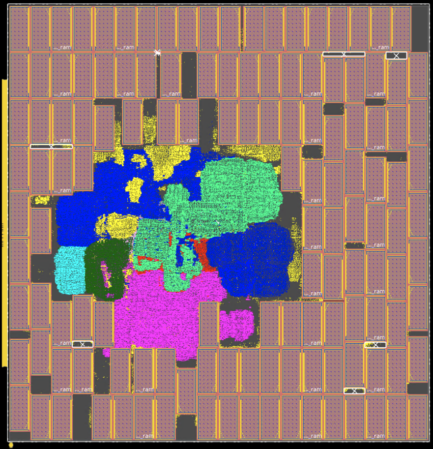
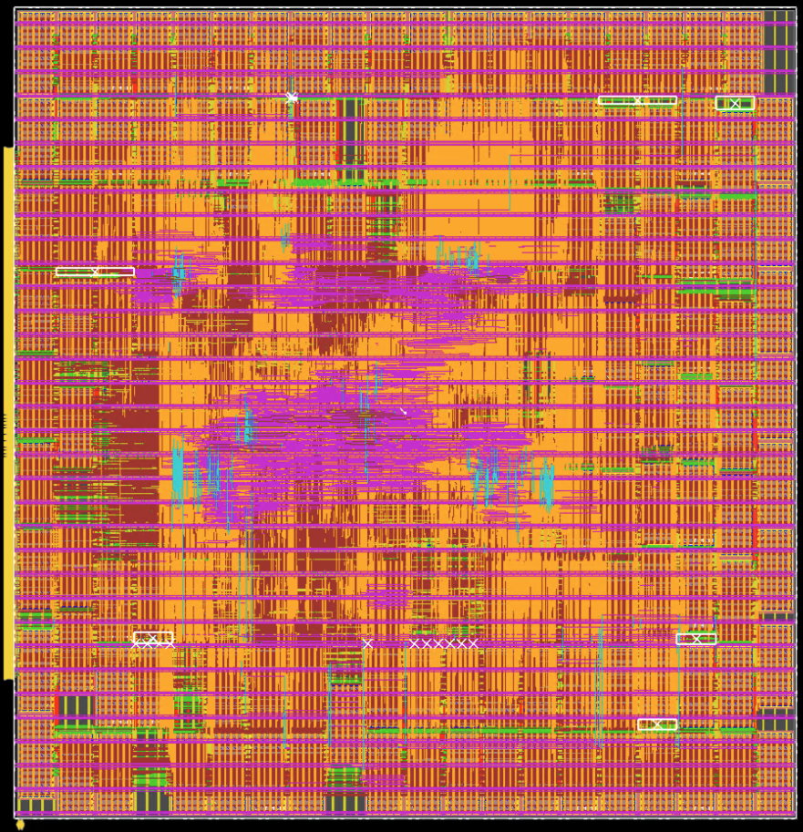

Even though CD improves proxy wirelength, the post-route wirelength worsens slightly (by ~1.47%) compared to the original CT macro placement.

**Question 6.** Are we using the industry tool in an “expert” manner?  (We believe so.)
We received an inquiry regarding the multiple ways in which macro placements could be obtained using Cadence tooling. To clarify:
- In our previous CT result shown [here](#August20), the initial macro placement (which is fed into Genus iSpatial) is generated using Innovus Concurrent Macro Placer. 
- It is also possible to use Genus iSpatial to perform **both** macro and standard-cell placement. In our experience, this worsens results, as shown below. I.e., based on our current understanding, the macro placement produced by Innovus Concurrent Macro Placer leads to the best results when fed to the CT flow.

<table>
<thead>
  <tr>
    <th colspan="10">
Macro placement generated by Circuit Training on Our Ariane-133 (NG45) 68% utilization when the input macro and standard cell placement to CT grouping is generated by Genus iSpatial, and the post-macro placement flow is using Innovus21.1
</th>
  </tr>
</thead>
<tbody>
  <tr>
    <td>Physical Design Stage</td>
    <td>Core Area (um^2)</td>
    <td>Standard Cell Area (um^2)</td>
    <td>Macro Area (um^2)</td>
    <td>Total Power (mW)</td>
    <td>Wirelength (um)</td>
    <td>WS  (ns)</td>
    <td>TNS  (ns)</td>
    <td>Congestion (H)</td>
    <td>Congestion (V)</td>
  </tr>
  <tr>
    <td>preCTS</td>
    <td>1814274</td>
    <td>215583</td>
    <td>1018355.73</td>
    <td>289.030</td>
    <td>4476331</td>
    <td>-0.002</td>
    <td>-0.002</td>
    <td>0.02%</td>
    <td>0.03%</td>
  </tr>
  <tr>
    <td>postCTS</td>
    <td>1814274</td>
    <td>216729</td>
    <td>1018355.73</td>
    <td>302.268</td>
    <td>4483560</td>
    <td>0.002</td>
    <td>0</td>
    <td>0.03%</td>
    <td>0.09%</td>
  </tr>
  <tr>
    <td>postRoute</td>
    <td>1814274</td>
    <td>216729</td>
    <td>1018355.73</td>
    <td>301.028</td>
    <td>4590581</td>
    <td>0.316</td>
    <td>0</td>
    <td></td>
    <td></td>
  </tr>
</tbody>
</table>

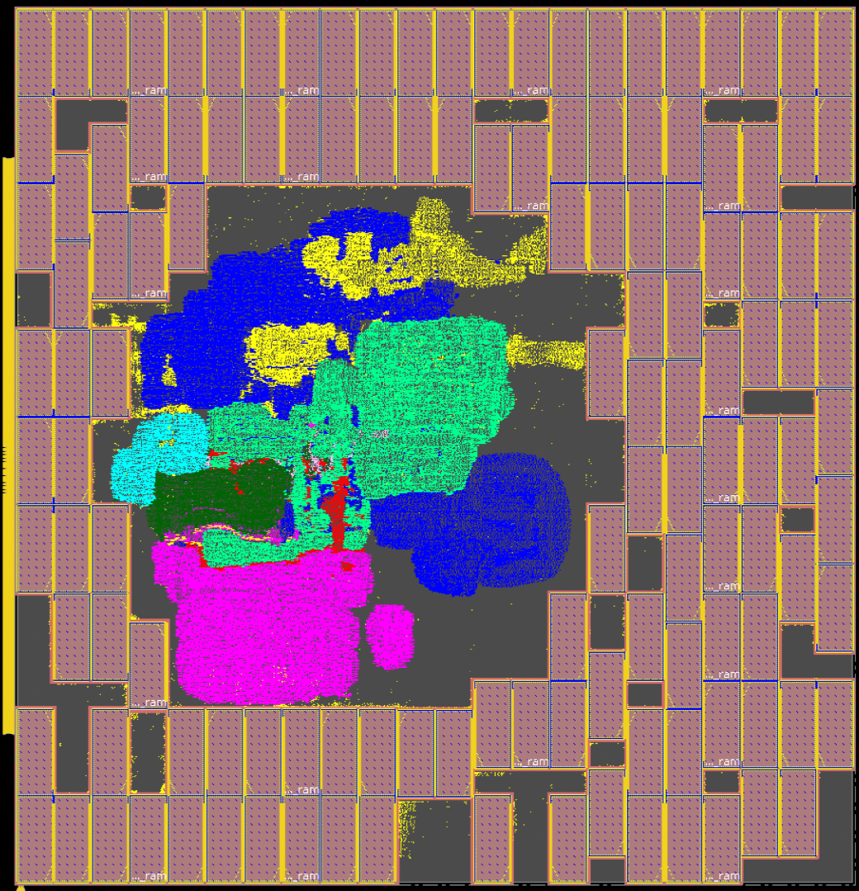
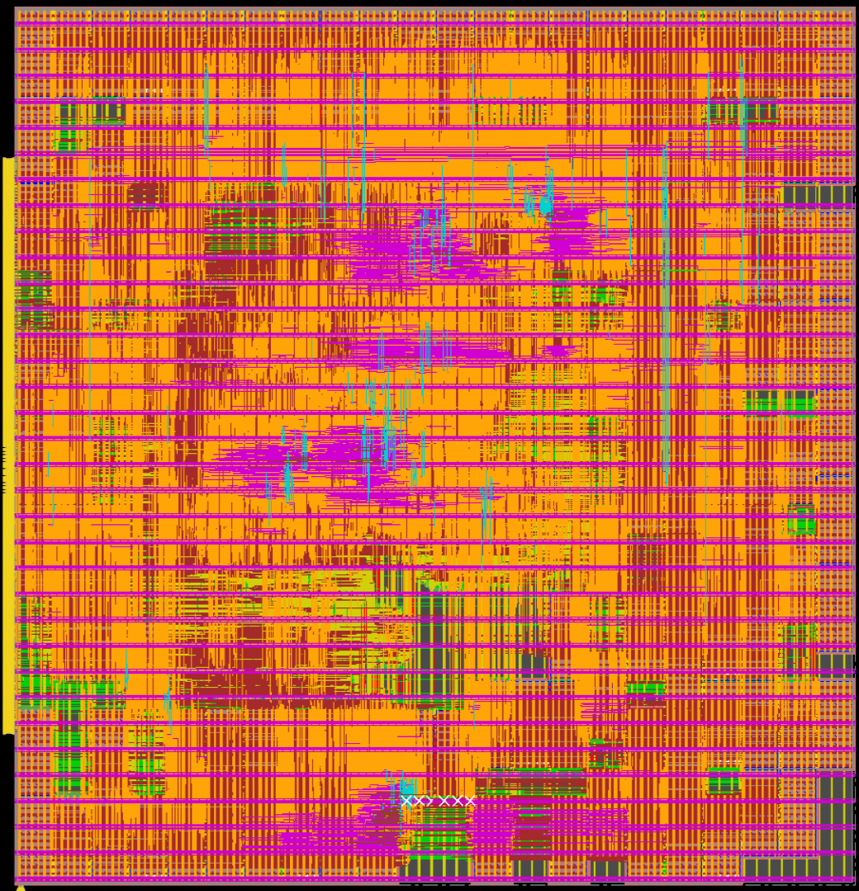

**Question 7.** What happens if we skip CT and continue directly to standard-cell P&R (i.e., the Innovus 21.1 flow) once we have a macro placement from the commercial tool?

At some point during the past weeks, we realized that this would also be a potential “baseline” for comparison. As can be seen below for both 68% and 51% variants of Ariane-133 in NG45, omitting the CT step can also produce good results by the Table 1 metrics. At this point, we do **not** have any diagnosis or interpretation of this data. One possible implication is that the Ariane-133 testcase is in some way not probative. The community’s suggestions (e.g., alternate testcases, constraints, floorplan setup, etc.) are always welcome. 

<table>
<thead>
  <tr>
    <th colspan="10">
Concurrent macro placement (Ariane 68%) continuing straight into the Innovus 21.1 P&amp;R flow (no application of Circuit Training) [baseline CT result: <a href="#Ariane133_68_CT">here</a>]
</th>
  </tr>
</thead>
<tbody>
  <tr>
    <td>Physical Design Stage</td>
    <td>Core Area  (um^2)</td>
    <td>Standard Cell  Area (um^2)</td>
    <td>Macro Area  (um^2)</td>
    <td>Total Power  (mW)</td>
    <td>Wirelength (um)</td>
    <td>WS (ns)</td>
    <td>TNS (ns)</td>
    <td>Congestion (H)</td>
    <td>Congestion (V)</td>
  </tr>
  <tr>
    <td>preCTS</td>
    <td>1814274</td>
    <td>214050</td>
    <td>1018355.73</td>
    <td>286.117</td>
    <td>3656436</td>
    <td>0.007</td>
    <td>0</td>
    <td>0.02%</td>
    <td>0.01%</td>
  </tr>
  <tr>
    <td>postCTS</td>
    <td>1814274</td>
    <td>215096</td>
    <td>1018355.73</td>
    <td>299.438</td>
    <td>3662225</td>
    <td>0.01</td>
    <td>0</td>
    <td>0.01%</td>
    <td>0.02%</td>
  </tr>
  <tr>
    <td>postRoute</td>
    <td>1814274</td>
    <td>215096</td>
    <td>1018355.73</td>
    <td>298.934</td>
    <td>3780153</td>
    <td>0.285</td>
    <td>0</td>
    <td></td>
    <td></td>
  </tr>
  <tr>
    <td colspan="10">
<b>Concurrent macro placement (Ariane 51%) continuing straight into the Innovus 21.1 P&amp;R flow (no application of Circuit Training) [baseline CT result: <a href="#Ariane133_51_CT">here</a>]</b>
</td>
  </tr>
  <tr>
    <td>Physical Design Stage</td>
    <td>Core Area  (um^2)</td>
    <td>Standard Cell Area (um^2)</td>
    <td>Macro Area (um^2)</td>
    <td>Total Power (mW)</td>
    <td>Wirelength (um)</td>
    <td>WS (ns)</td>
    <td>TNS (ns)</td>
    <td>Congestion (H)</td>
    <td>Congestion (V)</td>
  </tr>
  <tr>
    <td>preCTS</td>
    <td>2560080</td>
    <td>214060</td>
    <td>1018355.73</td>
    <td>285.509</td>
    <td>3647997</td>
    <td>0.047</td>
    <td>0</td>
    <td>0.00%</td>
    <td>0.00%</td>
  </tr>
  <tr>
    <td>postCTS</td>
    <td>2560080</td>
    <td>215117</td>
    <td>1018355.73</td>
    <td>298.362</td>
    <td>3649940</td>
    <td>0.011</td>
    <td>0</td>
    <td>0.00%</td>
    <td>0.01%</td>
  </tr>
  <tr>
    <td>postRoute</td>
    <td>2560080</td>
    <td>215117</td>
    <td>1018355.73</td>
    <td>297.849</td>
    <td>3764148</td>
    <td>0.210</td>
    <td>0</td>
    <td></td>
    <td></td>
  </tr>
</tbody>
</table>

Ariane 68%:

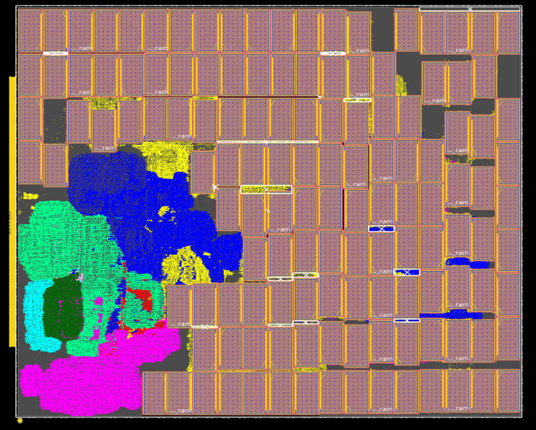
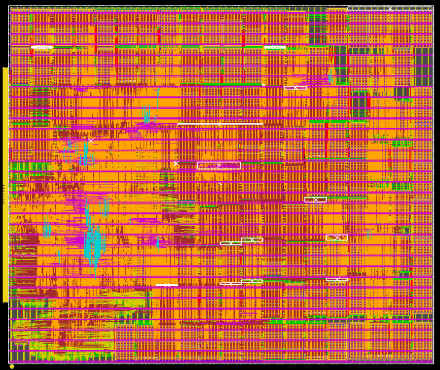

**Question 8.** How does the tightness of timing constraints affect the (relative) performance of CT?  
 
[Comment: This is related to Question 2, and is part of the broad question of field of use / sweet spot.  We still intend to work in the space of {design testcase} X {technology and design enablement} X {utilization} X {performance requirement}X experimental {questions, design/setup, execution} to reach conclusions that are above the bar of “satisfying readers”. Progress will continue to be reported here and in GitHub.]

### **Circuit Training Baseline Result on “Our NVDLA-NanGate45_68”.**
We have trained CT to generate a macro placement for the [NVDLA design](../../Flows/NanGate45/nvdla/). For this experiment we use the NanGate45 enablement; the initial canvas size is generated by setting utilization to 68%. We use the default hyperparameters used for Ariane to train CT for NVDLA design. The number of hard macros in NVDLA is 128, so we update [max_sequnece_length](https://github.com/google-research/circuit_training/blob/6a76e327a70b5f0c9e3291b57c085688386da04e/circuit_training/learning/ppo_collect.py#L53) to 129 in [ppo_collect.py](https://github.com/google-research/circuit_training/blob/6a76e327a70b5f0c9e3291b57c085688386da04e/circuit_training/learning/ppo_collect.py#L53) and [sequence_length](https://github.com/google-research/circuit_training/blob/6a76e327a70b5f0c9e3291b57c085688386da04e/circuit_training/learning/train_ppo.py#L57) to 129 in [train_ppo.py](https://github.com/google-research/circuit_training/blob/6a76e327a70b5f0c9e3291b57c085688386da04e/circuit_training/learning/train_ppo.py#L57).

The following table and screenshots show the CT result.
<table>
<thead>
  <tr>
    <th colspan="10">
Macro placement generated by Circuit Training on Our NVDLA (NG45) 68% utilization, post-macro placement flow using Innovus21.1
</th>
  </tr>
</thead>
<tbody>
  <tr>
    <td>Physical Design Stage</td>
    <td>Core Area (um^2)</td>
    <td>Standard Cell Area (um^2)</td>
    <td>Macro Area (um^2)</td>
    <td>Total Power (mW)</td>
    <td>Wirelength (um)</td>
    <td>WS  (ns)</td>
    <td>TNS  (ns)</td>
    <td>Congestion (H)</td>
    <td>Congestion (V)</td>
  </tr>
  <tr>
    <td>preCTS</td>
    <td>4002458</td>
    <td>401713</td>
    <td>2325683</td>
    <td>2428.453</td>
    <td>13601973</td>
    <td>-0.003</td>
    <td>-0.045</td>
    <td>0.40%</td>
    <td>1.22%</td>
  </tr>
  <tr>
    <td>postCTS</td>
    <td>4002458</td>
    <td>404398</td>
    <td>2325683</td>
    <td>2514.685</td>
    <td>13677780</td>
    <td>-0.009</td>
    <td>-0.027</td>
    <td>0.44%</td>
    <td>1.54%</td>
  </tr>
  <tr>
    <td>postRoute</td>
    <td>4002458</td>
    <td>404398</td>
    <td>2325683</td>
    <td>2491.368</td>
    <td>14317085</td>
    <td>0.142</td>
    <td>0</td>
    <td></td>
    <td></td>
  </tr>
</tbody>
</table>

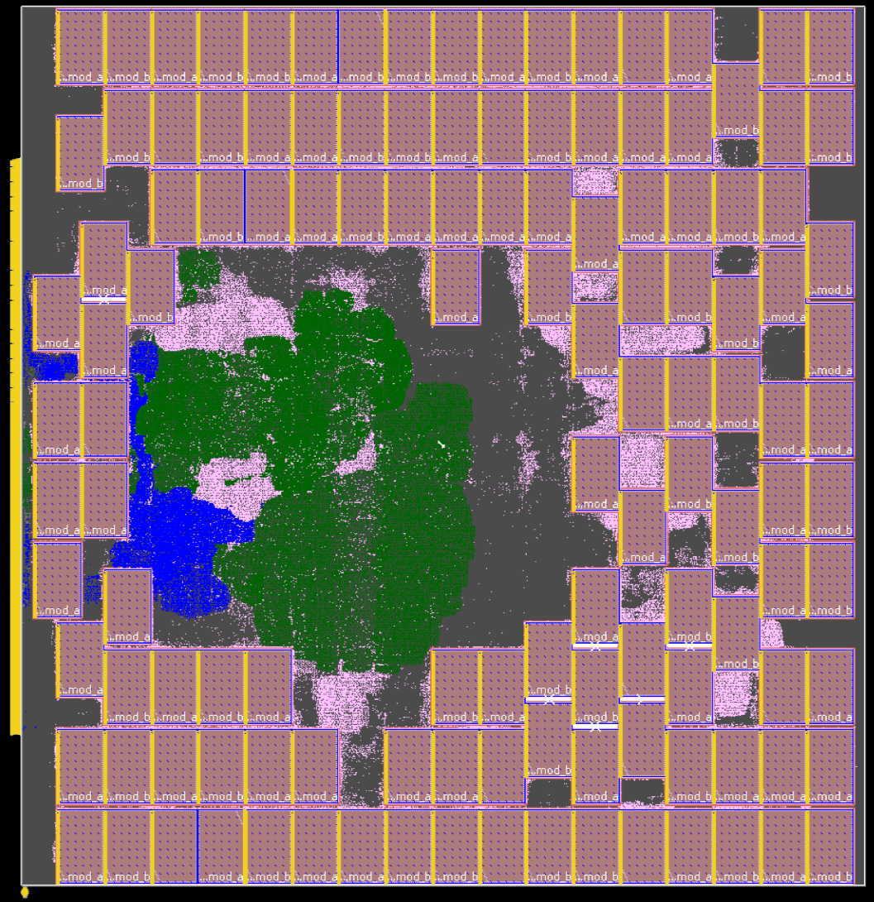
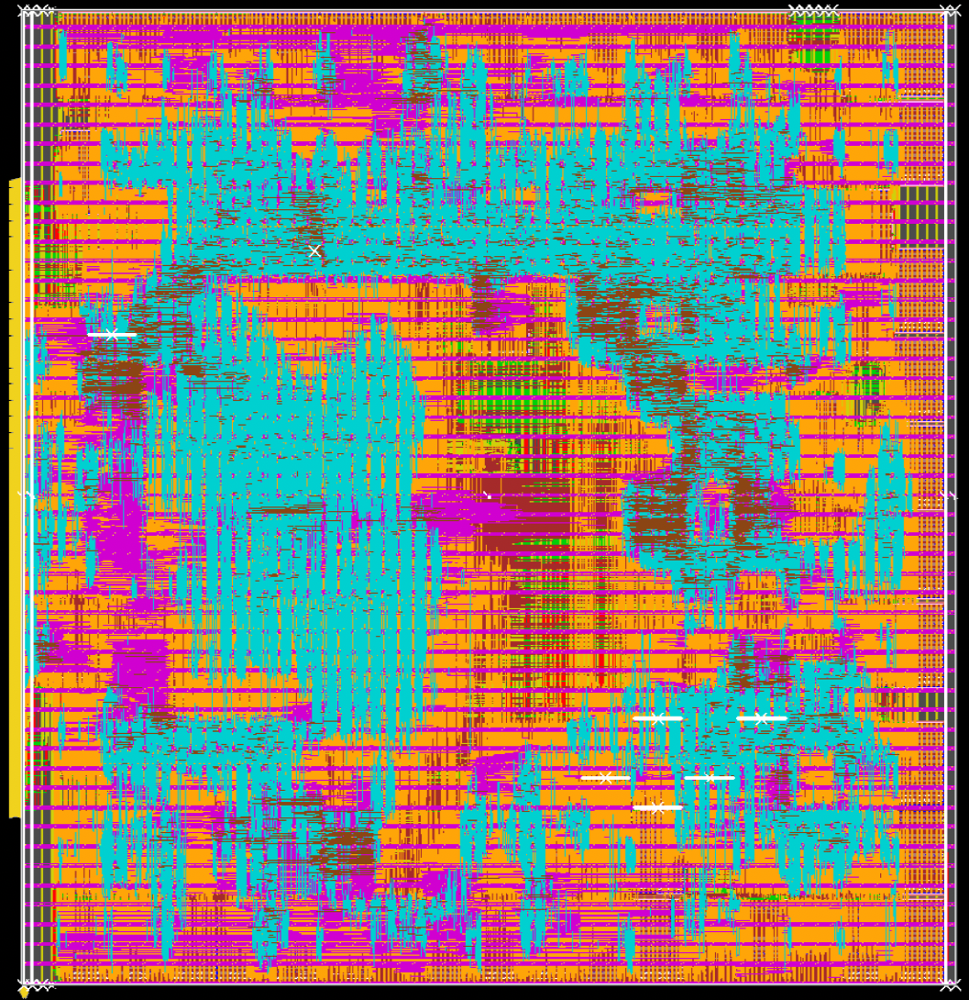

**September 18:**
- To address [Question 8](#Question8), we have performed a sweep of target clock period (TCP) constraint for Ariane133-68 in NG45. Experiments above were performed with a loose TCP of 4.0ns. According to our studies, the “hockey stick” ends at a TCP of 1.3ns, so we have generated netlists and run CT for TCP values of 1.3ns and 1.5ns. The results are shown below (post-physical synthesis summary results with TCP values of 4.0ns, 1.5ns, 1.3ns; CT + Innovus P&R results for 1.5ns, 1.3ns). We see that the wirelength numbers are worse for CT results compared to the CMP result, but the timing numbers for CT are better than CMP.
  - The following table shows the post-physical synthesis results of Ariane133-68-NG45 for different TCPs when the macro placement is generated using CMP.

<table>
<thead>
  <tr>
    <th colspan="10">
TCP: 4.0ns [<a href="#Ariane133_NG45_4ns_CT">Link</a> to corresponding CT result]
</th>
  </tr>
</thead>
<tbody>
  <tr>
    <td>Physical Design Stage</td>
    <td>Core Area (um^2)</td>
    <td>Standard Cell Area (um^2)</td>
    <td>Macro Area (um^2)</td>
    <td>Total Power (mW)</td>
    <td>Wirelength (um)</td>
    <td>WS (ns)</td>
    <td>TNS (ns)</td>
    <td>Congestion (H)</td>
    <td>Congestion (V)</td>
  </tr>
  <tr>
    <td>preCTS</td>
    <td>1814274</td>
    <td>215033</td>
    <td>1018356</td>
    <td>286.199</td>
    <td>3535026</td>
    <td>-0.001</td>
    <td>-0.001</td>
    <td>0.04%</td>
    <td>0.01%</td>
  </tr>
  <tr>
    <td>postCTS</td>
    <td>1814274</td>
    <td>216147</td>
    <td>1018356</td>
    <td>299.635</td>
    <td>3544668</td>
    <td>0.001</td>
    <td>0</td>
    <td>0.02%</td>
    <td>0.01%</td>
  </tr>
  <tr>
    <td>postRoute</td>
    <td>1814274</td>
    <td>216147</td>
    <td>1018356</td>
    <td>299.110</td>
    <td>3649892</td>
    <td>0.317</td>
    <td>0</td>
    <td></td>
    <td></td>
  </tr>
  <tr>
    <td>postRouteOpt</td>
    <td>1814274</td>
    <td>215738</td>
    <td>1018356</td>
    <td>295.127</td>
    <td>3653200</td>
    <td>0.397</td>
    <td>0</td>
    <td></td>
    <td></td>
  </tr>
  <tr>
    <td colspan="10">
TCP: 1.5ns [<a href="#Ariane133_NG45_1.3ns_CT">Link</a> to corresponding CT result]
</td>
  </tr>
  <tr>
    <td>Physical Design Stage</td>
    <td>Core Area (um^2)</td>
    <td>Standard Cell Area (um^2)</td>
    <td>Macro Area (um^2)</td>
    <td>Total Power (mW)</td>
    <td>Wirelength (um)</td>
    <td>WS (ns)</td>
    <td>TNS (ns)</td>
    <td>Congestion (H)</td>
    <td>Congestion (V)</td>
  </tr>
  <tr>
    <td>preCTS</td>
    <td>1814274</td>
    <td>232370</td>
    <td>1018356</td>
    <td>682.777</td>
    <td>3635909</td>
    <td>-0.008</td>
    <td>-0.143</td>
    <td>0.01%</td>
    <td>0.01%</td>
  </tr>
  <tr>
    <td>postCTS</td>
    <td>1814274</td>
    <td>234250</td>
    <td>1018356</td>
    <td>718.592</td>
    <td>3663001</td>
    <td>-0.002</td>
    <td>-0.006</td>
    <td>0.03%</td>
    <td>0.10%</td>
  </tr>
  <tr>
    <td>postRoute</td>
    <td>1814274</td>
    <td>234250</td>
    <td>1018356</td>
    <td>717.410</td>
    <td>3777403</td>
    <td>-0.221</td>
    <td>-86.88</td>
    <td></td>
    <td></td>
  </tr>
  <tr>
    <td>postRouteOpt</td>
    <td>1814274</td>
    <td>237178</td>
    <td>1018356</td>
    <td>718.866</td>
    <td>3785973</td>
    <td>-0.042</td>
    <td>-6.311</td>
    <td></td>
    <td></td>
  </tr>
  <tr>
    <td colspan="10">
TCP: 1.3ns [<a href="#Ariane133_NG45_1.3ns_CT">Link</a> to corresponding CT result]
</td>
  </tr>
  <tr>
    <td>Physical Design Stage</td>
    <td>Core Area (um^2)</td>
    <td>Standard Cell Area (um^2)</td>
    <td>Macro Area (um^2)</td>
    <td>Total Power (mW)</td>
    <td>Wirelength (um)</td>
    <td>WS (ns)</td>
    <td>TNS (ns)</td>
    <td>Congestion (H)</td>
    <td>Congestion (V)</td>
  </tr>
  <tr>
    <td>preCTS</td>
    <td>1814274</td>
    <td>251874</td>
    <td>1018356</td>
    <td>807.994</td>
    <td>3885279</td>
    <td>-0.15</td>
    <td>-242.589</td>
    <td>0.02%</td>
    <td>0.02%</td>
  </tr>
  <tr>
    <td>postCTS</td>
    <td>1814274</td>
    <td>254721</td>
    <td>1018356</td>
    <td>851.977</td>
    <td>3923912</td>
    <td>-0.127</td>
    <td>-133.426</td>
    <td>0.04%</td>
    <td>0.10%</td>
  </tr>
  <tr>
    <td>postRoute</td>
    <td>1814274</td>
    <td>254721</td>
    <td>1018356</td>
    <td>850.483</td>
    <td>4049905</td>
    <td>-0.239</td>
    <td>-410.578</td>
    <td></td>
    <td></td>
  </tr>
  <tr>
    <td>postRouteOpt</td>
    <td>1814274</td>
    <td>256230</td>
    <td>1018356</td>
    <td>851.546</td>
    <td>4057140</td>
    <td>-0.154</td>
    <td>-196.527</td>
    <td></td>
    <td></td>
  </tr>
</tbody>
</table>

  - The following table shows the post-physical synthesis results of Ariane133-68-NG45 for different TCPs when the macro placement is generated using CT.
<table>
<thead>
  <tr>
    <th colspan="10">
Ariane133-68-NG45 CT result for TCP:1.5ns [Corresponding CMP result <a href="#Ariane133_NG45_1.5ns_CMP">link</a>]</th>
  </tr>
</thead>
<tbody>
  <tr>
    <td>Physical Design Stage</td>
    <td>Core Area (um^2)</td>
    <td>Standard Cell Area (um^2)</td>
    <td>Macro Area (um^2)</td>
    <td>Total Power (mW)</td>
    <td>Wirelength (um)</td>
    <td>WS (ns)</td>
    <td>TNS (ns)</td>
    <td>Congestion (H)</td>
    <td>Congestion (V)</td>
  </tr>
  <tr>
    <td>preCTS</td>
    <td>1814274</td>
    <td>227917</td>
    <td>1018356</td>
    <td>673.158</td>
    <td>4243883</td>
    <td>-0.012</td>
    <td>-0.648</td>
    <td>0.03%</td>
    <td>0.03%</td>
  </tr>
  <tr>
    <td>postCTS</td>
    <td>1814274</td>
    <td>229836</td>
    <td>1018356</td>
    <td>708.797</td>
    <td>4247346</td>
    <td>-0.001</td>
    <td>-0.007</td>
    <td>0.07%</td>
    <td>0.12%</td>
  </tr>
  <tr>
    <td>postRoute</td>
    <td>1814274</td>
    <td>229836</td>
    <td>1018356</td>
    <td>707.522</td>
    <td>4360419</td>
    <td>-0.052</td>
    <td>-9.218</td>
    <td></td>
    <td></td>
  </tr>
  <tr>
    <td>postRouteOpt</td>
    <td>1814274</td>
    <td>230164</td>
    <td>1018356</td>
    <td>707.829</td>
    <td>4364537</td>
    <td>-0.009</td>
    <td>-0.233</td>
    <td></td>
    <td></td>
  </tr>
</tbody>
</table>
  

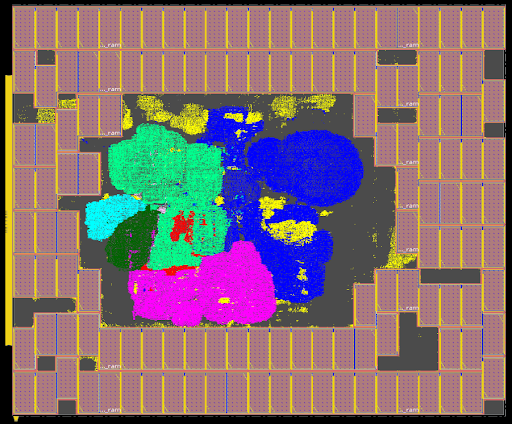
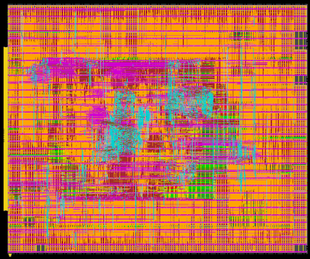

<table>
<thead>
  <tr>
    <th colspan="10">
Ariane133-68-NG45 CT result for TCP:1.3ns [Corresponding CMP result <a href="#Ariane133_NG45_1.3ns_CMP">link</a>]</th>
  </tr>
</thead>
<tbody>
  <tr>
    <td>Physical Design Stage</td>
    <td>Core Area (um^2)</td>
    <td>Standard Cell Area (um^2)</td>
    <td>Macro Area (um^2)</td>
    <td>Total Power (mW)</td>
    <td>Wirelength (um)</td>
    <td>WS (ns)</td>
    <td>TNS (ns)</td>
    <td>Congestion (H)</td>
    <td>Congestion (V)</td>
  </tr>
  <tr>
    <td>postSynth</td>
    <td>1814274</td>
    <td>244614</td>
    <td>1018356</td>
    <td>761.754</td>
    <td>4884882</td>
    <td>-0.764</td>
    <td>-533.519</td>
    <td></td>
    <td></td>
  </tr>
  <tr>
    <td>preCTS</td>
    <td>1814274</td>
    <td>244373</td>
    <td>1018356</td>
    <td>792.626</td>
    <td>4732895</td>
    <td>-0.123</td>
    <td>-184.135</td>
    <td>0.03%</td>
    <td>0.11%</td>
  </tr>
  <tr>
    <td>postCTS</td>
    <td>1814274</td>
    <td>247965</td>
    <td>1018356</td>
    <td>837.464</td>
    <td>4762751</td>
    <td>-0.084</td>
    <td>-35.57</td>
    <td>0.04%</td>
    <td>0.15%</td>
  </tr>
  <tr>
    <td>postRoute</td>
    <td>1814274</td>
    <td>247965</td>
    <td>1018356</td>
    <td>835.824</td>
    <td>4887126</td>
    <td>-0.123</td>
    <td>-63.739</td>
    <td></td>
    <td></td>
  </tr>
  <tr>
    <td>postRouteOpt</td>
    <td>1814274</td>
    <td>248448</td>
    <td>1018356</td>
    <td>836.399</td>
    <td>4892431</td>
    <td>-0.09</td>
    <td>-57.448</td>
    <td></td>
    <td></td>
  </tr>
</tbody>
</table>

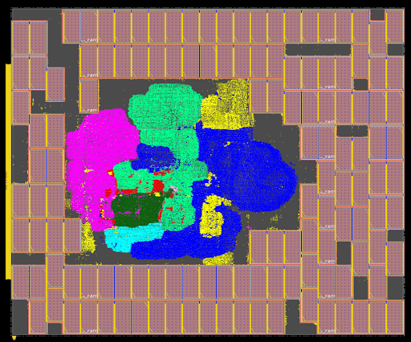
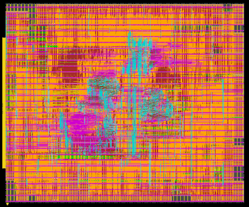

**September 19:**
We updated the detailed algorithm for [gridding](../../CodeElements/Gridding) in Circuit Training.
In constrast to the open-source [grid_size_selection.py](https://github.com/google-research/circuit_training/blob/main/circuit_training/grouping/grid_size_selection.py) in Circuit Training repo, which still calls the wrapper functions of plc client, our python scripts implement
the gridding from sractch and are easy to understand. The results of our scripts match exactly that of Circuit Training.

**September 21:**
We updated the detailed algorithm for [grouping](../../CodeElements/Grouping) and [Clustering](../../CodeElements/Clustering). Here we explictly shows how the netlist information such as net model is used during grouping and clustering, while the open-source Circuit Training implementation still calls the wrapper function of plc client to get netlist information.

Among the more notable details that were not apparent from the Nature paper or the Circuit Training repo:
- For the gridding, we summarized the detailed algorithm for the entire gridding process. We also provided the details for macro packing and metric calculation.
- For the grouping, we identified how to translate the protocol buffer netlist into the hypergraph, which is the input to the hMETIS hypergraph partitioner when the gate-level netlist is clustered into soft macros.
- For the grouping, we also identified the details for each step: grouping the macro pins of the same macro into a cluster; grouping the IOs that are within close proximity of each other, boundary by boundary; grouping the closely-related standard cells, which connect to the same macro or the same IO cluster.
- For the clustering, we solved the following key issues: what exactly is the Hypergraph, and how is it partitioned? How to break up clusters that span a distance larger than breakup_threshold? And how to recursively merge small adjacent clusters?
  
**September 30:**  

**Circuit Training Baseline Result on “Our bp_quad-NanGate45_68”.**
We have trained CT to generate a macro placement for the [bp_quad design](../../Flows/NanGate45/bp_quad/). For this experiment we use the NanGate45 enablement; the initial canvas size is generated by setting utilization to 68%. We use the default hyperparameters used for Ariane to train CT for bp_quad design. The number of hard macros in bp_quad is 220, so we update [max_sequence_length](https://github.com/google-research/circuit_training/blob/6a76e327a70b5f0c9e3291b57c085688386da04e/circuit_training/learning/ppo_collect.py#L53) to 221 in [ppo_collect.py](https://github.com/google-research/circuit_training/blob/6a76e327a70b5f0c9e3291b57c085688386da04e/circuit_training/learning/ppo_collect.py#L53) and [sequence_length](https://github.com/google-research/circuit_training/blob/6a76e327a70b5f0c9e3291b57c085688386da04e/circuit_training/learning/train_ppo.py#L57) to 221 in train_ppo.py.

<table>
<thead>
  <tr>
    <th colspan="10">
bp_quad-NG45-68% CT result (<a href="https://tensorboard.dev/experiment/QCD0s8OaQ1eIBv1njOMtOw/">Link</a> to Tensorboard) (<a href="#bp_quad_NG45_CMP">Link</a> to corresponding CMP result)
</th>
  </tr>
</thead>
<tbody>
  <tr>
    <td>Physical Design Stage</td>
    <td>Core Area (um^2)</td>
    <td>Standard Cell Area (um^2)</td>
    <td>Macro Area (um^2)</td>
    <td>Total Power (mW)</td>
    <td>Wirelength (um)</td>
    <td>WS (ns)</td>
    <td>TNS (ns)</td>
    <td>Congestion (H)</td>
    <td>Congestion (V)</td>
  </tr>
  <tr>
    <td>postSynth</td>
    <td>8449457</td>
    <td>1828674</td>
    <td>3917822</td>
    <td>1903.716</td>
    <td>36067460</td>
    <td>0.325</td>
    <td>0</td>
    <td></td>
    <td></td>
  </tr>
  <tr>
    <td>preCTS</td>
    <td>8449457</td>
    <td>1827246</td>
    <td>3917822</td>
    <td>2042.610</td>
    <td>35593805</td>
    <td>-0.015</td>
    <td>-0.64</td>
    <td>0.12%</td>
    <td>0.19%</td>
  </tr>
  <tr>
    <td>postCTS</td>
    <td>8449457</td>
    <td>1836549</td>
    <td>3917822</td>
    <td>2214.398</td>
    <td>35633384</td>
    <td>0</td>
    <td>0</td>
    <td>0.14%</td>
    <td>0.22%</td>
  </tr>
  <tr>
    <td>postRoute</td>
    <td>8449457</td>
    <td>1836549</td>
    <td>3917822</td>
    <td>2197.750</td>
    <td>36681437</td>
    <td>-0.11</td>
    <td>-63.817</td>
    <td></td>
    <td></td>
  </tr>
  <tr>
    <td>postRouteOpt</td>
    <td>8449457</td>
    <td>1836148</td>
    <td>3917822</td>
    <td>2197.478</td>
    <td>36718051</td>
    <td>-0.003</td>
    <td>-0.013</td>
    <td></td>
    <td></td>
  </tr>
</tbody>
</table>

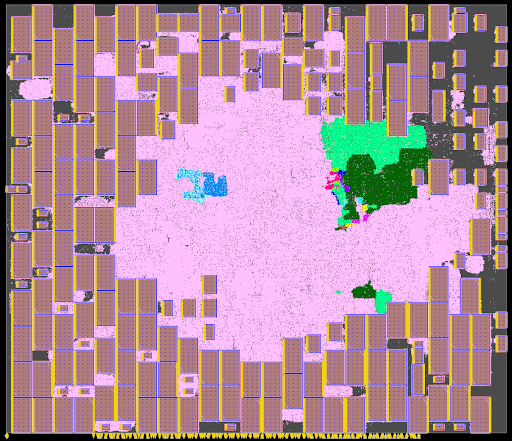
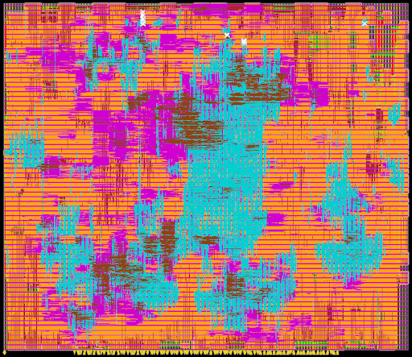

<table>
<thead>
  <tr>
    <th colspan="10">
bp_quad-NG45-68% CMP result (<a href="#bp_quad_NG45_CT">Link</a> to corresponding CT result)
</th>
  </tr>
</thead>
<tbody>
  <tr>
    <td>Physical Design Stage</td>
    <td>Core Area (um^2)</td>
    <td>Standard Cell Area (um^2)</td>
    <td>Macro Area (um^2)</td>
    <td>Total Power (mW)</td>
    <td>Wirelength (um)</td>
    <td>WS (ns)</td>
    <td>TNS (ns)</td>
    <td>Congestion (H)</td>
    <td>Congestion (V)</td>
  </tr>
  <tr>
    <td>postSynth</td>
    <td>8449457</td>
    <td>1808903</td>
    <td>3917822</td>
    <td>1875.440</td>
    <td>20854975</td>
    <td>0.327</td>
    <td>0</td>
    <td></td>
    <td></td>
  </tr>
  <tr>
    <td>preCTS</td>
    <td>8449457</td>
    <td>1814511</td>
    <td>3917822</td>
    <td>1990.066</td>
    <td>20766279</td>
    <td>-0.004</td>
    <td>-0.041</td>
    <td>0.02%</td>
    <td>0.04%</td>
  </tr>
  <tr>
    <td>postCTS</td>
    <td>8449457</td>
    <td>1824057</td>
    <td>3917822</td>
    <td>2160.034</td>
    <td>20870489</td>
    <td>0</td>
    <td>0</td>
    <td>0.03%</td>
    <td>0.05%</td>
  </tr>
  <tr>
    <td>postRoute</td>
    <td>8449457</td>
    <td>1824057</td>
    <td>3917822</td>
    <td>2159.687</td>
    <td>21535697</td>
    <td>-0.343</td>
    <td>-307.935</td>
    <td></td>
    <td></td>
  </tr>
  <tr>
    <td>postRouteOpt</td>
    <td>8449457</td>
    <td>1824031</td>
    <td>3917822</td>
    <td>2159.211</td>
    <td>21556685</td>
    <td>-0.003</td>
    <td>-0.029</td>
    <td></td>
    <td></td>
  </tr>
</tbody>
</table>
  

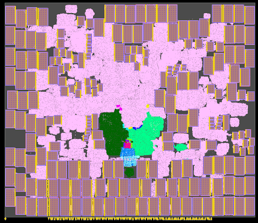
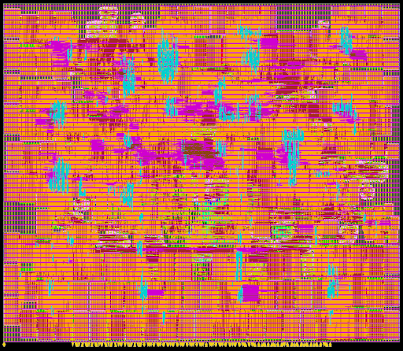

**October 3:**  
We shared the Ariane133-NG45-68% protobuf netlist and clustered netlist with Google engineers. They ran training on the clustered netlist, and the following table shows the Table 1 metrics and proxy cost. **Our training results resemble Google’s results**.
  
<table>
<thead>
  <tr>
    <th colspan="10">Ariane-NG45-68%-4ns CMP result (<a href="#Ariane133_68_CT">Link</a> to Our Result) (<a href="https://tensorboard.dev/experiment/bgFbbhJsRAeaW4YzCox5tA/#scalars">Link</a> to tensorboard)</th>
  </tr>
</thead>
<tbody>
  <tr>
    <td>Physical Design Stage</td>
    <td>Core Area (um^2)</td>
    <td>Standard Cell Area (um^2)</td>
    <td>Macro Area (um^2)</td>
    <td>Total Power (mW)</td>
    <td>Wirelength (um)</td>
    <td>WS (ns)</td>
    <td>TNS (ns)</td>
    <td>Congestion (H)</td>
    <td>Congestion (V)</td>
  </tr>
  <tr>
    <td>preCTS</td>
    <td>1814274</td>
    <td>215608</td>
    <td>1018356</td>
    <td>288.736</td>
    <td>4260100</td>
    <td>-0.001</td>
    <td>-0.001</td>
    <td>0.01%</td>
    <td>0.01%</td>
  </tr>
  <tr>
    <td>postCTS</td>
    <td>1814274</td>
    <td>216693</td>
    <td>1018356</td>
    <td>302.205</td>
    <td>4268402</td>
    <td>0.001</td>
    <td>0</td>
    <td>0.02%</td>
    <td>0.02%</td>
  </tr>
  <tr>
    <td>postRoute</td>
    <td>1814274</td>
    <td>216693</td>
    <td>1018356</td>
    <td>301.129</td>
    <td>4377728</td>
    <td>0.193</td>
    <td>0</td>
    <td></td>
    <td></td>
  </tr>
</tbody>
</table>

  

<table>
<thead>
  <tr>
    <th>Cost</th>
    <th>Ours</th>
    <th>Google’s</th>
  </tr>
</thead>
<tbody>
  <tr>
    <td>Wirelength</td>
    <td>0.0999</td>
    <td>0.1023</td>
  </tr>
  <tr>
    <td>Congestion</td>
    <td>0.8906</td>
    <td>0.9175</td>
  </tr>
  <tr>
    <td>Density</td>
    <td>0.4896</td>
    <td>0.4773</td>
  </tr>
  <tr>
    <td>Proxy</td>
    <td>0.7900</td>
    <td>0.7997</td>
  </tr>
</tbody>
</table>

  

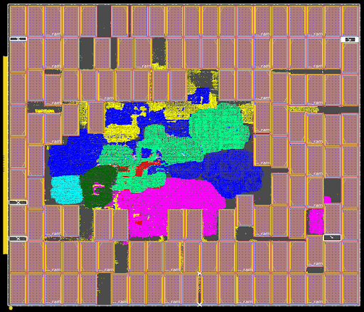
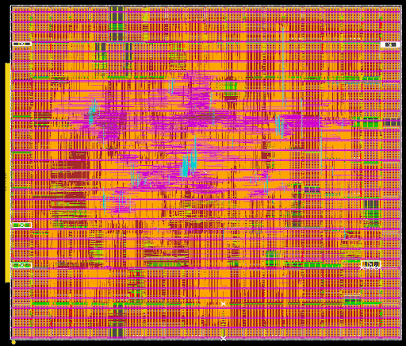

**October 8:**  

**Question 9.** Are CT results stable? If not, how much does the outcome vary?  

We see from the results in the [CT repo](https://github.com/google-research/circuit_training/blob/main/docs/ARIANE.md#results) that the outcomes of three runs with the same seed value are different. We ran six CT runs for Ariane133-NG45-68%-1.3ns design, and the following tables show the Table 1 metrics and the proxy cost details.

<table>
<thead>
  <tr>
    <th>Metrics</th>
    <th><a href="https://tensorboard.dev/experiment/t0aEPJbLQNyQCVtdVpbluA/">Run1</a></th>
    <th><a href="https://tensorboard.dev/experiment/WHmeHyVkQhGWJ6PphyUESg/">Run2</a></th>
    <th><a href="https://tensorboard.dev/experiment/vi1C12KzS2OiXgWz5PBSDw/">Run3</a></th>
    <th><a href="https://tensorboard.dev/experiment/AcoSNxRRR9qoevO4k6NYWg/">Run4</a></th>
    <th><a href="https://tensorboard.dev/experiment/k2YYfAuJTPKLQmiAP0KSqA/">Run5</a></th>
    <th><a href="https://tensorboard.dev/experiment/yauwzk5JRZCG2NnW32omDA/">Run6</a></th>
  </tr>
</thead>
<tbody>
  <tr>
    <td>core_area(um^2)</td>
    <td>1814274</td>
    <td>1814274</td>
    <td>1814274</td>
    <td>1814274</td>
    <td>1814274</td>
    <td>1814274</td>
  </tr>
  <tr>
    <td>macro_area(um^2)</td>
    <td>1018356</td>
    <td>1018356</td>
    <td>1018356</td>
    <td>1018356</td>
    <td>1018356</td>
    <td>1018356</td>
  </tr>
  <tr>
    <td>postSynth_std_cell_area(um^2)</td>
    <td>245871</td>
    <td>243223</td>
    <td>242695</td>
    <td>243382</td>
    <td>246725</td>
    <td>242711</td>
  </tr>
  <tr>
    <td>preCTS_std_cell_area(um^2)</td>
    <td>245235</td>
    <td>244615</td>
    <td>245921</td>
    <td>243693</td>
    <td>245426</td>
    <td>241760</td>
  </tr>
  <tr>
    <td>postCTS_std_cell_area(um^2)</td>
    <td>247138</td>
    <td>245862</td>
    <td>246186</td>
    <td>246099</td>
    <td>247774</td>
    <td>244237</td>
  </tr>
  <tr>
    <td>postRoute_std_cell_area(um^2)</td>
    <td>247138</td>
    <td>245862</td>
    <td>246186</td>
    <td>246099</td>
    <td>247774</td>
    <td>244237</td>
  </tr>
  <tr>
    <td>postRouteOpt_std_cell_area(um^2)</td>
    <td>247725</td>
    <td>246159</td>
    <td>246776</td>
    <td>246498</td>
    <td>248151</td>
    <td>244594</td>
  </tr>
  <tr>
    <td>postSynth_total_power(mw)</td>
    <td>757.853</td>
    <td>751.37</td>
    <td>755.971</td>
    <td>769.154</td>
    <td>760.549</td>
    <td>759.477</td>
  </tr>
  <tr>
    <td>preCTS_total_power(mw)</td>
    <td>795.381</td>
    <td>791.633</td>
    <td>794.2</td>
    <td>793.175</td>
    <td>794.542</td>
    <td>790.433</td>
  </tr>
  <tr>
    <td>postCTS_total_power(mw)</td>
    <td>837.759</td>
    <td>833.972</td>
    <td>833.019</td>
    <td>837.791</td>
    <td>837.733</td>
    <td>833.350</td>
  </tr>
  <tr>
    <td>postRoute_total_power(mw)</td>
    <td>835.807</td>
    <td>832.593</td>
    <td>831.162</td>
    <td>836.205</td>
    <td>836.124</td>
    <td>831.401</td>
  </tr>
  <tr>
    <td>postRouteOpt_total_power(mw)</td>
    <td>836.529</td>
    <td>832.975</td>
    <td>831.524</td>
    <td>836.826</td>
    <td>835.521</td>
    <td>831.911</td>
  </tr>
  <tr>
    <td>preCTS_wirelength(um)</td>
    <td>4792929</td>
    <td>4495121</td>
    <td>4709296</td>
    <td>4673400</td>
    <td>4735851</td>
    <td>4902798</td>
  </tr>
  <tr>
    <td>postCTS_wirelength(um)</td>
    <td>4833093</td>
    <td>4529411</td>
    <td>4749013</td>
    <td>4690341</td>
    <td>4777561</td>
    <td>4929463</td>
  </tr>
  <tr>
    <td>postRoute_wirelength(um)</td>
    <td>4955517</td>
    <td>4649621</td>
    <td>4869873</td>
    <td>4816827</td>
    <td>4903796</td>
    <td>5054361</td>
  </tr>
  <tr>
    <td>postRouteOpt_wirelength(um)</td>
    <td>4960472</td>
    <td>4654146</td>
    <td>4875070</td>
    <td>4821225</td>
    <td>4908694</td>
    <td>5059042</td>
  </tr>
  <tr>
    <td>postSynt_WS(ns)</td>
    <td>-0.764</td>
    <td>-0.764</td>
    <td>-0.764</td>
    <td>-0.764</td>
    <td>-0.764</td>
    <td>-0.764</td>
  </tr>
  <tr>
    <td>preCTS_WS(ns)</td>
    <td>-0.135</td>
    <td>-0.104</td>
    <td>-0.109</td>
    <td>-0.1</td>
    <td>-0.086</td>
    <td>-0.091</td>
  </tr>
  <tr>
    <td>postCTS_WS(ns)</td>
    <td>-0.102</td>
    <td>-0.056</td>
    <td>-0.069</td>
    <td>-0.106</td>
    <td>-0.077</td>
    <td>-0.08</td>
  </tr>
  <tr>
    <td>postRoute_WS(ns)</td>
    <td>-0.134</td>
    <td>-0.077</td>
    <td>-0.102</td>
    <td>-0.13</td>
    <td>-0.106</td>
    <td>-0.089</td>
  </tr>
  <tr>
    <td>postRouteOpt_WS(ns)</td>
    <td>-0.133</td>
    <td>-0.076</td>
    <td>-0.105</td>
    <td>-0.135</td>
    <td>-0.081</td>
    <td>-0.083</td>
  </tr>
  <tr>
    <td>postSynt_TNS(ns)</td>
    <td>-366.528</td>
    <td>-592.301</td>
    <td>-501.314</td>
    <td>-363.351</td>
    <td>-405.145</td>
    <td>-342.59</td>
  </tr>
  <tr>
    <td>preCTS_TNS(ns)</td>
    <td>-196.114</td>
    <td>-136.662</td>
    <td>-151.307</td>
    <td>-122.663</td>
    <td>-104.413</td>
    <td>-98.21</td>
  </tr>
  <tr>
    <td>postCTS_TNS(ns)</td>
    <td>-76.567</td>
    <td>-13.883</td>
    <td>-40.712</td>
    <td>-60.272</td>
    <td>-27.453</td>
    <td>-21.711</td>
  </tr>
  <tr>
    <td>postRoute_TNS(ns)</td>
    <td>-167.965</td>
    <td>-58.724</td>
    <td>-110.496</td>
    <td>-133.653</td>
    <td>-45.42</td>
    <td>-44.821</td>
  </tr>
  <tr>
    <td>postRouteOpt_TNS(ns)</td>
    <td>-123.027</td>
    <td>-27.571</td>
    <td>-79.826</td>
    <td>-105.775</td>
    <td>-33.286</td>
    <td>-40.314</td>
  </tr>
  <tr>
    <td>preCTS_Congestion (H)</td>
    <td>0.06%</td>
    <td>0.04%</td>
    <td>0.03%</td>
    <td>0.03%</td>
    <td>0.03%</td>
    <td>0.03%</td>
  </tr>
  <tr>
    <td>postCTS_Congestion (H)</td>
    <td>0.09%</td>
    <td>0.03%</td>
    <td>0.04%</td>
    <td>0.03%</td>
    <td>0.04%</td>
    <td>0.05%</td>
  </tr>
  <tr>
    <td>preCTS_Congestion (V)</td>
    <td>0.11%</td>
    <td>0.10%</td>
    <td>0.13%</td>
    <td>0.08%</td>
    <td>0.16%</td>
    <td>0.14%</td>
  </tr>
  <tr>
    <td>postCTS_Congestion (V)</td>
    <td>0.13%</td>
    <td>0.13%</td>
    <td>0.17%</td>
    <td>0.12%</td>
    <td>0.18%</td>
    <td>0.18%</td>
  </tr>
</tbody>
</table>

<table>
<thead>
  <tr>
    <th></th>
    <th>Wirelength cost</th>
    <th>Congestion cost</th>
    <th>Density cost</th>
    <th>Proxy cost</th>
  </tr>
</thead>
<tbody>
  <tr>
    <td>Run1</td>
    <td>0.1052</td>
    <td>0.97</td>
    <td>0.5239</td>
    <td>0.85215</td>
  </tr>
  <tr>
    <td>Run2</td>
    <td>0.1045</td>
    <td>0.9417</td>
    <td>0.5063</td>
    <td>0.8285</td>
  </tr>
  <tr>
    <td>Run3</td>
    <td>0.1033</td>
    <td>0.949</td>
    <td>0.5193</td>
    <td>0.83745</td>
  </tr>
  <tr>
    <td>Run4</td>
    <td>0.1034</td>
    <td>0.9378</td>
    <td>0.5185</td>
    <td>0.8316</td>
  </tr>
  <tr>
    <td>Run5</td>
    <td>0.1056</td>
    <td>0.9328</td>
    <td>0.5418</td>
    <td>0.8429</td>
  </tr>
  <tr>
    <td>Run6</td>
    <td>0.1104</td>
    <td>0.96</td>
    <td>0.5372</td>
    <td>0.8590</td>
  </tr>
  <tr>
    <td>Mean</td>
    <td>0.1054</td>
    <td>0.9486</td>
    <td>0.5245</td>
    <td>0.8419</td>
  </tr>
  <tr>
    <td>STD</td>
    <td>0.0026</td>
    <td>0.0142</td>
    <td>0.0131</td>
    <td>0.0119</td>
  </tr>
</tbody>
</table>
  
We further ran coordinate descent (CD) placer on the CT outcomes and the following tables show the Table 1 metrics and proxy cost details of the CD placer outcomes. **Even though we see a significant improvement in the proxy cost, we do not see similar improvement in the Table 1 metric**.

<table>
<thead>
  <tr>
    <th>Metrics</th>
    <th>Run1_CD</th>
    <th>Run2_CD</th>
    <th>Run3_CD</th>
    <th>Run4_CD</th>
    <th>Run5_CD</th>
    <th>Run6_CD</th>
  </tr>
</thead>
<tbody>
  <tr>
    <td>core_area (um2)</td>
    <td>1814274</td>
    <td>1814274</td>
    <td>1814274</td>
    <td>1814274</td>
    <td>1814274</td>
    <td>1814274</td>
  </tr>
  <tr>
    <td>macro_area (um2)</td>
    <td>1018356</td>
    <td>1018356</td>
    <td>1018356</td>
    <td>1018356</td>
    <td>1018356</td>
    <td>1018356</td>
  </tr>
  <tr>
    <td>postSynth_std_cell_area (um2)</td>
    <td>243566</td>
    <td>244506</td>
    <td>244016</td>
    <td>244368</td>
    <td>242548</td>
    <td>247357</td>
  </tr>
  <tr>
    <td>preCTS_std_cell_area (um2)</td>
    <td>243267</td>
    <td>241949</td>
    <td>240051</td>
    <td>245803</td>
    <td>242336</td>
    <td>245297</td>
  </tr>
  <tr>
    <td>postCTS_std_cell_area (um2)</td>
    <td>246719</td>
    <td>244046</td>
    <td>241932</td>
    <td>247881</td>
    <td>244474</td>
    <td>247763</td>
  </tr>
  <tr>
    <td>postRoute_std_cell_area (um2)</td>
    <td>246719</td>
    <td>244046</td>
    <td>241932</td>
    <td>247881</td>
    <td>244474</td>
    <td>247763</td>
  </tr>
  <tr>
    <td>postRouteOpt_std_cell_area (um2)</td>
    <td>247000</td>
    <td>243860</td>
    <td>241282</td>
    <td>248055</td>
    <td>245020</td>
    <td>248377</td>
  </tr>
  <tr>
    <td>postSynth_total_power (mW)</td>
    <td>736.564</td>
    <td>747.327</td>
    <td>758.3497</td>
    <td>749.487</td>
    <td>752.643</td>
    <td>750.437</td>
  </tr>
  <tr>
    <td>preCTS_total_power (mW)</td>
    <td>790.601</td>
    <td>788.404</td>
    <td>785.7521</td>
    <td>797.216</td>
    <td>789.500</td>
    <td>794.160</td>
  </tr>
  <tr>
    <td>postCTS_total_power (mW)</td>
    <td>835.029</td>
    <td>830.542</td>
    <td>827.7217</td>
    <td>839.145</td>
    <td>832.896</td>
    <td>836.920</td>
  </tr>
  <tr>
    <td>postRoute_total_power (mW)</td>
    <td>833.305</td>
    <td>829.015</td>
    <td>825.9415</td>
    <td>837.320</td>
    <td>830.757</td>
    <td>835.113</td>
  </tr>
  <tr>
    <td>postRouteOpt_total_power (mW)</td>
    <td>833.109</td>
    <td>828.801</td>
    <td>824.8444</td>
    <td>837.595</td>
    <td>831.417</td>
    <td>835.770</td>
  </tr>
  <tr>
    <td>preCTS_wirelength (um)</td>
    <td>4807227</td>
    <td>4481988</td>
    <td>4663403</td>
    <td>4645833</td>
    <td>4742585</td>
    <td>4813011</td>
  </tr>
  <tr>
    <td>postCTS_wirelength (um)</td>
    <td>4830788</td>
    <td>4501231</td>
    <td>4680124</td>
    <td>4683338</td>
    <td>4779530</td>
    <td>4839729</td>
  </tr>
  <tr>
    <td>postRoute_wirelength (um)</td>
    <td>4955395</td>
    <td>4621695</td>
    <td>4804536</td>
    <td>4809309</td>
    <td>4896653</td>
    <td>4965139</td>
  </tr>
  <tr>
    <td>postRouteOpt_wirelength (um)</td>
    <td>4960842</td>
    <td>4626687</td>
    <td>4809650</td>
    <td>4814381</td>
    <td>4901760</td>
    <td>4969937</td>
  </tr>
  <tr>
    <td>postSynt_WS (ns)</td>
    <td>-0.764</td>
    <td>-0.764</td>
    <td>-0.764</td>
    <td>-0.764</td>
    <td>-0.764</td>
    <td>-0.764</td>
  </tr>
  <tr>
    <td>preCTS_WS (ns)</td>
    <td>-0.11</td>
    <td>-0.092</td>
    <td>-0.065</td>
    <td>-0.115</td>
    <td>-0.105</td>
    <td>-0.143</td>
  </tr>
  <tr>
    <td>postCTS_WS (ns)</td>
    <td>-0.102</td>
    <td>-0.058</td>
    <td>-0.056</td>
    <td>-0.101</td>
    <td>-0.094</td>
    <td>-0.11</td>
  </tr>
  <tr>
    <td>postRoute_WS (ns)</td>
    <td>-0.135</td>
    <td>-0.076</td>
    <td>-0.088</td>
    <td>-0.107</td>
    <td>-0.11</td>
    <td>-0.14</td>
  </tr>
  <tr>
    <td>postRouteOpt_WS (ns)</td>
    <td>-0.129</td>
    <td>-0.062</td>
    <td>-0.055</td>
    <td>-0.101</td>
    <td>-0.109</td>
    <td>-0.137</td>
  </tr>
  <tr>
    <td>postSynt_TNS (ns)</td>
    <td>-351.045</td>
    <td>-331.782</td>
    <td>-406.717</td>
    <td>-431.986</td>
    <td>-450.335</td>
    <td>-444.635</td>
  </tr>
  <tr>
    <td>preCTS_TNS (ns)</td>
    <td>-133.192</td>
    <td>-90.187</td>
    <td>-57.052</td>
    <td>-152.966</td>
    <td>-139.133</td>
    <td>-196.673</td>
  </tr>
  <tr>
    <td>postCTS_TNS (ns)</td>
    <td>-55.003</td>
    <td>-19.074</td>
    <td>-8.908</td>
    <td>-47.75</td>
    <td>-52.329</td>
    <td>-101.123</td>
  </tr>
  <tr>
    <td>postRoute_TNS (ns)</td>
    <td>-145.14</td>
    <td>-31.185</td>
    <td>-15.033</td>
    <td>-82.306</td>
    <td>-96.749</td>
    <td>-157.245</td>
  </tr>
  <tr>
    <td>postRouteOpt_TNS (ns)</td>
    <td>-109.739</td>
    <td>-12.692</td>
    <td>-8.418</td>
    <td>-60.53</td>
    <td>-66.632</td>
    <td>-126.007</td>
  </tr>
  <tr>
    <td>preCTS_Congestion (H)</td>
    <td>0.03%</td>
    <td>0.03%</td>
    <td>0.07%</td>
    <td>0.05%</td>
    <td>0.04%</td>
    <td>0.04%</td>
  </tr>
  <tr>
    <td>postCTS_Congestion (H)</td>
    <td>0.03%</td>
    <td>0.03%</td>
    <td>0.07%</td>
    <td>0.05%</td>
    <td>0.04%</td>
    <td>0.05%</td>
  </tr>
  <tr>
    <td>preCTS_Congestion (V)</td>
    <td>0.16%</td>
    <td>0.12%</td>
    <td>0.10%</td>
    <td>0.15%</td>
    <td>0.17%</td>
    <td>0.14%</td>
  </tr>
  <tr>
    <td>postCTS_Congestion (V)</td>
    <td>0.19%</td>
    <td>0.16%</td>
    <td>0.10%</td>
    <td>0.18%</td>
    <td>0.21%</td>
    <td>0.15%</td>
  </tr>
</tbody>
</table>

<table>
<thead>
  <tr>
    <th></th>
    <th>Wirelength cost</th>
    <th>Congestion cost</th>
    <th>Density cost</th>
    <th>Proxy cost</th>
  </tr>
</thead>
<tbody>
  <tr>
    <td>Run1_CD</td>
    <td>0.0944</td>
    <td>0.7942</td>
    <td>0.4927</td>
    <td>0.73785</td>
  </tr>
  <tr>
    <td>Run2_CD</td>
    <td>0.089</td>
    <td>0.7829</td>
    <td>0.4925</td>
    <td>0.7267</td>
  </tr>
  <tr>
    <td>Run3_CD</td>
    <td>0.0928</td>
    <td>0.796</td>
    <td>0.4931</td>
    <td>0.73735</td>
  </tr>
  <tr>
    <td>Run4_CD</td>
    <td>0.0957</td>
    <td>0.8104</td>
    <td>0.4951</td>
    <td>0.7485</td>
  </tr>
  <tr>
    <td>Run5_CD</td>
    <td>0.0909</td>
    <td>0.7799</td>
    <td>0.4933</td>
    <td>0.7275</td>
  </tr>
  <tr>
    <td>Run6_CD</td>
    <td>0.0922</td>
    <td>0.7843</td>
    <td>0.4934</td>
    <td>0.7311</td>
  </tr>
  <tr>
    <td>Mean</td>
    <td>0.0925</td>
    <td>0.7913</td>
    <td>0.4934</td>
    <td>0.7348</td>
  </tr>
  <tr>
    <td>STD</td>
    <td>0.0024</td>
    <td>0.0114</td>
    <td>0.0009</td>
    <td>0.0082</td>
  </tr>
</tbody>
</table>

**October 15:**  

**Question 10.** What is the correlation between proxy cost and the post RouteOpt metrics?  

We have collected macro placement generated by CT runs for Ariane133-NG45-68%-1.3ns that have proxy cost less than 0.9. There are ~40 such macro placements over four CT runs. From that 15 runs are chosen randomly, two runs from each bucket of proxy cost (0.9-i*0.01, 0.9-(i+1)*0.01] s.t. i ε [0, 6] and one run from (0.82, 0.83]. Table 1 metrics and proxy costs of these 15 runs are available in the following table.

<table>
<thead>
  <tr>
    <th></th>
    <th>RUN1</th>
    <th>RUN2</th>
    <th>RUN3</th>
    <th>RUN4</th>
    <th>RUN5</th>
    <th>RUN6</th>
    <th>RUN7</th>
    <th>RUN8</th>
    <th>RUN9</th>
    <th>RUN10</th>
    <th>RUN11</th>
    <th>RUN12</th>
    <th>RUN13</th>
    <th>RUN14</th>
    <th>RUN15</th>
  </tr>
</thead>
<tbody>
  <tr>
    <td>core_area (um^2)</td>
    <td>1814274</td>
    <td>1814274</td>
    <td>1814274</td>
    <td>1814274</td>
    <td>1814274</td>
    <td>1814274</td>
    <td>1814274</td>
    <td>1814274</td>
    <td>1814274</td>
    <td>1814274</td>
    <td>1814274</td>
    <td>1814274</td>
    <td>1814274</td>
    <td>1814274</td>
    <td>1814274</td>
  </tr>
  <tr>
    <td>macro_area (um^2)</td>
    <td>1018356</td>
    <td>1018356</td>
    <td>1018356</td>
    <td>1018356</td>
    <td>1018356</td>
    <td>1018356</td>
    <td>1018356</td>
    <td>1018356</td>
    <td>1018356</td>
    <td>1018356</td>
    <td>1018356</td>
    <td>1018356</td>
    <td>1018356</td>
    <td>1018356</td>
    <td>1018356</td>
  </tr>
  <tr>
    <td>postSynth_std_cell_area (um^2)</td>
    <td>242067</td>
    <td>243116</td>
    <td>243055</td>
    <td>246488</td>
    <td>243788</td>
    <td>244004</td>
    <td>244090</td>
    <td>244844</td>
    <td>245083</td>
    <td>246072</td>
    <td>240942</td>
    <td>246725</td>
    <td>242695</td>
    <td>243643</td>
    <td>243223</td>
  </tr>
  <tr>
    <td>preCTS_std_cell_area (um^2)</td>
    <td>243195</td>
    <td>245232</td>
    <td>242421</td>
    <td>244504</td>
    <td>244174</td>
    <td>245232</td>
    <td>241542</td>
    <td>246361</td>
    <td>243436</td>
    <td>246115</td>
    <td>244612</td>
    <td>245426</td>
    <td>245921</td>
    <td>244513</td>
    <td>244615</td>
  </tr>
  <tr>
    <td>postCTS_std_cell_area (um^2)</td>
    <td>246379</td>
    <td>247012</td>
    <td>243583</td>
    <td>247185</td>
    <td>246155</td>
    <td>247948</td>
    <td>244115</td>
    <td>248349</td>
    <td>247013</td>
    <td>248156</td>
    <td>246469</td>
    <td>247774</td>
    <td>246186</td>
    <td>247138</td>
    <td>245862</td>
  </tr>
  <tr>
    <td>postRoute_std_cell_area (um^2)</td>
    <td>246379</td>
    <td>247012</td>
    <td>243583</td>
    <td>247185</td>
    <td>246155</td>
    <td>247948</td>
    <td>244115</td>
    <td>248349</td>
    <td>247013</td>
    <td>248156</td>
    <td>246469</td>
    <td>247774</td>
    <td>246186</td>
    <td>247138</td>
    <td>245862</td>
  </tr>
  <tr>
    <td>postRouteOpt_std_cell_area (um^2)</td>
    <td>247121</td>
    <td>247607</td>
    <td>243894</td>
    <td>247394</td>
    <td>246878</td>
    <td>248433</td>
    <td>244274</td>
    <td>248746</td>
    <td>247320</td>
    <td>248770</td>
    <td>247390</td>
    <td>248151</td>
    <td>246776</td>
    <td>247547</td>
    <td>246159</td>
  </tr>
  <tr>
    <td>postSynth_total_power (mw)</td>
    <td>769.520</td>
    <td>753.509</td>
    <td>742.910</td>
    <td>752.287</td>
    <td>752.254</td>
    <td>741.871</td>
    <td>756.514</td>
    <td>753.901</td>
    <td>753.265</td>
    <td>749.084</td>
    <td>750.949</td>
    <td>760.549</td>
    <td>755.971</td>
    <td>753.220</td>
    <td>751.370</td>
  </tr>
  <tr>
    <td>preCTS_total_power (mw)</td>
    <td>791.074</td>
    <td>793.708</td>
    <td>787.915</td>
    <td>792.428</td>
    <td>791.913</td>
    <td>792.947</td>
    <td>787.022</td>
    <td>791.689</td>
    <td>790.387</td>
    <td>795.202</td>
    <td>791.286</td>
    <td>794.542</td>
    <td>794.200</td>
    <td>791.590</td>
    <td>791.633</td>
  </tr>
  <tr>
    <td>postCTS_total_power (mw)</td>
    <td>834.752</td>
    <td>836.171</td>
    <td>829.367</td>
    <td>834.354</td>
    <td>833.401</td>
    <td>836.912</td>
    <td>830.593</td>
    <td>835.061</td>
    <td>831.509</td>
    <td>833.914</td>
    <td>832.950</td>
    <td>837.733</td>
    <td>833.019</td>
    <td>835.334</td>
    <td>833.972</td>
  </tr>
  <tr>
    <td>postRoute_total_power (mw)</td>
    <td>833.184</td>
    <td>834.695</td>
    <td>828.029</td>
    <td>833.086</td>
    <td>831.875</td>
    <td>835.325</td>
    <td>828.821</td>
    <td>833.941</td>
    <td>830.484</td>
    <td>832.671</td>
    <td>831.772</td>
    <td>836.124</td>
    <td>831.162</td>
    <td>833.983</td>
    <td>832.593</td>
  </tr>
  <tr>
    <td>postRouteOpt_total_power (mw)</td>
    <td>833.961</td>
    <td>835.436</td>
    <td>828.254</td>
    <td>833.318</td>
    <td>832.649</td>
    <td>835.803</td>
    <td>829.066</td>
    <td>834.304</td>
    <td>831.652</td>
    <td>833.287</td>
    <td>832.768</td>
    <td>835.521</td>
    <td>831.524</td>
    <td>834.484</td>
    <td>832.975</td>
  </tr>
  <tr>
    <td>preCTS_wirelength (um)</td>
    <td>4728745</td>
    <td>4717333</td>
    <td>4642346</td>
    <td>4628632</td>
    <td>4659824</td>
    <td>4873402</td>
    <td>4882098</td>
    <td>4543637</td>
    <td>4649807</td>
    <td>4709934</td>
    <td>4486281</td>
    <td>4735851</td>
    <td>4709296</td>
    <td>4585732</td>
    <td>4495121</td>
  </tr>
  <tr>
    <td>postCTS_wirelength (um)</td>
    <td>4762085</td>
    <td>4757761</td>
    <td>4674012</td>
    <td>4665159</td>
    <td>4693884</td>
    <td>4912764</td>
    <td>4918705</td>
    <td>4585918</td>
    <td>4677979</td>
    <td>4742407</td>
    <td>4522423</td>
    <td>4777561</td>
    <td>4749013</td>
    <td>4616680</td>
    <td>4529411</td>
  </tr>
  <tr>
    <td>postRoute_wirelength (um)</td>
    <td>4885433</td>
    <td>4888249</td>
    <td>4797431</td>
    <td>4795134</td>
    <td>4817647</td>
    <td>5042041</td>
    <td>5043542</td>
    <td>4716210</td>
    <td>4807107</td>
    <td>4869741</td>
    <td>4650492</td>
    <td>4903796</td>
    <td>4869873</td>
    <td>4742247</td>
    <td>4649621</td>
  </tr>
  <tr>
    <td>postRouteOpt_wirelength (um)</td>
    <td>4890958</td>
    <td>4893245</td>
    <td>4802406</td>
    <td>4800104</td>
    <td>4822688</td>
    <td>5047120</td>
    <td>5048498</td>
    <td>4720614</td>
    <td>4811606</td>
    <td>4874840</td>
    <td>4655745</td>
    <td>4908694</td>
    <td>4875070</td>
    <td>4746909</td>
    <td>4654146</td>
  </tr>
  <tr>
    <td>Wirelength_Cost</td>
    <td>0.1042</td>
    <td>0.1011</td>
    <td>0.1032</td>
    <td>0.1014</td>
    <td>0.1032</td>
    <td>0.1055</td>
    <td>0.1064</td>
    <td>0.1027</td>
    <td>0.1048</td>
    <td>0.1027</td>
    <td>0.1023</td>
    <td>0.1056</td>
    <td>0.1033</td>
    <td>0.1053</td>
    <td>0.1045</td>
  </tr>
  <tr>
    <td>postSynt_WS (ns)</td>
    <td>-0.764</td>
    <td>-0.764</td>
    <td>-0.764</td>
    <td>-0.79</td>
    <td>-0.764</td>
    <td>-0.764</td>
    <td>-0.79</td>
    <td>-0.764</td>
    <td>-0.764</td>
    <td>-0.764</td>
    <td>-0.764</td>
    <td>-0.764</td>
    <td>-0.764</td>
    <td>-0.764</td>
    <td>-0.764</td>
  </tr>
  <tr>
    <td>preCTS_WS (ns)</td>
    <td>-0.114</td>
    <td>-0.101</td>
    <td>-0.08</td>
    <td>-0.096</td>
    <td>-0.116</td>
    <td>-0.101</td>
    <td>-0.066</td>
    <td>-0.121</td>
    <td>-0.117</td>
    <td>-0.137</td>
    <td>-0.124</td>
    <td>-0.086</td>
    <td>-0.109</td>
    <td>-0.125</td>
    <td>-0.104</td>
  </tr>
  <tr>
    <td>postCTS_WS (ns)</td>
    <td>-0.088</td>
    <td>-0.08</td>
    <td>-0.036</td>
    <td>-0.066</td>
    <td>-0.098</td>
    <td>-0.076</td>
    <td>-0.021</td>
    <td>-0.098</td>
    <td>-0.096</td>
    <td>-0.053</td>
    <td>-0.104</td>
    <td>-0.077</td>
    <td>-0.069</td>
    <td>-0.109</td>
    <td>-0.056</td>
  </tr>
  <tr>
    <td>postRoute_WS (ns)</td>
    <td>-0.121</td>
    <td>-0.094</td>
    <td>-0.072</td>
    <td>-0.341</td>
    <td>-0.118</td>
    <td>-0.087</td>
    <td>-0.088</td>
    <td>-0.118</td>
    <td>-0.123</td>
    <td>-0.134</td>
    <td>-0.137</td>
    <td>-0.106</td>
    <td>-0.102</td>
    <td>-0.13</td>
    <td>-0.077</td>
  </tr>
  <tr>
    <td>postRouteOpt_WS (ns)</td>
    <td>-0.125</td>
    <td>-0.096</td>
    <td>-0.063</td>
    <td>-0.066</td>
    <td>-0.089</td>
    <td>-0.087</td>
    <td>-0.041</td>
    <td>-0.119</td>
    <td>-0.13</td>
    <td>-0.099</td>
    <td>-0.126</td>
    <td>-0.081</td>
    <td>-0.105</td>
    <td>-0.134</td>
    <td>-0.076</td>
  </tr>
  <tr>
    <td>postSynt_TNS (ns)</td>
    <td>-326.535</td>
    <td>-382.684</td>
    <td>-477.484</td>
    <td>-339.098</td>
    <td>-401.614</td>
    <td>-414.822</td>
    <td>-367.119</td>
    <td>-412.85</td>
    <td>-422.819</td>
    <td>-350.771</td>
    <td>-313.919</td>
    <td>-405.145</td>
    <td>-501.314</td>
    <td>-366.866</td>
    <td>-592.301</td>
  </tr>
  <tr>
    <td>preCTS_TNS (ns)</td>
    <td>-147.905</td>
    <td>-129.089</td>
    <td>-92.977</td>
    <td>-111.456</td>
    <td>-141.654</td>
    <td>-116.344</td>
    <td>-62.661</td>
    <td>-171.687</td>
    <td>-156.067</td>
    <td>-206.043</td>
    <td>-169.834</td>
    <td>-104.413</td>
    <td>-151.307</td>
    <td>-168.846</td>
    <td>-136.662</td>
  </tr>
  <tr>
    <td>postCTS_TNS (ns)</td>
    <td>-69.386</td>
    <td>-67.761</td>
    <td>-4.902</td>
    <td>-34.67</td>
    <td>-60.302</td>
    <td>-41.497</td>
    <td>-2.514</td>
    <td>-83.036</td>
    <td>-62.184</td>
    <td>-27.629</td>
    <td>-122.576</td>
    <td>-27.453</td>
    <td>-40.712</td>
    <td>-55.55</td>
    <td>-13.883</td>
  </tr>
  <tr>
    <td>postRoute_TNS (ns)</td>
    <td>-172.018</td>
    <td>-85.027</td>
    <td>-48.269</td>
    <td>-37.909</td>
    <td>-85.811</td>
    <td>-70.604</td>
    <td>-15.213</td>
    <td>-129.351</td>
    <td>-128.868</td>
    <td>-143.568</td>
    <td>-199.374</td>
    <td>-45.42</td>
    <td>-110.496</td>
    <td>-132.265</td>
    <td>-58.724</td>
  </tr>
  <tr>
    <td>postRouteOpt_TNS (ns)</td>
    <td>-135.838</td>
    <td>-70.139</td>
    <td>-25.199</td>
    <td>-33.755</td>
    <td>-68.666</td>
    <td>-47.43</td>
    <td>-14.211</td>
    <td>-118.13</td>
    <td>-96.63</td>
    <td>-105.577</td>
    <td>-152.772</td>
    <td>-33.286</td>
    <td>-79.826</td>
    <td>-94.025</td>
    <td>-27.571</td>
  </tr>
  <tr>
    <td>preCTS_Congestion (H)</td>
    <td>0.04%</td>
    <td>0.03%</td>
    <td>0.04%</td>
    <td>0.03%</td>
    <td>0.02%</td>
    <td>0.05%</td>
    <td>0.03%</td>
    <td>0.02%</td>
    <td>0.03%</td>
    <td>0.05%</td>
    <td>0.04%</td>
    <td>0.03%</td>
    <td>0.03%</td>
    <td>0.02%</td>
    <td>0.04%</td>
  </tr>
  <tr>
    <td>postCTS_Congestion (H)</td>
    <td>0.05%</td>
    <td>0.04%</td>
    <td>0.05%</td>
    <td>0.06%</td>
    <td>0.04%</td>
    <td>0.05%</td>
    <td>0.04%</td>
    <td>0.05%</td>
    <td>0.04%</td>
    <td>0.04%</td>
    <td>0.06%</td>
    <td>0.04%</td>
    <td>0.04%</td>
    <td>0.03%</td>
    <td>0.03%</td>
  </tr>
  <tr>
    <td>preCTS_Congestion (V)</td>
    <td>0.17%</td>
    <td>0.16%</td>
    <td>0.11%</td>
    <td>0.14%</td>
    <td>0.16%</td>
    <td>0.11%</td>
    <td>0.16%</td>
    <td>0.13%</td>
    <td>0.15%</td>
    <td>0.12%</td>
    <td>0.14%</td>
    <td>0.16%</td>
    <td>0.13%</td>
    <td>0.11%</td>
    <td>0.10%</td>
  </tr>
  <tr>
    <td>postCTS_Congestion (V)</td>
    <td>0.16%</td>
    <td>0.14%</td>
    <td>0.13%</td>
    <td>0.13%</td>
    <td>0.15%</td>
    <td>0.12%</td>
    <td>0.16%</td>
    <td>0.14%</td>
    <td>0.18%</td>
    <td>0.13%</td>
    <td>0.15%</td>
    <td>0.18%</td>
    <td>0.17%</td>
    <td>0.14%</td>
    <td>0.13%</td>
  </tr>
  <tr>
    <td>Congestion_Cost</td>
    <td>1.0192</td>
    <td>0.9983</td>
    <td>1.0115</td>
    <td>1.0062</td>
    <td>0.9894</td>
    <td>1.006</td>
    <td>0.9813</td>
    <td>0.9966</td>
    <td>0.9932</td>
    <td>0.9587</td>
    <td>0.9672</td>
    <td>0.9328</td>
    <td>0.949</td>
    <td>0.9439</td>
    <td>0.9417</td>
  </tr>
  <tr>
    <td>Wirelength_Cost</td>
    <td>0.1042</td>
    <td>0.1011</td>
    <td>0.1032</td>
    <td>0.1014</td>
    <td>0.1032</td>
    <td>0.1055</td>
    <td>0.1064</td>
    <td>0.1027</td>
    <td>0.1048</td>
    <td>0.1027</td>
    <td>0.1023</td>
    <td>0.1056</td>
    <td>0.1033</td>
    <td>0.1053</td>
    <td>0.1045</td>
  </tr>
  <tr>
    <td>Congestion_Cost</td>
    <td>1.0192</td>
    <td>0.9983</td>
    <td>1.0115</td>
    <td>1.0062</td>
    <td>0.9894</td>
    <td>1.006</td>
    <td>0.9813</td>
    <td>0.9966</td>
    <td>0.9932</td>
    <td>0.9587</td>
    <td>0.9672</td>
    <td>0.9328</td>
    <td>0.949</td>
    <td>0.9439</td>
    <td>0.9417</td>
  </tr>
  <tr>
    <td>Density_Cost</td>
    <td>0.5622</td>
    <td>0.5923</td>
    <td>0.5543</td>
    <td>0.5622</td>
    <td>0.5523</td>
    <td>0.5354</td>
    <td>0.5409</td>
    <td>0.53</td>
    <td>0.5113</td>
    <td>0.5439</td>
    <td>0.5215</td>
    <td>0.5418</td>
    <td>0.5193</td>
    <td>0.5136</td>
    <td>0.5063</td>
  </tr>
  <tr>
    <td>Proxy_Cost</td>
    <td>0.8949</td>
    <td>0.8964</td>
    <td>0.8861</td>
    <td>0.8856</td>
    <td>0.87405</td>
    <td>0.8762</td>
    <td>0.8675</td>
    <td>0.866</td>
    <td>0.85705</td>
    <td>0.854</td>
    <td>0.84665</td>
    <td>0.8429</td>
    <td>0.83745</td>
    <td>0.83405</td>
    <td>0.8285</td>
  </tr>
</tbody>
</table>

In the following table we report the Kendall rank correlation coefficient for proxy costs and postPlaceOpt metrics and for proxy costs and postRouteOpt metrics. Here values near +1, -1 indicate high correlation or anti-correlation and values near 0 indicate high miscorrelation.
  
<table>
<thead>
  <tr>
    <th colspan="8">Correlation between PostPlaceOpt metrics and proxy cost</th>
  </tr>
</thead>
<tbody>
  <tr>
    <td>Cost</td>
    <td>Std Cell Area</td>
    <td>Wirelength</td>
    <td>Total Power</td>
    <td>Worst Slack</td>
    <td>TNS</td>
    <td>Congestion (V)</td>
    <td>Congestion (H)</td>
  </tr>
  <tr>
    <td>Wirelength</td>
    <td>-0.09662</td>
    <td>0.33655</td>
    <td>-0.12501</td>
    <td>0.32851</td>
    <td>0.29809</td>
    <td>-0.06098</td>
    <td>0.00000</td>
  </tr>
  <tr>
    <td>Congestion</td>
    <td>-0.30622</td>
    <td>0.10476</td>
    <td>-0.23810</td>
    <td>0.17225</td>
    <td>0.14286</td>
    <td>0.18118</td>
    <td>0.13093</td>
  </tr>
  <tr>
    <td>Density</td>
    <td>-0.08654</td>
    <td>0.21053</td>
    <td>0.15311</td>
    <td>0.24038</td>
    <td>0.19139</td>
    <td>0.35399</td>
    <td>0.03289</td>
  </tr>
  <tr>
    <td>Proxy</td>
    <td>-0.22967</td>
    <td>0.23810</td>
    <td>-0.06667</td>
    <td>0.28708</td>
    <td>0.23810</td>
    <td>0.32210</td>
    <td>0.06547</td>
  </tr>
</tbody>
</table>

<table>
<thead>
  <tr>
    <th colspan="6">Correlation between PostRouteOpt metrics and proxy cost</th>
  </tr>
</thead>
<tbody>
  <tr>
    <td>Cost</td>
    <td>Std Cell Area</td>
    <td>Wirelength</td>
    <td>Total Power</td>
    <td>Worst Slack</td>
    <td>TNS</td>
  </tr>
  <tr>
    <td>Wirelength</td>
    <td>-0.22116</td>
    <td>0.31732</td>
    <td>-0.14424</td>
    <td>0.16347</td>
    <td>0.31732</td>
  </tr>
  <tr>
    <td>Congestion</td>
    <td>-0.02857</td>
    <td>0.08571</td>
    <td>-0.00952</td>
    <td>0.10476</td>
    <td>-0.04762</td>
  </tr>
  <tr>
    <td>Density</td>
    <td>0.09569</td>
    <td>0.22967</td>
    <td>0.09569</td>
    <td>0.26795</td>
    <td>0.07656</td>
  </tr>
  <tr>
    <td>Proxy</td>
    <td>-0.00952</td>
    <td>0.25714</td>
    <td>0.04762</td>
    <td>0.20000</td>
    <td>0.04762</td>
  </tr>
</tbody>
</table>

- Kendall rank correlation coefficients indicate poor correlation between proxy cost and postPlaceOpt metrics. Similarly, we see a poor correlation between proxy cost and postRouteOpt metrics.
  - We see the proxy costs of RUN3 and RUN7 are 0.8861 and 0.8675 respectively, which is much higher than the best proxy cost of 0.8285 (corresponding to RUN15), but the total power and TNS for RUN3 and RUN7 are better than RUN15.

**Circuit Training Baseline Result on “Our MemPool_Group-NanGate45_68”.**
We have trained CT to generate a macro placement for the [MemPool Group design](../../Flows/NanGate45/mempool_group/). For this experiment we use the NanGate45 enablement; the initial canvas size is generated by setting utilization to 68%. We use the default hyperparameters used for Ariane to train CT for bp_quad design. The number of hard macros in MemPool Group is 324, so we update [max_sequence_length](https://github.com/google-research/circuit_training/blob/6a76e327a70b5f0c9e3291b57c085688386da04e/circuit_training/learning/ppo_collect.py#L53) to 325 in [ppo_collect.py](https://github.com/google-research/circuit_training/blob/6a76e327a70b5f0c9e3291b57c085688386da04e/circuit_training/learning/ppo_collect.py#L53)  and [sequence_length](https://github.com/google-research/circuit_training/blob/6a76e327a70b5f0c9e3291b57c085688386da04e/circuit_training/learning/train_ppo.py#L57) to 325 in [train_ppo.py](https://github.com/google-research/circuit_training/blob/6a76e327a70b5f0c9e3291b57c085688386da04e/circuit_training/learning/train_ppo.py#L57).

  
<table>
<thead>
  <tr>
    <th colspan="10">MemPool group-NG45-68%-4ns CT result (Flow2. Final DRC Count: 19367) (<a href="https://tensorboard.dev/experiment/32FLUvjVSjaQ0wYO1m9vJQ/#scalars">Link</a> to Tensorboard)</th>
  </tr>
</thead>
<tbody>
  <tr>
    <td>Physical Design Stage</td>
    <td>Core Area (um^2)</td>
    <td>Standard Cell Area (um^2)</td>
    <td>Macro Area (um^2)</td>
    <td>Total Power (mW)</td>
    <td>Wirelength (um)</td>
    <td>WS (ns)</td>
    <td>TNS (ns)</td>
    <td>Congestion (H)</td>
    <td>Congestion (V)</td>
  </tr>
  <tr>
    <td>postSynth</td>
    <td>11371934</td>
    <td>4976373</td>
    <td>3078071</td>
    <td>3149.187</td>
    <td>113753318</td>
    <td>0</td>
    <td>0</td>
    <td></td>
    <td></td>
  </tr>
  <tr>
    <td>preCTS</td>
    <td>11371934</td>
    <td>4916168</td>
    <td>3078071</td>
    <td>2528.429</td>
    <td>113557846</td>
    <td>-0.033</td>
    <td>-42.949</td>
    <td>3.03%</td>
    <td>1.51%</td>
  </tr>
  <tr>
    <td>postCTS</td>
    <td>11371934</td>
    <td>4867885</td>
    <td>3078071</td>
    <td>2707.906</td>
    <td>113908550</td>
    <td>-0.001</td>
    <td>-0.018</td>
    <td>3.55%</td>
    <td>1.76%</td>
  </tr>
  <tr>
    <td>postRoute</td>
    <td>11371934</td>
    <td>4867885</td>
    <td>3078071</td>
    <td>2742.635</td>
    <td>123398335</td>
    <td>-0.749</td>
    <td>-13254.6</td>
    <td></td>
    <td></td>
  </tr>
  <tr>
    <td>postRouteOpt</td>
    <td>11371934</td>
    <td>4861749</td>
    <td>3078071</td>
    <td>2742.982</td>
    <td>123578279</td>
    <td>-0.206</td>
    <td>-26.811</td>
    <td></td>
    <td></td>
  </tr>
</tbody>
</table>

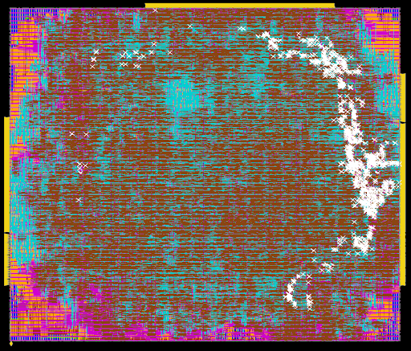

<table>
<thead>
  <tr>
    <th colspan="10">MemPool group-NG45-68%-4ns CMP result (Flow2. Final DRC Count: 26)</th>
  </tr>
</thead>
<tbody>
  <tr>
    <td>Physical Design Stage</td>
    <td>Core Area (um^2)</td>
    <td>Standard Cell Area (um^2)</td>
    <td>Macro Area (um^2)</td>
    <td>Total Power (mW)</td>
    <td>Wirelength (um)</td>
    <td>WS (ns)</td>
    <td>TNS (ns)</td>
    <td>Congestion (H)</td>
    <td>Congestion (V)</td>
  </tr>
  <tr>
    <td>postSynth</td>
    <td>11371934</td>
    <td>4947251</td>
    <td>3078071</td>
    <td>2938.815</td>
    <td>94419498</td>
    <td>0</td>
    <td>0</td>
    <td></td>
    <td></td>
  </tr>
  <tr>
    <td>preCTS</td>
    <td>11371934</td>
    <td>4891095</td>
    <td>3078071</td>
    <td>2402.835</td>
    <td>96594902</td>
    <td>-0.018</td>
    <td>-150.478</td>
    <td>1.72%</td>
    <td>0.78%</td>
  </tr>
  <tr>
    <td>postCTS</td>
    <td>11371934</td>
    <td>4846216</td>
    <td>3078071</td>
    <td>2584.086</td>
    <td>97108227</td>
    <td>-0.003</td>
    <td>-0.043</td>
    <td>1.85%</td>
    <td>0.87%</td>
  </tr>
  <tr>
    <td>postRoute</td>
    <td>11371934</td>
    <td>4846216</td>
    <td>3078071</td>
    <td>2589.973</td>
    <td>102792205</td>
    <td>-0.241</td>
    <td>-4400.6</td>
    <td></td>
    <td></td>
  </tr>
  <tr>
    <td>postRouteOpt</td>
    <td>11371934</td>
    <td>4837150</td>
    <td>3078071</td>
    <td>2586.602</td>
    <td>102907484</td>
    <td>-0.02</td>
    <td>-1.029</td>
    <td></td>
    <td></td>
  </tr>
</tbody>
</table>

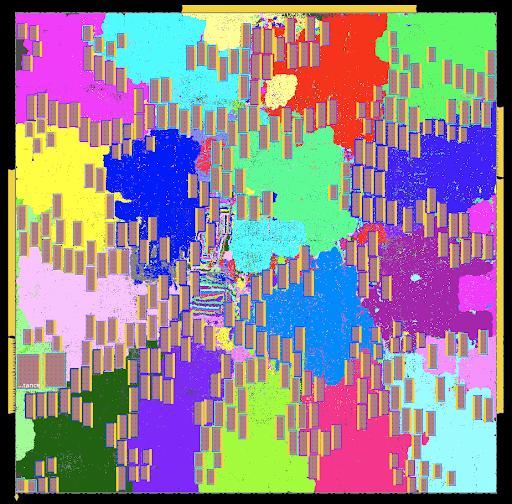
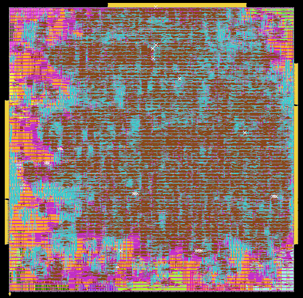

## **Pinned (to bottom) question list:**

**[Question 1](#Question1).** How does having an initial set of placement locations (from physical synthesis) affect the (relative) quality of the CT result?  
**[Question 2](#Question2).** How does utilization affect the (relative) performance of CT?  
**[Question 3](#Question3).** Is a testcase such as Ariane-133 “probative”, or do we need better testcases?  
**[Question 4](#Question4).** How much does the guidance to clustering that comes from (x,y) locations matter?  
**[Question 5](Question5).** What is the impact of the Coordinate Descent (CD) placer on proxy cost and Table 1 metric?  
**[Question 6](#Question6).** Are we using the industry tool in an “expert” manner?  (We believe so.)  
**[Question 7](#Question7).** What happens if we skip CT and continue directly to standard-cell P&R (i.e., the Innovus 21.1 flow) once we have a macro placement from the commercial tool?  
**[Question 8](#Question8).** How does the tightness of timing constraints affect the (relative) performance of CT?   
**[Question 9](#Question9).** Are CT results stable? If not, how much does the outcome vary?  
**[Question 10](#Question10).** What is the correlation between proxy cost and the postRouteOpt Table 1 metrics?  
