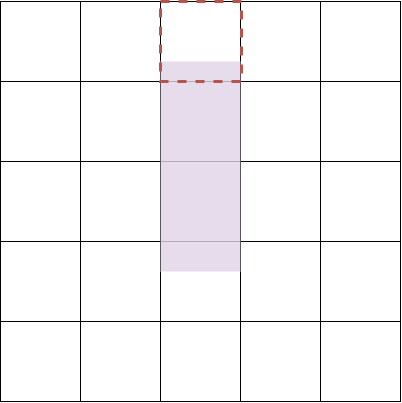
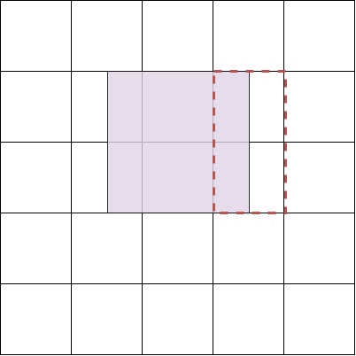

# Proxy Cost Computation in Circuit Training
<i>In this documentation, we use gridcell and grid interchangably. They both mean the grid system induced by the gridding process.</i>

In Circuit Training, *proxy cost* is the weighted sum of wirelength, density, and congestion costs. It is used to determine the overall quality of the macro placement solution. 

<b>Proxy Cost = Wwirelength &times; Costwirelength + Wdensity &times; Costdensity + Wcongestion &times; Costcongestion</b>

 
Where <b>Wwirelength</b>, <b>Wdensity</b> and <b>Wcongestion</b> are the weights. From the [Circuit Training repo](https://github.com/google-research/circuit_training/blob/9e7097fa0c2a82030f43b298259941fc8ca6b7ae/circuit_training/environment/environment.py#L61-L65), we found that <b>Wwirelength = 1</b>, <b>Wdensity = 1</b>, and <b>Wcongestion = 0.5</b>. From communication with Google engineers, we learned that in their internal flow, they use <b>Wwirelength = 1</b>, <b>Wdensity = 0.5</b>, and <b>Wcongestion = 0.5</b>.

Circuit Training repo provides the plc_wrapper_main binary to compute these cost functions. There is no available detailed description, or open-source implementation, of these cost functions. With feedback and confirmations from Google engineers, we have implemented all three cost functions; the source code is available [here](../../CodeElements/Plc_client/plc_client_os.py). In the following, we provide a detailed description of the implementation of these cost functions.

## Comparison with Google's Plc_client
<table class="tg">
<thead>
  <tr>
    <th class="tg-c3ow">Testcase</th>
    <th class="tg-baqh">Method</th>
    <th class="tg-c3ow">HPWL Cost </th>
    <th class="tg-baqh">Density Cost</th>
    <th class="tg-baqh">Congestion Cost</th>
  </tr>
</thead>
<tbody>
  <tr>
    <td class="tg-c3ow" rowspan="2">Google's Ariane</td>
    <td class="tg-baqh">Google</td>
    <td class="tg-c3ow">0.050186608</td>
    <td class="tg-baqh">0.756401122</td>
    <td class="tg-baqh">0.984565650</td>
  </tr>
  <tr>
    <td class="tg-baqh">Our</td>
    <td class="tg-c3ow">0.050186604</td>
    <td class="tg-baqh">0.756401122</td>
    <td class="tg-baqh">0.984565675</td>
  </tr>
  <tr>
    <td class="tg-c3ow" rowspan="2">Ariane NanGate45</td>
    <td class="tg-baqh">Google</td>
    <td class="tg-c3ow">0.387988658</td>
    <td class="tg-baqh">0.500452106</td>
    <td class="tg-baqh">2.448659090</td>
  </tr>
  <tr>
    <td class="tg-baqh">Our</td>
    <td class="tg-c3ow">0.387988659</td>
    <td class="tg-baqh">0.500452101</td>
    <td class="tg-baqh">2.448659182</td>
  </tr>
</tbody>
</table>

## Table of Contents
  - [Wirelength cost computation](#wirelength-cost-computation)
  - [Density cost computation](#density-cost-computation)
  - [Congestion cost computation](#congestion-cost-computation)

## Wirelength cost computation
The wirelength cost function depends on the net (bounding box) half-perimeter wirelength (HPWL). So, first we describe steps to compute HPWL of a net – and then we compute the wirelength cost.  

##### **Procedure to compute net HPWL**
1. Initialize <b>xmin = floatmax</b>, <b>ymin = floatmax</b>, <b>xmax = 0</b>, <b>ymax = 0</b>
2. For each <b>node</b> in net
   1. <b>xmin = min(xmin, node&rarr;x)</b>, <b>ymin = min(ymin, node&rarr;y)</b>
   2. <b>xmax = max(xmax, node&rarr;x)</b>, <b>ymax = max(ymax, node&rarr;y)</b>
3. <b>nethpwl = (xmax - xmin) + (ymax - ymin)</b>
  
A protobuf netlist consists of different types of <b>node</b>s. Different possible types of <b>node</b>s are macro, standard cell, macro pin and port. A net consists of one source <b>node</b> and one or more sink <b>node</b>s. A net can have only standard cell, macro pin and port as its source or sink <b>node</b>s. In the following wirelength cost computation procedure, we use the term net weight, which is the weight of the source <b>node</b> of the net. This weight indicates the total number of connections between the source and each sink <b>node</b>.  

##### **Procedure to compute wirelength cost**
1. <b>hpwl = 0</b>, <b>netcount = 0</b>
2. For each <b>net</b>
   1. Compute <b>nethpwl</b> using the previous procedure
   2. <b>hpwl += net&rarr;weight &times; nethpwl</b>
   3. <b>netcount += net&rarr;weight</b>
3. <b>Costwirelength = hpwl &#8260; [netcount &times; (canvasheight + canvaswidth)]</b>

In the above procedure, <b>canvasheight</b> is the height of the canvas and <b>canvaswidth</b> is the width of the canvas.

## Density cost computation
Density cost function depends on the gridcell density. So, first we describe the steps to compute gridcell density – and then we compute the density cost.

The gridcell density of grid (i, j) is the ratio of the summation of all the overlapped areas (the common area between the node and the grid) of standard cell and macro nodes with the grid (i, j) to the total gridcell area.

##### **Procedure to compute density cost**
1. <b>n =</b> number of rows <b>&times;</b> number of columns
2. <b>k = floor(n &times; 0.1)</b>
3. if <b>k == 0</b>
   1. <b>k = 1</b>
4. <b>Costdensity =</b> (average density of top <b>k</b> densest gridcells) <b>&times; 0.5</b>

Notice that **0.5** is not the “**weight**” of this cost function, but simply another factor applied besides the weight factor from the cost function. Google engineers informed us “ the 0.5 is there to correct the [bloating of the std cell clusters](https://github.com/google-research/circuit_training/blob/9e7097fa0c2a82030f43b298259941fc8ca6b7ae/circuit_training/grouping/grouping.py#L370)”.

## Congestion cost computation
We divide the congestion cost computation into six sub-stages:
1. [Compute horizontal and vertical congestion of each grid due to net routing.](#computation-of-grid-congestion-due-to-net-routing)
2. [Apply smoothing only to grid congestion due to net routing.](#computation-for-smoothing)
3. [Compute congestion of each grid due to macros.](#computation-for-macro-congestion)
4. **Grid horizontal congestion** = horizontal congestion due to macros + horizontal congestion due to net routing after smoothing. 
5. **Grid vertical congestion** = vertical congestion due to macros + vertical congestion due to net routing after smoothing.
6. [Finally, we concatenate the **Grid horizontal congestion** array and the **Grid vertical congestion** array and take the average of the top **5**% of the concatenated list.](#computation-of-the-final-congestion-cost)
  
### Computation of grid congestion due to net routing
We first want to address that the following computation is **"grid-based"** (not to be confused with the conventional n-pin net) derived from gridding. The main differences are instead of looking at each pin location, we only look at grid cells subject to pin locations. This implies that if all net entities (source pin and sink pins) are within the same grid cell, no routing congestion will be computed (except for macro congestions). More formally, we define a n-grid net as a net whose pins occupy n different grids. We also define the grid occupied by the source pin of a net as the source grid of the net, and remaining grids occupied by other pins of the net as sink grids. In other words, if a three-pin net has a source pin in grid g<b>i</b> and two sink pins in the same grid g<b>j</b>, we would consider this as a two-grid net.

Given the above grid-base routing setting, we divide this problem into three sub-problems.
1. [Congestion due to two-grid nets.](#congestion-due-to-two-grid-nets)
2. [Congestion due to three-grid nets.](#congestion-due-to-three-grid-nets)
3. [Congestion due to multi-grid nets where the number of grids is greater than three.](#congestion-due-to-multi-grid-nets-where-the-number-of-grids-is-greater-than-three)

A grid location <b>(i, j)</b> is the intersection of the <b>ith</b> column with the <b>jth</b> row.

For these three problems we consider that the horizontal routing cost due to a net-segment from <b>(i, j)</b> grid to <b>(i+1, j)</b> grid applies only to the grid <b>(i, j)</b>. Similarly the vertical routing cost due to a net-segment from <b>(i, j)</b> grid to <b>(i, j+1)</b> grid applies only to the grid <b>(i, j)</b>. Here the direction of the net does not matter. 

Now we compute the congestion due to different nets:
#### *Congestion due to two-grid nets*
Two-grid net routing depends on the source and sink node. Consider 
1. Source node is <b>(i1, j1)</b>
2. Sink node is <b>(i2, j2)</b>

##### **Procedure for congestion computation due to two-grid nets**
1. <b>imin = min(i1, i2)</b>, <b>imax = max(i1, i2)</b>
2. <b>w = net&rarr;weight</b>
3. Add horizontal congestion cost (considering weight <b>w</b>) due this grid from <b>(imin, j1)</b> to <b>(imax-1, j1)</b>.
4. <b>jmin = min(j1, j2)</b>, <b>jmax = max(j1, j2)</b>
5. Add vertical congestion cost (considering weight <b>w</b>) due to this grid from <b>(i2, jmin)</b> to <b>(i2, jmax - 1)</b>.
  
In the following figure P2 is the source grid and P1 is the sink grid of the net. When the arrow crosses the top edge of the grid cell it contributes to the vertical congestion cost of the grid cell and when it crosses the right edge of the grid cell it contributes to the horizontal congestion cost of the grid cell.
  

#### *Congestion due to three-grid nets*
The Congestion cost of three-grid nets does not change when the locations of the grids are interchanged.
  
In the following figure, P3 is the source and P1 and P2 are the sinks. We see that interchanging the position does not change the route.

Consider the three grid locations are <b>(i1, j1)</b>, <b>(i2, j2)</b> and <b>(i3, j3)</b>.
We compute congestion due to three-grids using two functions:
1. <b>Lrouting</b>
2. <b>Trouting</b>

In the below function all congestion cost computation takes into account the weight.

First we describe these two functions and then we describe how the congestion due to three grid nets are computed.
##### **Congestion cost update using <b>Lrouting</b>:**
The inputs are three grid id and net weight. We consider the following grids are  <b>(i1, j1)</b>, <b>(i2, j2)</b> and <b>(i3, j3)</b> where <b>i1 < i2 < i3</b> and <b>(j1 < j2 < j3)</b> or <b>(j1 > j2 > j3)</b>.
1. Add horizontal congestion cost due to grids from <b>(i1, j1)</b> to <b>(i2-1, j1)</b>
2. Add horizontal congestion cost due to grids from <b>(i2, j2)</b> to <b>(i3-1, j2)</b>
3. Add vertical congestion cost due to grids from <b>(i2, min(j1, j2))</b> to <b>(i2, max(j1, j2) - 1)</b>.
4. Add vertical congestion cost due to grids from <b>(i3, min(j2, j3))</b> to <b>(i3, max(j2, j3) - 1)</b>.

##### **Congestion cost update using <b>Trouting</b>:**
The inputs are three grid id and net weight. We consider the following grids as <b>(i1, j1)</b>, <b>(i2, j2)</b> and <b>(i3, j3)</b> where <b>(j1 <= j2 <= j3 )</b> or <b>(j1 >= j2 >= j3)</b>.
1. <b>imin = min(i1, i2, i3)</b>, <b>imax = max(i1, i2, i3)</b>
2. Add horizontal congestion cost due to grids from <b>(imin, j2)</b> to <b>(imax - 1, j2)</b>.
3. Add vertical congestion cost due to grids from <b>(i1, min(j1, j2))</b> to <b>(i1, max(j1, j2) - 1)</b>.
4. Add vertical congestion cost due to grids from <b>(i3, min(j2, j3))</b> to <b>(i3, max(j2, j3) - 1)</b>.

##### **Procedure congestion cost computation due to three-grid nets:**
The inputs are three grid locations and the net weight.
1. Sort the grid based on the column. After sorting grid locations are <b>(i1, j1)</b>, <b>(i2, j2)</b> and <b>(i3, j3)</b>. As it is sorted based on column <b>i1 <= i2 <= i3</b>.
2. If <b>i1 < i2</b> and <b>i2 < i3</b> and <b>min(j1, j3) < j2</b> and <b>max(j1, j3) > j2</b>:
   1. Update congestion cost using <b>Lrouting</b>.
   2. Return.
3. If <b>i2 == i3</b> and <b>i1 < i2</b> and <b>j1 < min(j2, j3)</b>:
   1. Add horizontal congestion cost due to grids from <b>(i1, j1)</b> to <b>(i2-1, j1)</b>
   2. Add vertical congestion cost due to grids from <b>(i2, j1)</b> to <b>(i2, max(j2, j3) -1)</b>
   3. Return.
4. If <b>j2 == j3</b>:
   1. Add horizontal congestion cost due to grids from <b>(i1, j1)</b> to <b>(i2 -1, j1)</b>
   2. Add horizontal congestion cost due to grids from <b>(i2, j2)</b> to <b>(i3 -1, j2)</b>
   3. Add vertical congestion cost due to grids from <b>(i2, min(j1, j2))</b> to <b>(i2, max(j1, j2) - 1)</b>.
   4. Return
5. Update congestion cost using <b>Trouting</b>.

The following four figures represent the four cases mentioned in the above procedure from point two to point five.

Figure corresponding to point two.

Figure corresponding to point three.

Figure corresponding to point four.

Figure corresponding to point five.

#### *Congestion due to multi-grid nets where the number of grids is greater than three*
1. Consider the net is a n-grid net where <b>n > 3</b>. 
2. We break this net using star model into **n-1** two-grid nets where the source grid is the common node.
3. For each two-grid nets we update congestion values.

#### *Computation for Smoothing:*

1. **Congestion smoothing = 0.0**
   1. Return the grid congestion that is due to net routing: no smoothing is applied.
2. **Congestion smoothing > 0.0 = k** (k is an integer; both CT and our code appear to use the floor of any non-integer smoothing value)
   1. Take grid congestion due to net routing
   2. For horizontal grid congestion
      1. For each gridcell
         1. If not out-of-bound, take k gridcells on each side (left/right), divide the current cell entry by the total number of gridcells taken and add the value to the corresponding gridcell.
   3. For vertical grid congestion
      1. For each gridcell
         1. If not out-of-bound, take k gridcells on each side (up/down), divide the current cell entry by the total number of gridcells taken and add the value to the corresponding gridcell.
   4. For example, suppose that smoothing = 2 (default value), and we apply it to horizontal grid congestion in four rows of gridcells with respect to the red gridcell highlighted in each row. Then, the blue gridcells in each row show the numbers of gridcells that we divide by (respectively from the top row to the bottom row:  3, 4, 5, 4) when smoothing congestion.

#### *Computation for Macro Congestion:*
Macro congestion is induced by the location of hard macros over the grid cells. For each hard macro, we need to consider its dimension of overlapping over the grid cells and the macro routing resources given. The computation of macro congestion is quite straightforward. We just need to add the rout-
ing resources blocked by the macros to the corresponding boundaries of the gridcells.

When a macro overlaps with multiple gridcells, if any part of the module **partially overlaps** with the grid cell (either vertically, or horizontally), we set the top row (if vertical) or right column (if horizontal) to 0. We define partially overlaps as when a hard macro does not fully cover a grid cell. 

**Vertical Partial Overlap** is when in vertical direction, a macro (purple) is not entirely all covering the grid cells it overlaps with. Shown in the picture below. In this case, we set the macro congestion of grid cells from the top row (red) to 0.

**Horizontal Partial Overlap** is when in horizontal direction, a macro (purple) is not entirely all covering the grid cells it overlaps with. Shown in the picture below. In this case, we set the macro congestion of grid cells from the right column (red) to 0.

Note that these two situations are mutually inclusive. 

Finally, we provide our computation stepsbelow:

- For each hard MACRO:
   - For each gridcell it overlaps with:
      - For both horizontal and vertical macro routing congestion map:
         1. Find the dimension of overlap, multiply by macro routing allocation
         2. Divide by (the grid_cell dimension multiplied by routing per micron)
         3. Add to the corresponding gridcell

#### *Computation of the final congestion cost:*
- Adding the Macro allocation congestion and Net routing congestion together for both Vertical and Horizontal congestion map
- Concat both vertical and horizontal congestion maps together.
- Take the top **5**% of the most congested gridcells **in the concatenation**, and average them out to get the final congestion cost. 
