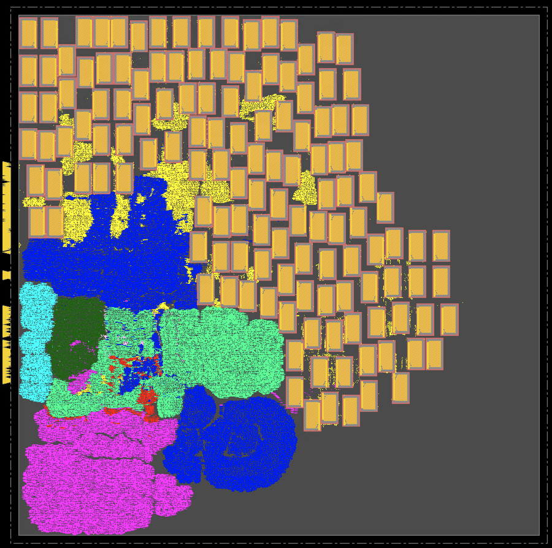

# **Synthesis, Place \& Route (SP\&R):**
Here we provide the setup to run SP&R of Ariane design with 136 macros on NanGate45 using commercial and open-source tools.
  - [**SP\&R Flow**](#spr-flow)
    - [**Cadence tools**](#using-cadence-genus-and-innovus)
    - [**OpenROAD tools**](#using-openroad-flow-scripts)

## **SP\&R Flow:**
We implement Ariane design with [136 macroes](../../../Testcases/ariane136/) on the NanGate45 platform using the proprietary (commercial) tools **Cadence Genus** (Synthesis) and **Cadence Innovus** (P&R), and the open-source tools **Yosys** (Synthesis) and **OpenROAD** (P&R). The required *.lef* and *.lib* files are downloaded from the OpenROAD-flow-scripts (ORFS) [GitHub](https://github.com/The-OpenROAD-Project/OpenROAD-flow-scripts/tree/master/flow/platforms/nangate45). We use the [fakeram](https://github.com/jjcherry56/bsg_fakeram) generator for the NanGate45 platform to generate the 16-bit (256x16, single-ported SRAM) memory. All the required *.lib* and *.lef* files are available in the [*Enablements/NanGate45*](../../../Enablements/NanGate45/) directory.  
  
  
### **Using Cadence Genus and Innovus:**
All the required scripts are available in the [*./scripts/cadence/*](./scripts/cadence/) directory.  
**Synthesis:** [run_genus.tcl](./scripts/cadence/run_genus.tcl) contains the setup for synthesis using Genus. It reads the .sv files based on the list in [*./scripts/cadence/rtl_list.tcl*](./scripts/cadence/rtl_list.tcl) (changing the order of the file may cause errors). The timing constraints are provided in [*./constrains/ariane.sdc*](./constraints/ariane.sdc) file. To launch the synthesis run please use the below command
```
genus -overwrite -log log/genus.log -no_gui -files run_genus.tcl
```  
We also generate a synthesized netlist, which is available in the [*./netlist/*](./netlist/) directory.  
  
**P\&R:** [run_innovus.tcl](./scripts/cadence/run_invs.tcl) contains the setup for the P&R run using Innvous. It reads the netlist provided in [*./netlist/*](./netlist/) directory. To launch the P\&R run please use the below command.
```
innovus -64 -init run_invs.tcl -log log/run.log
```  
Innovus requires a configuration file to run the macro placement flow. For this we use *proto_design -constraints mp_config.tcl* command. The configuration file [*mp_config.tcl*](./scripts/cadence/mp_config.tcl) is available in the *./scripts/cadence/* directory. Some details of the configuration files are as follows.
1. Provide the memory hierarchy name under the **SEED** section. If you do not provide the memory hierarchy here, then the macro placement constraints (e.g., cell orientation, spacing, etc.) related to that memory may be overlooked.
2. For each macro, valid orientation and spacing rules can be provided under the **MACRO** section. For example, we set valid macro orientation as *R0* for our run, horizontal spacing as *10um*, and vertical spacing as *5um*. Also, when you provide the cell name (ref name, not instance name) add the *isCell=true* option.

Below is the screenshot of the Ariane SP\&R database with 136 memory macros using Cadence flow.  
  


This script was written and developed by ABKGroup students at UCSD; however, the underlying commands and reports are copyrighted by Cadence. We thank Cadence for granting permission to share our research to help promote and foster the next generation of innovators.


### **Using OpenROAD-flow-scripts:**
Clone ORFS and build OpenROAD tools following the steps given [here](https://github.com/The-OpenROAD-Project/OpenROAD-flow-scripts). To run SP&R using OpenROAD tools follow the below mentioned steps:  
1. Copy [*./scripts/OpenROAD/ariane.tar.gz*](./scripts/OpenROAD/ariane.tar.gz) file to *{ORFS Clone Directory}/OpenROAD-flow-scripts/flow/designs/nangate45* area.
2. Use command *tar -xvf ariane.tar.gz* to untar *ariane.tar.gz*. This will generate *ariane136* directory which contains all the files required to run SP&R using ORFS.
3. To launch the SP&R job go to the flow directory and use the below command
  ```
  make DESIGN_CONFIG=./designs/asap7/ariane136/config_hier.mk
  ```
4. config_hier.mk uses the **RTL-MP** (RTL Macro Placer) for macro placement. If you wish to run macro placement using the older **Triton Macro Placer**, please use the below command:
  ```
  make DESIGN_CONFIG=./designs/asap7/ariane136/config.mk
  ```  
  
<!-- Below is the screenshot of the Ariane SP\&R database with 136 memory macros using the ORFS (RTL-MP) flow.  
 -->
