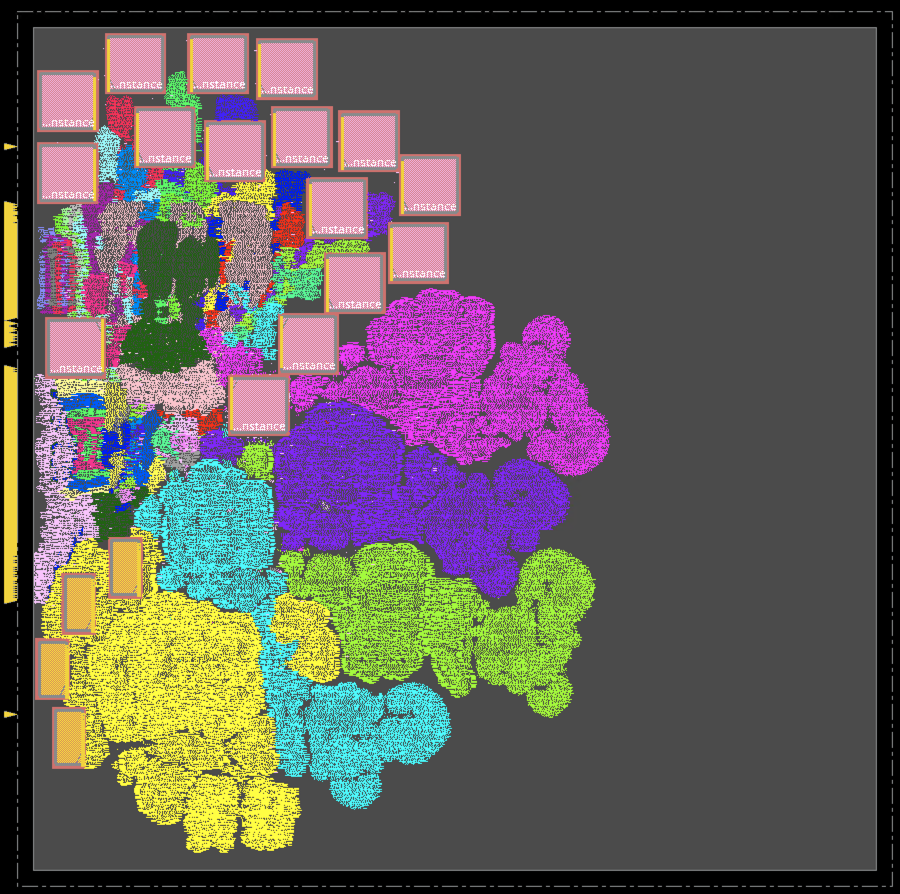

# **Synthesis, Place & Route (SP&R):**  
Here we provide the setup to run SP&R of MemPool_tile on NanGate45 using commercial and open-source tools. MemPool tile is part of MemPool which is an open-source many-core system targeting image processing applications. It can be downloaded from [mempool](https://github.com/pulp-platform/mempool) GitHub repo.

### **Using Cadence Innovus:**
All the required scripts to run P\&R are available in the [*./scripts/cadence/*](./scripts/cadence/) directory. 
We use an unnamed commercial logic synthesis tool to synthesize the MemPool tile. The synthesized gate-level (standard cells and SRAM macros) netlist is available in [*./netlist/*](./netlist/) directory. We use this netlist for the P&R run.  
**P\&R:** [run_innovus.tcl](./scripts/cadence/run_invs.tcl) contains the setup for the P&R run using Innvous. It reads the gate-level netlist provided in [*./netlist/*](./netlist/) directory. To launch the P\&R run please use the below command.  
```
innovus -64 -init run_invs.tcl -log log/run.log
```  
Innovus requires a configuration file to run the macro placement flow. For this we use *proto_design -constraints mp_config.tcl* command. The configuration file [*mp_config.tcl*](./scripts/cadence/mp_config.tcl) is available in the [*./scripts/cadence/*](./scripts/cadence/) directory. Some details of the configuration files are as follows:
1. Provide the memory hierarchy name under the **SEED** section. If you do not provide the memory hierarchy here, then the macro placement constraints (e.g., cell orientation, spacing, etc.) related to that memory may be overlooked.
2. For each macro, valid orientation and spacing rules can be provided under the **MACRO** section. For example, we set valid macro orientation as *R0* for our run, horizontal spacing as *10um*, and vertical spacing as *5um*. Also, when you provide the cell name (ref name, not instance name) add the *isCell=true* option.
  
Below is the screenshot of the mempool_tile SP\&R databse.  



This script was written and developed by ABKGroup students at UCSD; however, the underlying commands and reports are copyrighted by Cadence. We thank Cadence for granting permission to share our research to help promote and foster the next generation of innovators.


### **Using OpenROAD-flow-scripts:**
Clone ORFS and build OpenROAD tools following the steps given [here](https://github.com/The-OpenROAD-Project/OpenROAD-flow-scripts). To run SP&R using OpenROAD tools follow the below mentioned steps:  
1. Copy [*./scripts/OpenROAD/mempool_tile.tar.gz*](./scripts/OpenROAD/mempool_tile.tar.gz) directory to *{ORFS Clone Directory}/OpenROAD-flow-scripts/flow/designs/asap7* area.
2. Use command *tar -xvf mempool_tile.tar.gz* to untar *mempool_tile.tar.gz*. This will generate *mempool_tile* directory which contains all the files required to run SP&R using ORFS.
3. To launch the SP&R job go to the flow directory and use the below command
  ```
  make DESIGN_CONFIG=./designs/asap7/mempool_tile/config.mk
  ```
<!-- Below is the screenshot of the mempool_tile SP\&R database.  
 -->
