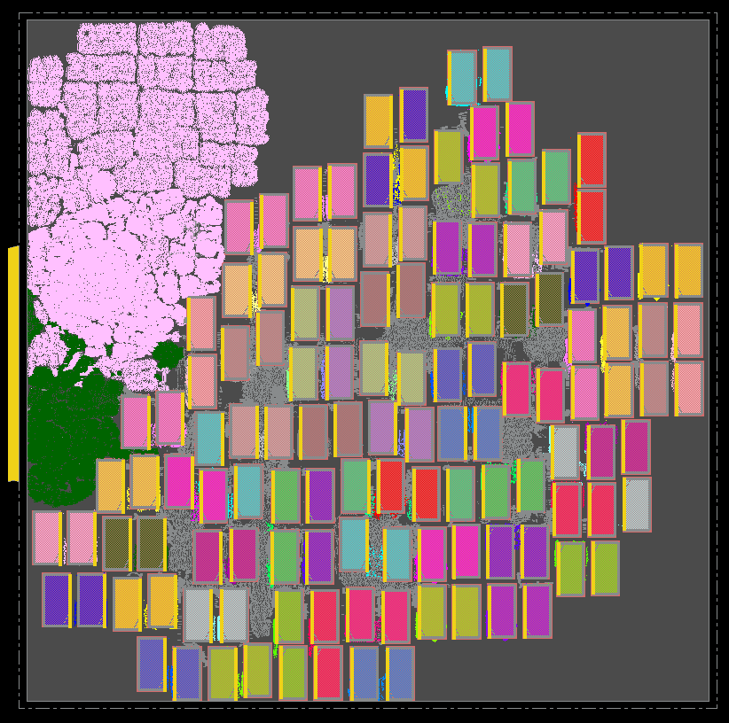

We implement [NVDLA](../../../Testcases/nvdla) on the [ASAP7](../../../Enablements/ASAP7) platform using the proprietary (commercial) tools **Cadence Genus** (Synthesis) and **Cadence Innovus** (P&R), and the open-source tools **Yosys** (Synthesis) and **OpenROAD** (P&R). 

The screenshot of the design using Cadence Flow-1 on ASAP7 enablement is shown below   
  
  
<!-- The screenshot of the design using ORFS on ASAP7 enablement is shown below  
 -->
