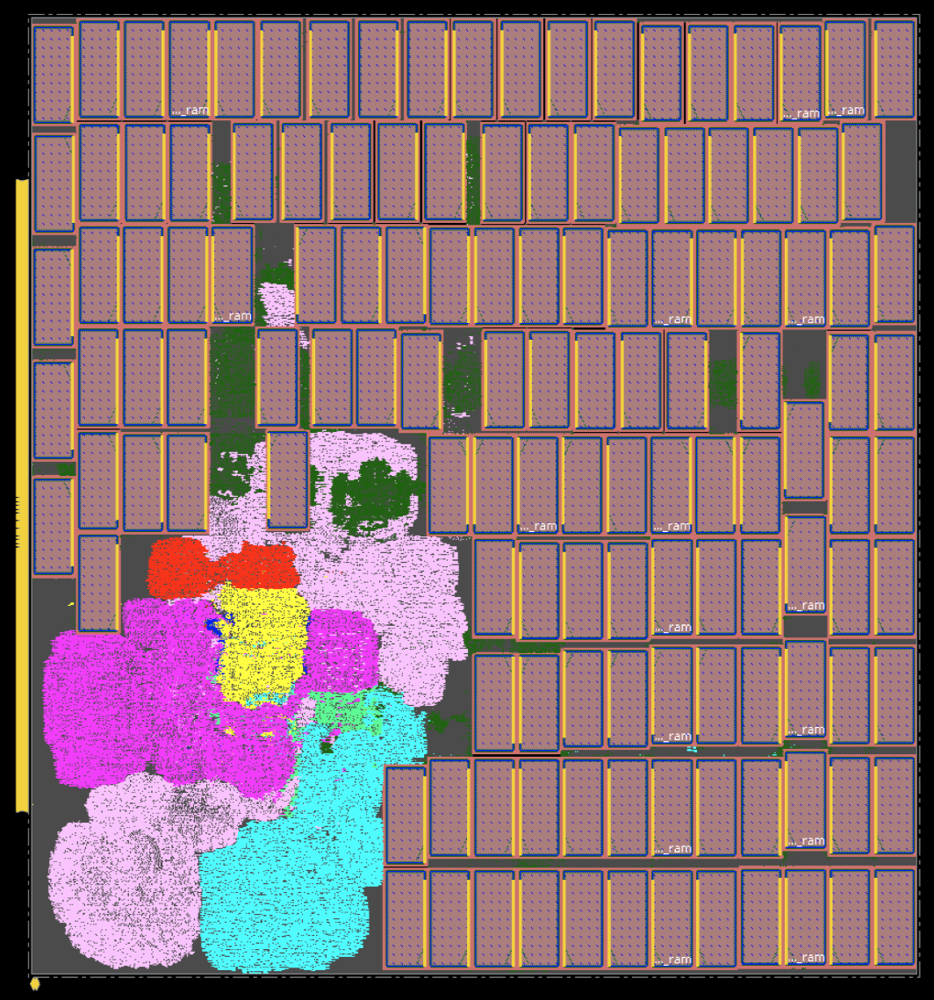
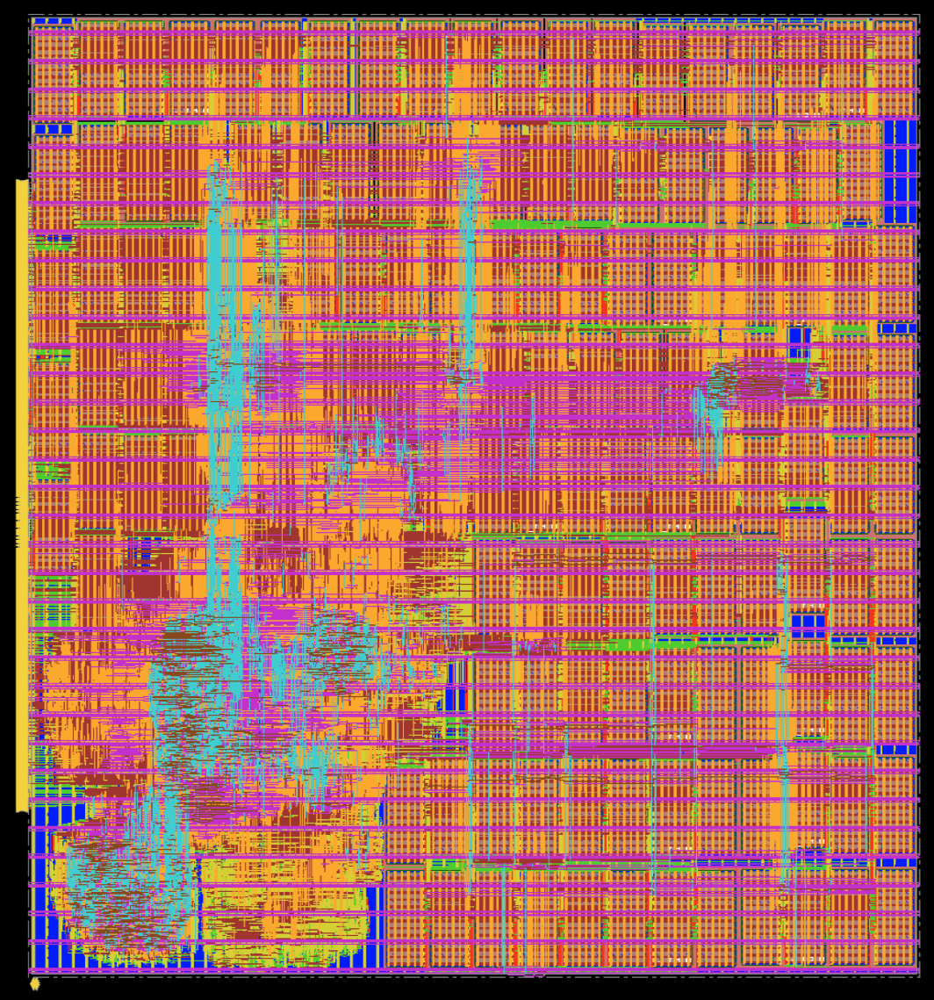
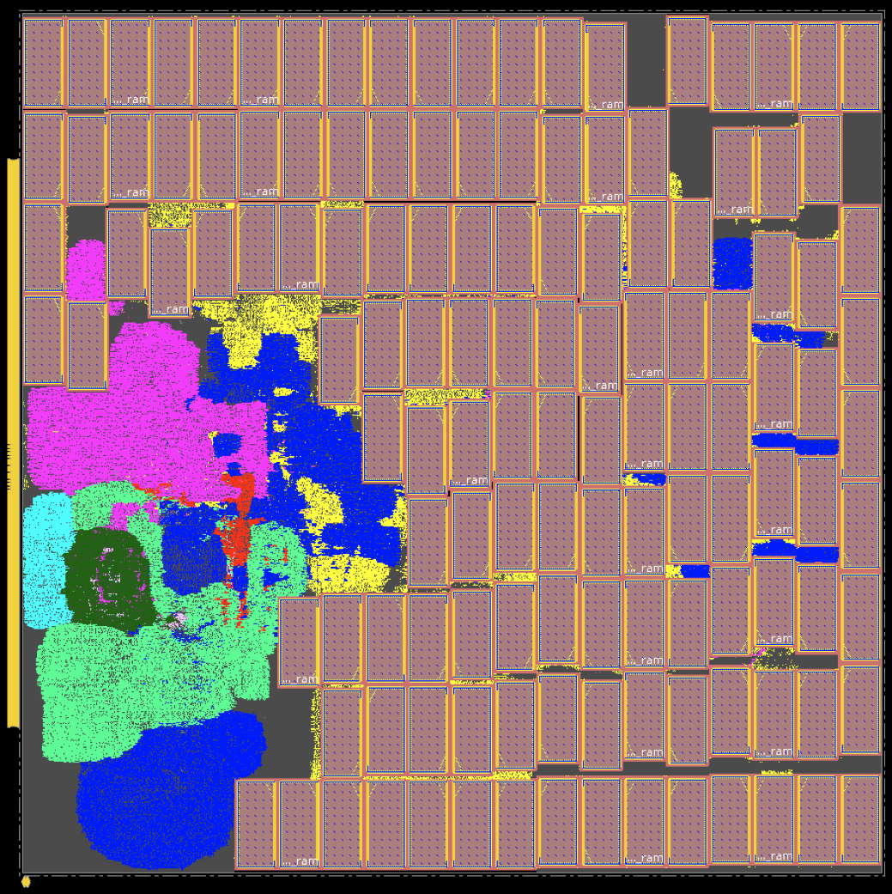
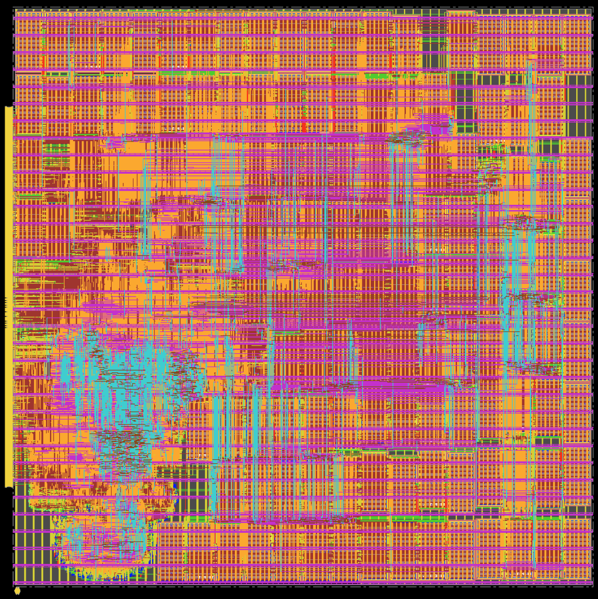
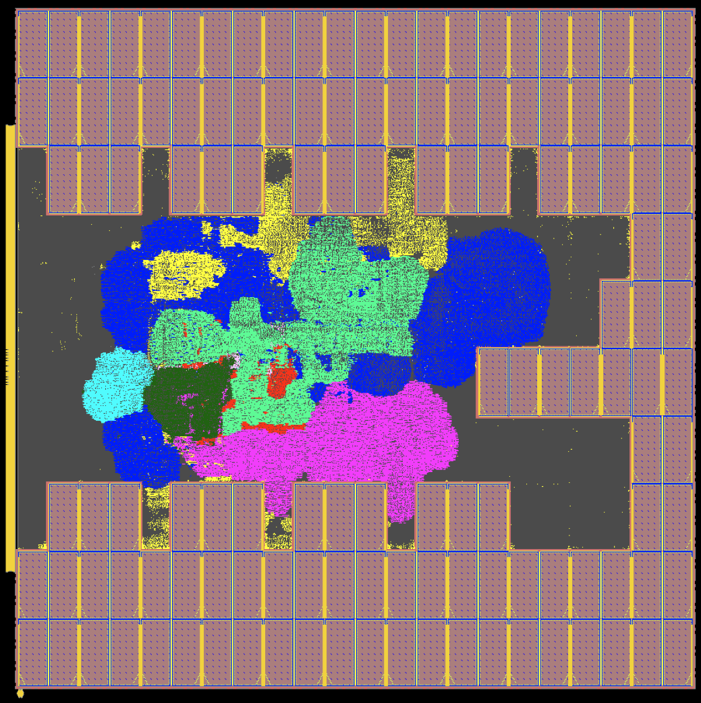
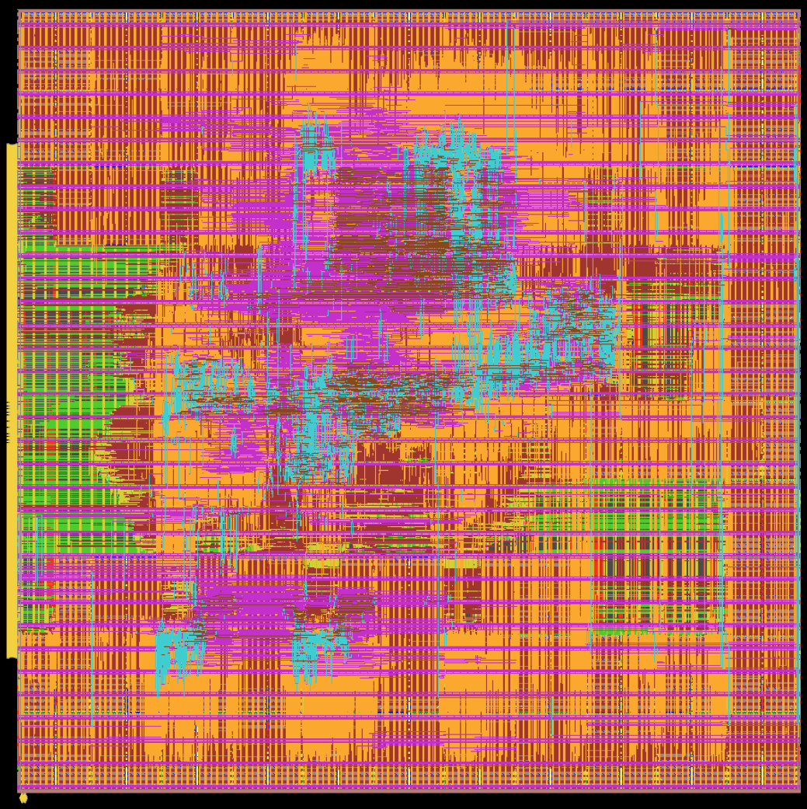
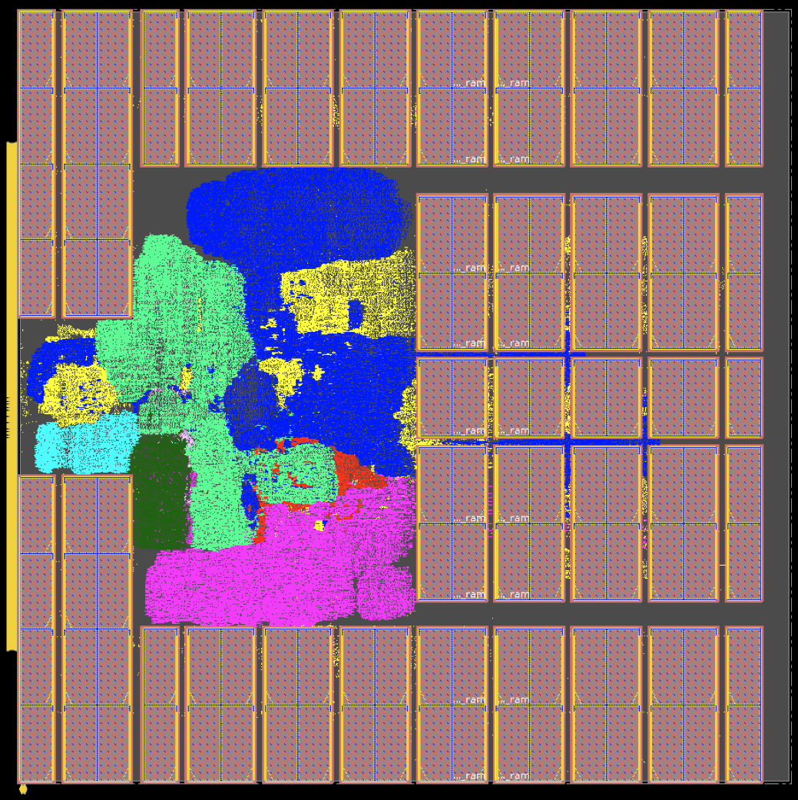
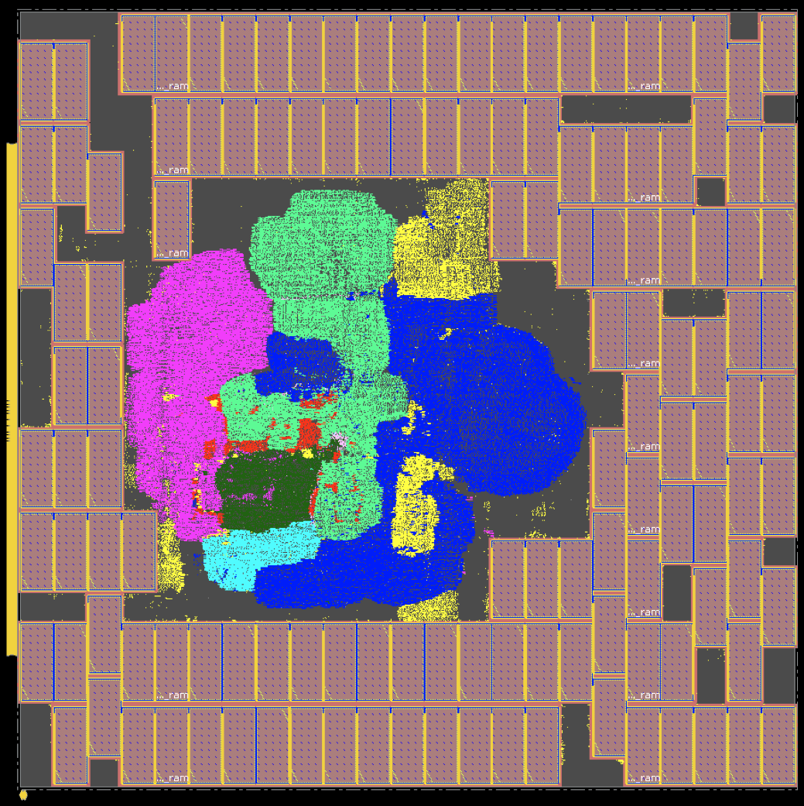
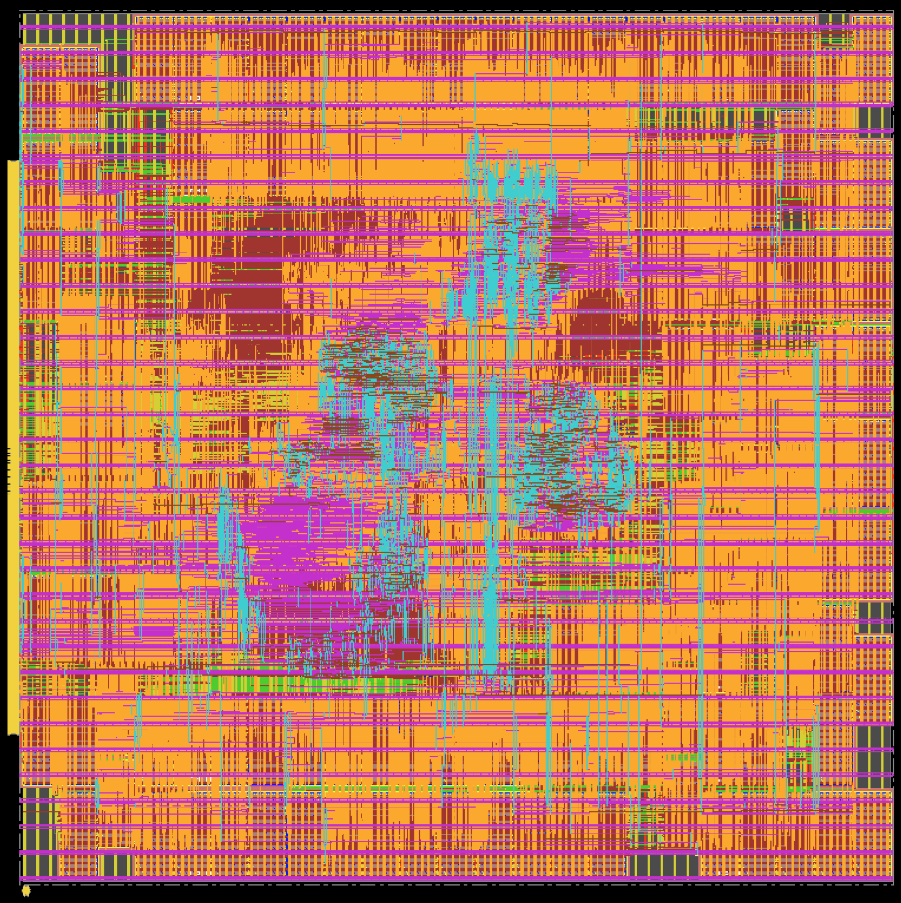

We implement [Ariane design with 133 macros](../../../Testcases/ariane133) on the [NanGate45](../../../Enablements/NanGate45) platform using the proprietary (commercial) tools **Cadence Genus** (Synthesis) and **Cadence Innovus** (P&R), and the open-source tools **Yosys** (Synthesis) and **OpenROAD** (P&R). 

## *Macro Placement Generated by Cadence Flow-1*
The screenshot of the placed and routed Ariane133-NG45 design generated using [Flow-1](../../figures/flow-1.PNG) is shown below. Flow-1 uses Cadence Concurrent Macro Placer (CMP) to place the macros.  

| Physical Design Stage | Core Area (um^2) | Standard Cell Area (um^2) | Macro Area (um^2) | Total Power (mW) | Wirelength (um) | WS (ns) | TNS (ns) | Congestion (H) | Congestion (V) |
|-----------------------|------------------|---------------------------|-------------------|------------------|-----------------|---------|----------|----------------|----------------|
| postSynth             |          1814274 |                    215401 |           1018356 |          751.379 |         3643746 |  -2.976 | -12125.3 |                |                |
| preCTS                |          1814274 |                    241394 |           1018356 |          778.305 |         3731576 |  -0.216 | -394.259 |          0.01% |          0.02% |
| postCTS               |          1814274 |                    245861 |           1018356 |          825.089 |         3779460 |  -0.163 | -168.228 |          0.02% |          0.03% |
| postRoute             |          1814274 |                    245861 |           1018356 |          825.273 |         3917426 |  -0.165 | -186.824 |                |                |
| postRouteOpt          |          1814274 |                    246221 |           1018356 |          825.631 |         3921486 |  -0.165 | -167.579 |                |                |

## *Flow-2 Result for the Macro Placement Generated by Cadence Concurrent Macro Placer*
The screenshot of the placed and routed Ariane133-NG45 design generated using [Flow-2](../../figures/flow-2.PNG) is shown below. Here the initial macro placement is generated using CMP.  

The following table shows the different metrics for Ariane133-NG45 (Utilization: 68% Clock Period: 1.3ns) implementation using [Flow-2](../../figures/flow-2.PNG).
| Physical Design Stage | Core Area (um^2) | Standard Cell Area (um^2) | Macro Area (um^2) | Total Power (mW) | Wirelength (um) | WS (ns) | TNS (ns)  | Congestion (H) | Congestion (V) |
|-----------------------|------------------|---------------------------|-------------------|------------------|----------------|--------|----------|---------------|---------------|
| preCTS                |          1814274 |                    251874 |           1018356 |          807.994 |        3885279 | -0.150 | -242.589 |         0.02% |         0.02% |
| postCTS               |          1814274 |                    254721 |           1018356 |          851.977 |        3923912 | -0.127 | -133.426 |         0.04% |         0.10% |
| postRoute             |          1814274 |                    254721 |           1018356 |          850.483 |        4049905 | -0.239 | -410.578 |               |               |
| postRouteOpt          |          1814274 |                    256230 |           1018356 |          851.546 |        4057140 | -0.154 | -196.527 |               |               |

## *Macro Placement Generated by OpenROAD Flow Scripts (ORFS) (Flow-3)*
The following screenshot shows the placed Ariane133-NG45 design generated using [Flow-3](../../figures/flow-3.PNG). Here the macro placement is generated using the RTL-MP engine of OpenROAD.

## *Baseline Macro Placement Generated by Human*
### Manual macro placement on a gridded canvas
The following screenshots show the placed and routed Ariane133-NG45 design generated using [Flow-2](../../figures/flow-2.PNG), where the macros are placed manually on a gridded canvas.

The manual macro placement is provided in [manual_floorplan.def](../ariane133/def/manual_floorplan.def).
We generate the manual macro placement in two steps:  
(1) we call the [gridding](../../../CodeElements/Gridding/) scripts to generate grid cells (in this case, we end up with a 22 columns x 30 rows grid); and (2) we manually place macros so that their centers lie on centers of grid cells, with no overlap between macros or overflow of macros beyond the layout canvas.

Note that this human-constructed macro placement can serve as a competitive baseline for [Circuit Training](https://github.com/google-research/circuit_training).
The metrics reported by the Innovus tool after different physical design stages are shown below. 
Note that (1) we set the activity factor to 0.2 in our flow; (2) the standard cell area does not include physical cells; (3) In order to match [Nature paper](https://www.nature.com/articles/s41586-021-03544-w), we adjust the pin positions to occupy about 60% of the left boundary; and (4) the total macro area for ariane133 (NanGate45) is 1018356um^2, and the overall utilization is ~68%%.  

| Physical Design Stage | Core Area (um^2) | Standard Cell Area (um^2) | Macro Area (um^2) | Total Power (mW) | Wirelength (um) | WS (ns) | TNS (ns) | Congestion (H) | Congestion (V) |
|-----------------------|------------------|---------------------------|-------------------|------------------|-----------------|---------|----------|----------------|----------------|
| postSynth             |          1814274 |                    242813 |           1018356 |          759.332 |         4941086 |  -0.764 | -451.478 |                |                |
| preCTS                |          1814274 |                    243778 |           1018356 |          791.963 |         4821642 |  -0.119 | -137.735 |          0.06% |          0.08% |
| postCTS               |          1814274 |                    246360 |           1018356 |          835.687 |         4863282 |  -0.115 |  -50.599 |          0.06% |          0.13% |
| postRoute             |          1814274 |                    246360 |           1018356 |          834.281 |         5013763 |  -0.121 |  -74.638 |                |                |
| postRouteOpt          |          1814274 |                    246583 |           1018356 |          834.660 |         5018976 |  -0.117 |  -55.035 |                |                |

### Macro placement generated by an Industry expert
We thank Dr. Jinwook Jung for sharing the Human Macro Placement of Ariane133 design. The following figure shows placed and routed Ariane133-NG45 design where the macro palcement is generated by Dr. Jung. He has also shared the [place_srams.tcl](./def/place_srams.tcl) to reproduce the macro placement.

The following table shows the different metrics, when [Flow-2](../../figures/flow-2.PNG) is used for the above macro placement.
| Physical Design Stage | Core Area (um^2) | Standard Cell Area (um^2) | Macro Area (um^2) | Total Power (mW) | Wirelength (um) | WS (ns) | TNS (ns) | Congestion (H) | Congestion (V) |
|-----------------------|------------------|---------------------------|-------------------|------------------|-----------------|---------|----------|----------------|----------------|
| postSynth             |          1814274 |                    244729 |           1018356 |          739.014 |         4664986 |  -0.764 | -472.548 |                |                |
| preCTS                |          1814274 |                    245069 |           1018356 |          792.784 |         4549848 |  -0.133 |  -175.54 |          0.03% |          0.20% |
| postCTS               |          1814274 |                    247377 |           1018356 |          835.154 |         4567212 |  -0.128 |  -72.595 |          0.04% |          0.21% |
| postRoute             |          1814274 |                    247377 |           1018356 |          833.294 |         4705687 |  -0.143 |  -86.669 |                |                |
| postRouteOpt          |          1814274 |                    246722 |           1018356 |          831.745 |         4711746 |  -0.107 |  -69.589 |                |                |

## *Macro Placement Generated by Circuit Training (CT)*
The following screenshot shows the placed and routed Ariane133-NG45 design generated using [Flow-2](../../figures/flow-2.PNG), where the initial macro placement is generated by CT.

The following table shows the different metrics, when [Flow-2](../../figures/flow-2.PNG) is used when initial macro placement is generated using CT.  
| Physical Design Stage | Core Area (um^2) | Standard Cell Area (um^2) | Macro Area (um^2) | Total Power (mW) | Wirelength (um) | WS (ns) | TNS (ns) | Congestion (H) | Congestion (V) |
|-----------------------|------------------|---------------------------|-------------------|------------------|-----------------|---------|----------|----------------|----------------|
| postSynth             | 1814274          | 244614                    | 1018356           | 761.754          | 4884882         | -0.764  | -533.519 |                |                |
| preCTS                | 1814274          | 244373                    | 1018356           | 792.626          | 4732895         | -0.123  | -184.135 | 0.03%          | 0.11%          |
| postCTS               | 1814274          | 247965                    | 1018356           | 837.464          | 4762751         | -0.084  | -35.57   | 0.04%          | 0.15%          |
| postRoute             | 1814274          | 247965                    | 1018356           | 835.824          | 4887126         | -0.123  | -63.739  |                |                |
| postRouteOpt          | 1814274          | 248448                    | 1018356           | 836.399          | 4892431         | -0.09   | -57.448  |                |                |