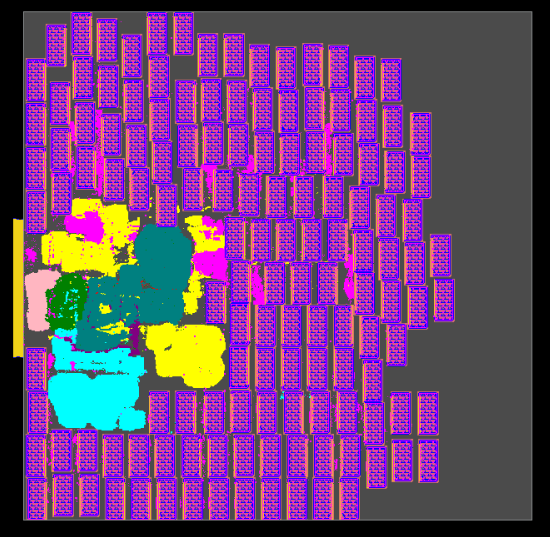
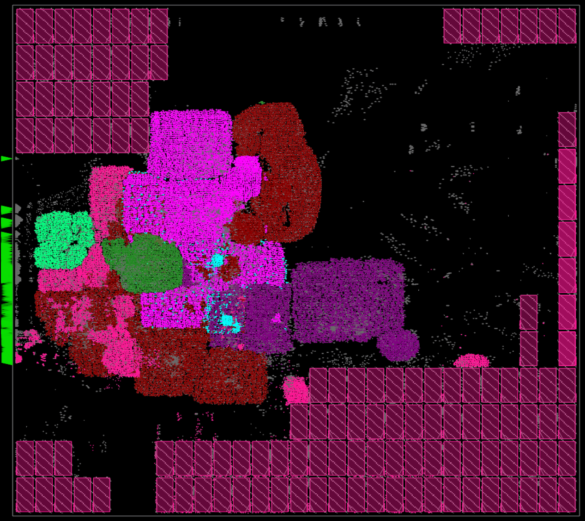
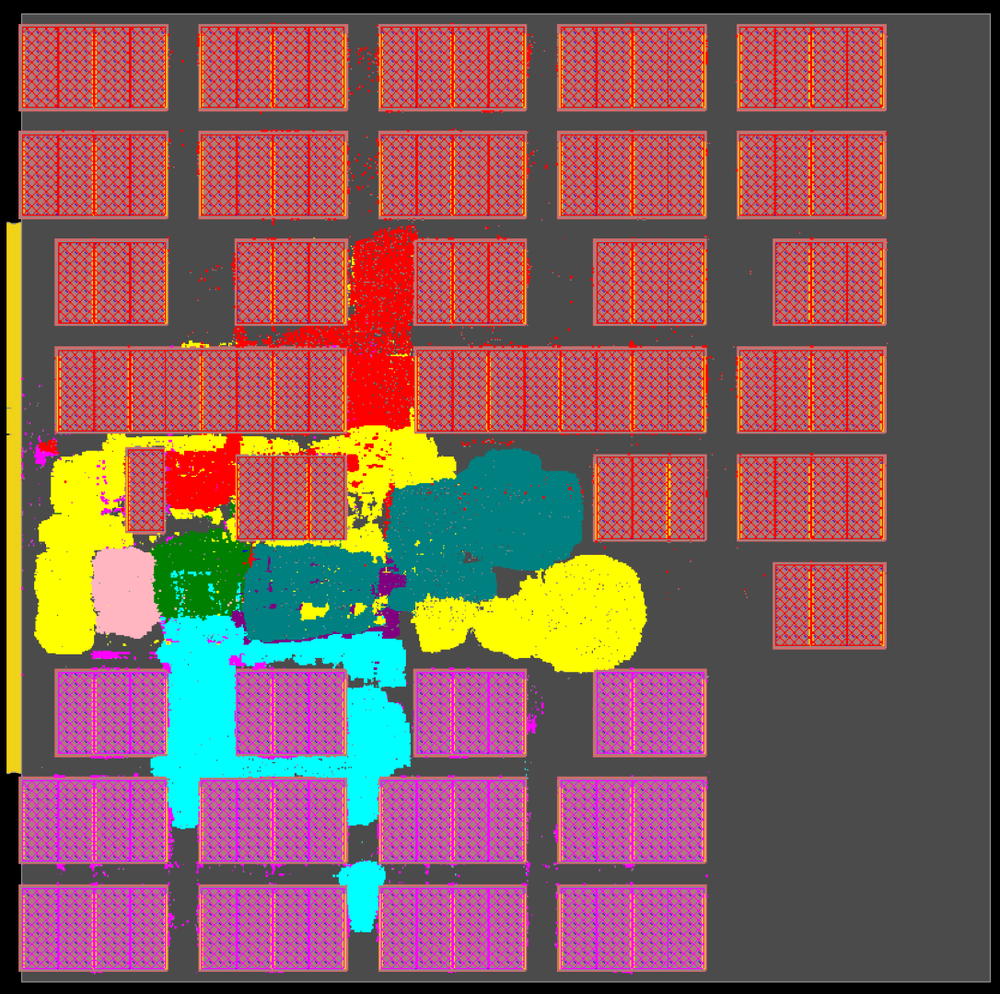

We implement [Ariane design with 133 macros](../../../Testcases/ariane133) on the [NanGate45](../../../Enablements/NanGate45) platform using the proprietary (commercial) tools **Cadence Genus** (Synthesis) and **Cadence Innovus** (P&R), and the open-source tools **Yosys** (Synthesis) and **OpenROAD** (P&R). 

## *Macro Placement Generated by Cadence Flow-1*
The screenshot of the design using Cadence Flow-1 on Nangate45 enablement is shown below   
  
  
## *Macro Placement Generated by ORFS*
The screenshot of the design using ORFS on Nangate45 enablement is shown below  

## *Baseline Macro Placement Generated by Human*
The screenshot of the design using Cadence tool for standard cell placement and routing on Nangate45 enablement is shown below   
  
The manual macro placement is provided in [manual_floorplan.def](https://github.com/TILOS-AI-Institute/MacroPlacement/blob/main/Flows/NanGate45/ariane133/def/manual_floorplan.def).
We generate the manual macro placement in two steps:  
(1) we call the [gridding](https://github.com/TILOS-AI-Institute/MacroPlacement/tree/main/CodeElements/Gridding) scripts to generate grid cells (27 x 27 in our case); (2) we manually place macros on the center of grid cells.

The macro placement can a competitive baseline for [Circuit Training](https://github.com/google-research/circuit_training).
The metrics after different physical design stages are shown below. 
Note that (1) we set the activity factor to 0.2; (2) the standard cell area does not include physical cells; (3) In order to match [Nature paper](https://www.nature.com/articles/s41586-021-03544-w), we adjust the pin positions to occupy about 60% of the left boundary. 
(activity factor = 2)
<table class="tg">
<thead>
  <tr>
    <th class="tg-0lax">Stage in Physcial Design</th>
    <th class="tg-0lax">Core Area (um^2)</th>
    <th class="tg-0lax">Standard Cell Area (um^2)</th>
    <th class="tg-0lax">Total Power (mW)</th>
    <th class="tg-0lax">Wirelength (m)</th>
    <th class="tg-0lax">WNS (ps)</th>
    <th class="tg-0lax">TNS (ns)</th>
  </tr>
</thead>
<tbody>
  <tr>
    <td class="tg-0lax">Post-placement</td>
    <td class="tg-0lax">2560080</td>
    <td class="tg-0lax">215189</td>
    <td class="tg-0lax">0.29</td>
    <td class="tg-0lax">4.47</td>
    <td class="tg-0lax">-2</td>
    <td class="tg-0lax">-0.05</td>   
  </tr>
</tbody>
<tbody>
  <tr>
    <td class="tg-0lax">Post-CTS</td>
    <td class="tg-0lax">2560080</td>
    <td class="tg-0lax">216326</td>
    <td class="tg-0lax">0.30</td>
    <td class="tg-0lax">4.47</td>
    <td class="tg-0lax">0</td>
    <td class="tg-0lax">1</td>   
  </tr>
</tbody>
<tbody>
  <tr>
    <td class="tg-0lax">Post-Routing</td>
    <td class="tg-0lax">2560080</td>
    <td class="tg-0lax">216326</td>
    <td class="tg-0lax">0.30</td>
    <td class="tg-0lax">4.59</td>
    <td class="tg-0lax">62</td>
    <td class="tg-0lax">0</td>   
  </tr>
</tbody>
</table>

