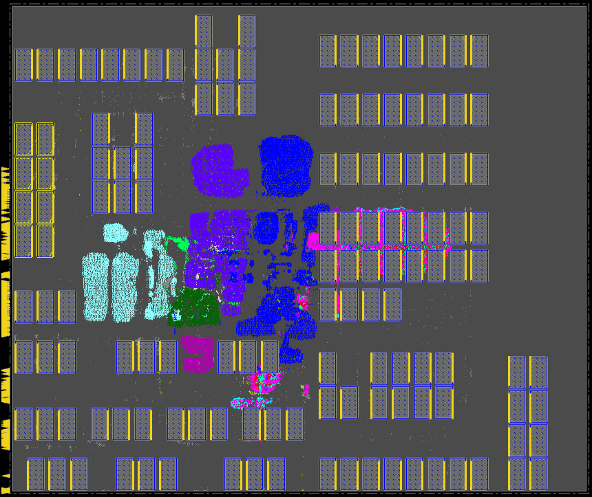

# **Synthesis, Place \& Route (SP\&R):**
Here we provide the setup to run SP&R of Ariane design with 133 macros on NanGate45 using commercial and open-source tools. First, we provide the steps for netlist preparation and then discuss the SP&R flow.
  - [**SP\&R Flow:**](#spr-flow)
    - [**Using Cadence Genus and Innovus:**](#using-cadence-genus-and-innovus)
    - [**Using OpenROAD-flow-scripts:**](#using-openroad-flow-scripts)

## **SP\&R Flow:**
We implement Ariane design on the NanGate45 platform using commercial tools Genus (Synthesis) and Innovus (P&R) and open-source tools Yosys (Synthesis) and OpenROAD (P&R). The required *.lef* and *.lib* files are downloaded from the OpenROAD-flow-scripts (ORFS) [GitHub](https://github.com/The-OpenROAD-Project/OpenROAD-flow-scripts/tree/master/flow/platforms/nangate45). We use the [fakeram](https://github.com/jjcherry56/bsg_fakeram) generator for the NanGate45 platform to generate the 16-bit memory. All the required *.lib* and *.lef* files are copied into the *./platforms/nangate45* directory.  
  
### **Using Cadence Genus and Innovus:**
All the required scripts are available in the *./scripts/cadence/* directory.  
**Synthesis:** run_genus.tcl contains the setup for synthesis using Genus. It reads the .sv files based on the list in *./scripts/cadence/rtl_list.tcl* (changing the order of the file may cause errors). The timing constraints are provided in *./scripts/constrains/ariane.sdc* file. To launch the synthesis run please use the below command
```
genus -overwrite -log log/genus.log -no_gui -files run_genus.tcl
```  
We also generated synthesized netlist and this is avaialbe in *./netlist/* directory.  
  
**P\&R:** run_innovus.tcl contains the setup for the P&R run using Innvous. It reads the netlist provided in *./netlist/* directory. To launch the P\&R run please use the below command.
```
innovus -64 -init run_invs.tcl -log log/run.log
```  
Innovus required a configuration file to run the macro placement flow. For this we use *proto_design -constraints mp_config.tcl* command. The configuration file *mp_config.tcl* is available in the *./scripts/cadence/* directory. Some details of the configuration files are given below
1. Provide the memory hierarchy name under the **SEED** section. If you do not provide the memory hierarchy here, then the macro placement constraints (e.g., cell orientation, spacing, etc.) related to that memory may be overlooked.
2. For each macro, valid orientation, and spacing rules can be provided under the **MACRO** section. For example, we set valid macro orientation as *R0* for our run, horizontal spacing as *10um*, and vertical spacing as *5um*. Also, when you provide the cell name (ref name, not instance name) add the *isCell=true* option.

Below is the screenshot of the Ariane SP\&R database with 136 memory macros using Cadence flow.  
  

### **Using OpenROAD-flow-scripts:**
Clone ORFS and build OpenROAD tools following the steps given [here](https://github.com/The-OpenROAD-Project/OpenROAD-flow-scripts). To run SP&R using OpenROAD tools follow the below mentioned steps:  
1. Copy *./scripts/OpenROAD/ariane.tar.gz* directory to *{ORFS Clone Directory}/OpenROAD-flow-scripts/flow/designs/nangate45* area.
2. Use command *tar -xvf ariane.tar.gz* to untar *ariane.tar.gz*. This will generate *ariane136* directory which contains all the files required to run SP&R using ORFS.
3. To launch the SP&R job go to the flow directory and use the below command
  ```
  make DESIGN_CONFIG=./designs/nangate45/ariane136/config_hier.mk
  ```
4. config_hier.mk uses the **RTL-MP** for macro placement. To run macro placement using **Triton Macro Placer** use the below command
  ```
  make DESIGN_CONFIG=./designs/nangate45/ariane136/config.mk
  ```  
  
Below is the screenshot of the Ariane SP\&R database with 136 memory macros using ORFS (RTL-MP) flow.  
