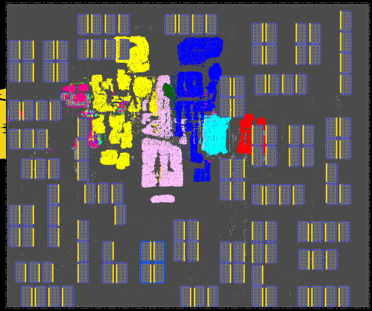

We implement [Ariane design with 133 macros](../../../Testcases/ariane133) on the [NanGate45](../../../Enablements/NanGate45) platform using the proprietary (commercial) tools **Cadence Genus** (Synthesis) and **Cadence Innovus** (P&R), and the open-source tools **Yosys** (Synthesis) and **OpenROAD** (P&R). 

## *Macro Placement Generated by Cadence Flow-1*
The screenshot of the design using Cadence Flow-1 on Nangate45 enablement is shown below.   
  

|Physical Design Stage|Core Area (um^2)|Standard Cell Area (um^2)|Macro Area (um^2)|Total Power (mW)|Wirelength(um)|WS(ns)|TNS(ns)|Congestion(H)|Congestion(V)|
|---------------------|----------------|-------------------------|-----------------|----------------|--------------|------|-------|-------------|-------------|
|preCTS               |2560080    |213764                |1018356       |285    |3488909 |0.009 |0.000  |0.00%        |0.00%        |
|postCTS              |2560080    |214818                |1018356       |297    |3492066 |0.000 |0.000  |0.00%        |0.00%        |
|postRoute            |2560080    |214818                |1018356       |297    |3598577 |0.189 |0.000  |             |             |

## *Macro Placement Generated by ORFS (Flow-3)*
The screenshot of the design using ORFS on Nangate45 enablement is shown below.  

## *Baseline Macro Placement Generated by Human*
The screenshot of the design using the Cadence Innovus tool for standard-cell placement and routing on Nangate45 enablement is shown below.   
  
The manual macro placement is provided in [manual_floorplan.def](https://github.com/TILOS-AI-Institute/MacroPlacement/blob/main/Flows/NanGate45/ariane133/def/manual_floorplan.def).
We generate the manual macro placement in two steps:  
(1) we call the [gridding](https://github.com/TILOS-AI-Institute/MacroPlacement/tree/main/CodeElements/Gridding) scripts to generate grid cells (in this case, we end up with a 27 x 27 grid); and (2) we manually place macros so that their centers lie on centers of grid cells, with no overlap between macros or overflow of macros beyond the layout canvas.

Note that this human-constructed macro placement can serve as a competitive baseline for [Circuit Training](https://github.com/google-research/circuit_training).
The metrics reported by the Innovus tool after different physical design stages are shown below. 
Note that (1) we set the activity factor to 0.2 in our flow; (2) the standard cell area does not include physical cells; (3) In order to match [Nature paper](https://www.nature.com/articles/s41586-021-03544-w), we adjust the pin positions to occupy about 60% of the left boundary; and (4) the total macro area for ariane133 (NanGate45) is 1018356um^2, and the overall utilization is 48.228%.  

|Physical Design Stage|Core Area (um^2)|Standard Cell Area (um^2)|Macro Area (um^2)|Total Power (mW)|Wirelength(um)|WS(ns)|TNS(ns)|Congestion(H)|Congestion(V)|
|---------------------|----------------|-------------------------|-----------------|----------------|--------------|------|-------|-------------|-------------|
|preCTS               |2560080    |215189               |1018356       |286    |4470832 |-0.002|-0.005 |0.00%        |0.00%        |
|postCTS              |2560080    |216323               |1018356       |300    |4472866 |0.001 |0.000  |0.00%        |0.00%        |
|postRoute            |2560080    |216323               |1018356       |299    |4587141 |0.284 |0.000  |             |             |

