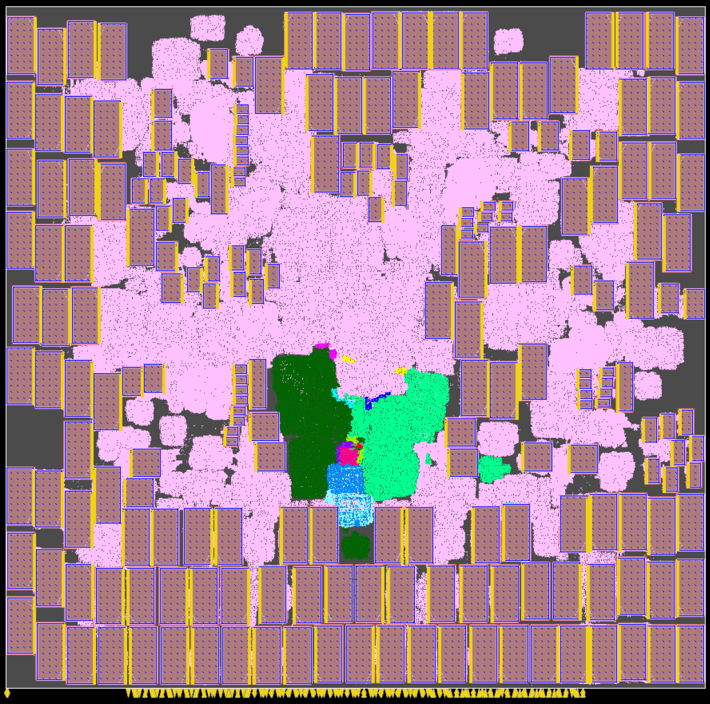
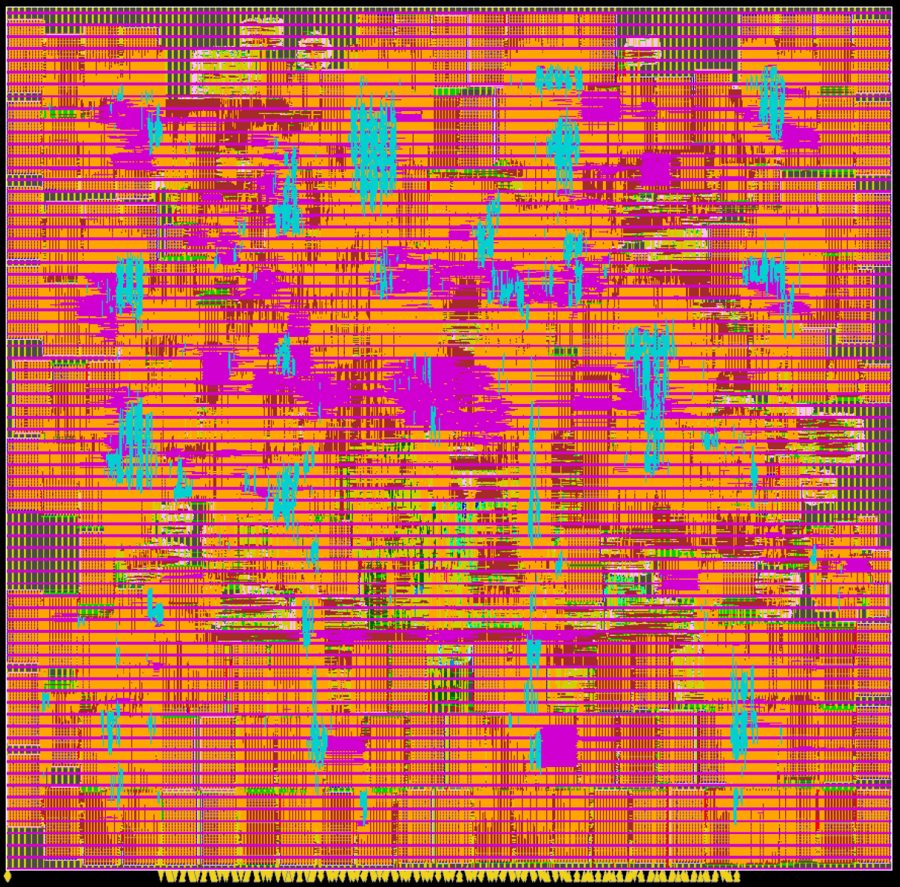
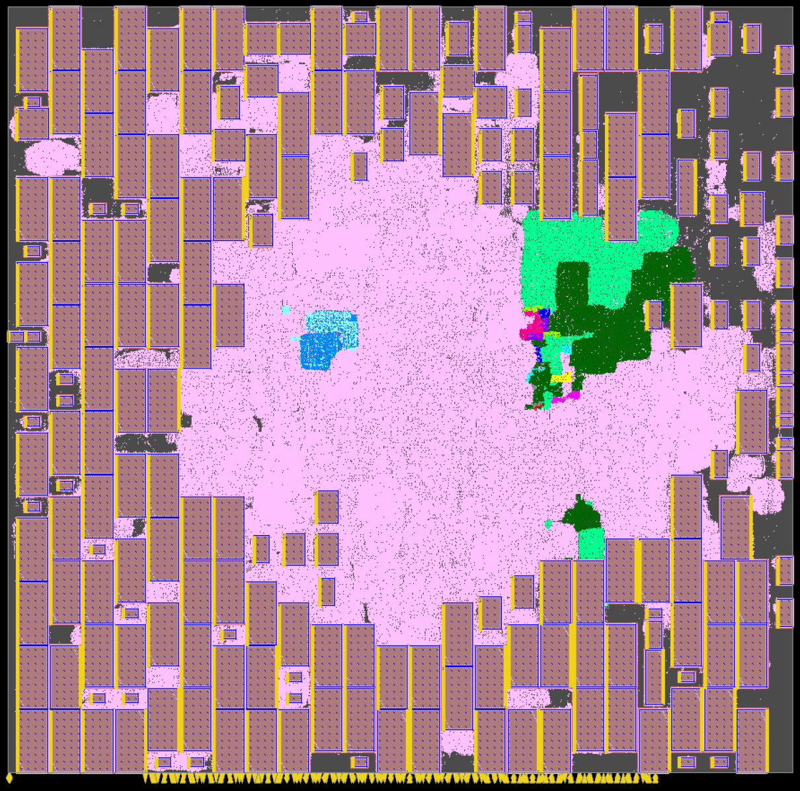
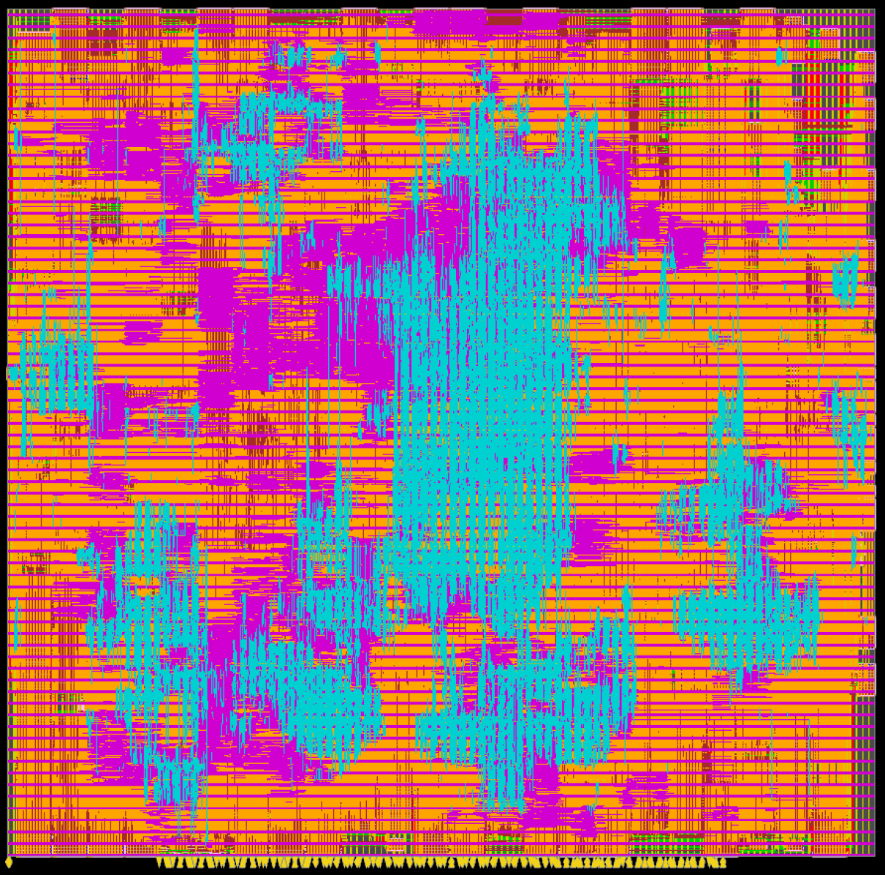

## Macro Placement Generated Using Concurrent Macro Placer (CMP)
The following figure shows the placed and routed BlackParrot quad core design where the macro placement is generated using CMP.

## Macro Placement Generated Using Circuit Training (CT)
The following figure shows the placed and routed BlackParrot quad core design where the macro placement is generated using CT.

