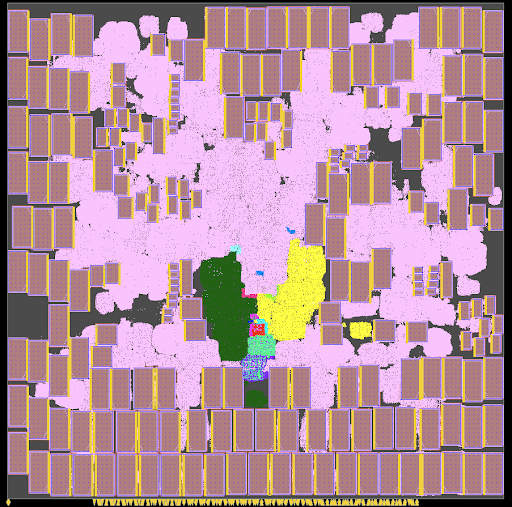
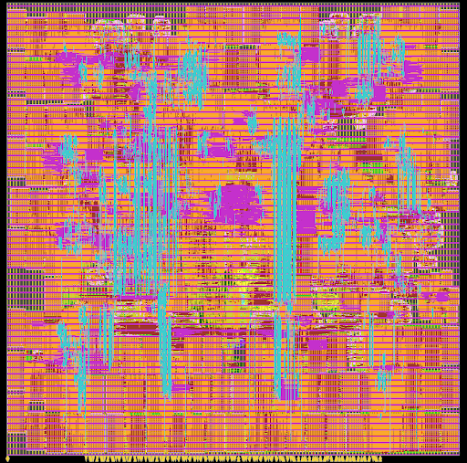
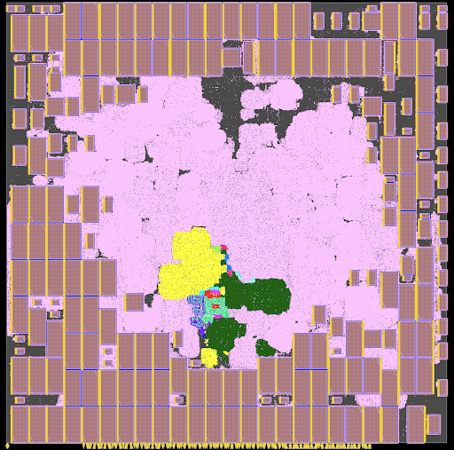

## Macro Placement Generated Using Concurrent Macro Placer (CMP)
The following table and screenshots provide details of BlackParrot (Quad-Core) NG45-68%-(bp clock)1.3ns design, when the macro placement is generated using CMP.

<table>
<thead>
  <tr>
    <th colspan="10">BlackParrot (Quad-Core)-NG45-68%-1.3ns CMP</th>
  </tr>
</thead>
<tbody>
  <tr>
    <td>Physical Design Stage</td>
    <td>Core Area (um^2)</td>
    <td>Standard Cell Area (um^2)</td>
    <td>Macro Area (um^2)</td>
    <td>Total Power (mW)</td>
    <td>Wirelength (um)</td>
    <td>WS (ns)</td>
    <td>TNS (ns)</td>
    <td>Congestion (H)</td>
    <td>Congestion (V)</td>
  </tr>
  <tr>
    <td>postSynth</td>
    <td>8449457</td>
    <td>1904443</td>
    <td>3917822</td>
    <td>3783.599</td>
    <td>22806319</td>
    <td>-0.371</td>
    <td>-4936.000</td>
    <td></td>
    <td></td>
  </tr>
  <tr>
    <td>preCTS</td>
    <td>8449457</td>
    <td>1905223</td>
    <td>3917822</td>
    <td>4067.750</td>
    <td>22267026</td>
    <td>-0.194</td>
    <td>-604.759</td>
    <td>0.02%</td>
    <td>0.05%</td>
  </tr>
  <tr>
    <td>postCTS</td>
    <td>8449457</td>
    <td>1915688</td>
    <td>3917822</td>
    <td>4431.875</td>
    <td>22409471</td>
    <td>-0.137</td>
    <td>-313.557</td>
    <td>0.03%</td>
    <td>0.06%</td>
  </tr>
  <tr>
    <td>postRoute</td>
    <td>8449457</td>
    <td>1915688</td>
    <td>3917822</td>
    <td>4428.464</td>
    <td>23120107</td>
    <td>-0.170</td>
    <td>-541.650</td>
    <td></td>
    <td></td>
  </tr>
  <tr>
    <td>postRouteOpt</td>
    <td>8449457</td>
    <td>1916166</td>
    <td>3917822</td>
    <td>4428.664</td>
    <td>23144317</td>
    <td>-0.144</td>
    <td>-356.201</td>
    <td></td>
    <td></td>
  </tr>
</tbody>
</table>

## Macro Placement Generated Using Circuit Training (CT)
The following table and screenshots provide details of BlackParrot (Quad-Core) NG45-68%-(bp clock)1.3ns design, when the macro placement is generated using CT.

<table>
<thead>
  <tr>
    <th colspan="10">BlackParrot (Quad-Core)-NG45-68%-1.3ns CT</th>
  </tr>
</thead>
<tbody>
  <tr>
    <td>Physical Design Stage</td>
    <td>Core Area (um^2)</td>
    <td>Standard Cell Area (um^2)</td>
    <td>Macro Area (um^2)</td>
    <td>Total Power (mW)</td>
    <td>Wirelength (um)</td>
    <td>WS (ns)</td>
    <td>TNS (ns)</td>
    <td>Congestion (H)</td>
    <td>Congestion (V)</td>
  </tr>
  <tr>
    <td>preCTS</td>
    <td>8449457</td>
    <td>1938948</td>
    <td>3917822</td>
    <td>4278.370</td>
    <td>35668650</td>
    <td>-0.237</td>
    <td>-1260.100</td>
    <td>0.18%</td>
    <td>0.34%</td>
  </tr>
  <tr>
    <td>postCTS</td>
    <td>8449457</td>
    <td>1954471</td>
    <td>3917822</td>
    <td>4657.913</td>
    <td>35769745</td>
    <td>-0.151</td>
    <td>-580.246</td>
    <td>0.18%</td>
    <td>0.37%</td>
  </tr>
  <tr>
    <td>postRoute</td>
    <td>8449457</td>
    <td>1954471</td>
    <td>3917822</td>
    <td>4624.574</td>
    <td>36804993</td>
    <td>-0.179</td>
    <td>-1710.700</td>
    <td></td>
    <td></td>
  </tr>
  <tr>
    <td>postRouteOpt</td>
    <td>8449457</td>
    <td>1956712</td>
    <td>3917822</td>
    <td>4627.387</td>
    <td>36845404</td>
    <td>-0.185</td>
    <td>-1040.800</td>
    <td></td>
    <td></td>
  </tr>
</tbody>
</table>

