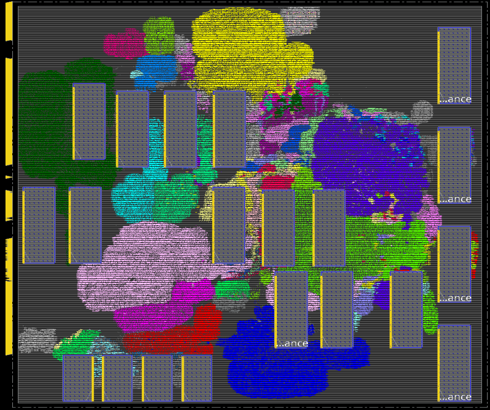
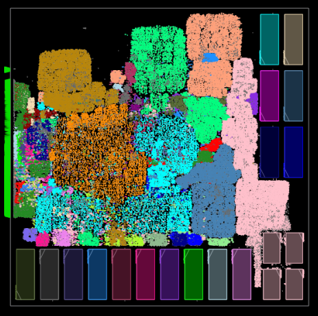

We implement [Mempool tile](../../../Testcases/mempool) on the [NanGate45](../../../Enablements/NanGate45) platform using the proprietary (commercial) tools **Cadence Genus** (Synthesis) and **Cadence Innovus** (P&R), and the open-source tools **Yosys** (Synthesis) and **OpenROAD** (P&R). 

The screenshot of the design using Cadence Flow-1 on Nangate45 enablement is shown below   

  
The screenshot of the design using ORFS on Nangate45 enablement is shown below  

