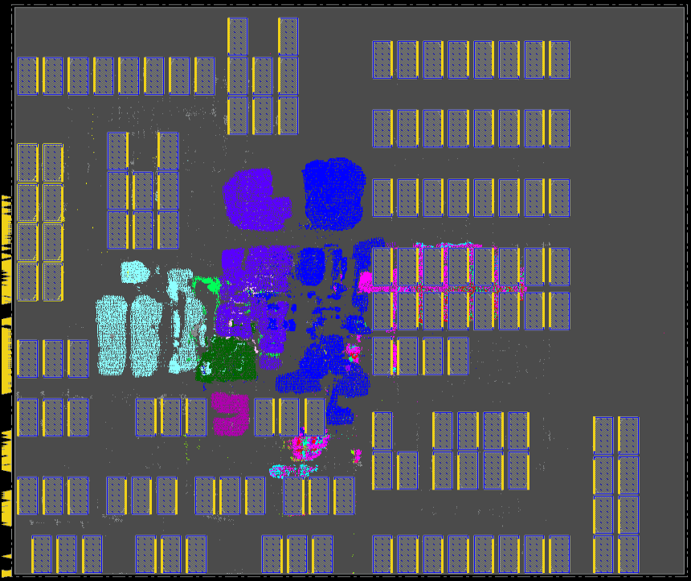
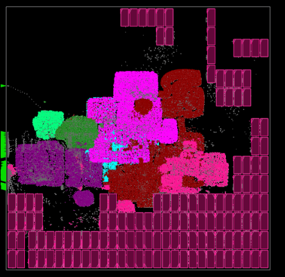

# Synthesis, Place & Route (SP&R):
The setup to run SP&R on the available test cases for the given enablements are available in *./<enablement_name>/<testcase_name>/* directories.  
- [NanGate45](../Enablements/NanGate45/)
  - [Ariane136](./NanGate45/ariane136/)
  - [Ariane133](./NanGate45/ariane133/)
  - [MemPool tile](./NanGate45/mempool_tile/)
  - [NVDLA](./NanGate45/nvdla/)
- [ASAP7](../Enablements/ASAP7/)
  - [Ariane136](./ASAP7/ariane136/)
  - [Ariane133](./ASAP7/ariane133/)
  - [MemPool tile](./ASAP7/mempool_tile/)
  - [NVDLA](./ASAP7/nvdla/)
- [SKY130HD FakeStack](../Enablements/SKY130HD/)
  - [Ariane136](./SKY130HD/ariane136/)
  - [Ariane133](./SKY130HD/ariane133/)
  - [MemPool tile](./SKY130HD/mempool_tile/)
  - [NVDLA](./SKY130HD/nvdla/)

Inside each directory are the following sub-directories that contain all of the files required to run the full SP&R flow.  
  - *constraints* directory contians the SDC constraint file for current design and enablement.
  - *def* directory contains the floorplan DEF file that is used in the SP&R flow. We provide two DEF files one with just the core.
    area and pin placements that is used for the logical synthesis flow [Flow-1](./figures/flow-1.PNG) and another DEF file that also inlcudes macro placements that
    is used in the physical synthesis iSpatial flow [Flow-2](./figures/flow-2.PNG).
  - *netlist* directory contains the synthesized netlist from [Flow-1](./figures/flow-1.PNG).
  - *scripts* directory contains the setup and scripts to run the full SP&R flow using both commercial and open-source tools.
  - *run* directory to peform the SP&R runs using the runscripts available in the *scripts* direcotry.

We provide the runscripts for all the flows and they are available in the *./\<enablement\>/\<testcase\>/scripts/* directory. The sub-directories available in the scripts directory are as follows.
- *cadence* directory contains all the runscripts related to [Flow-1](./figures/flow-1.PNG), [Flow-2](./figures/flow-2.PNG). We will also add [Flow-4](./figures/flow-4.PNG) scripts here.
- *OpenROAD* directory contains the *<testcase>.tar.gz* file, which includes all the required file to run [Flow-3](./figures/flow-3.PNG) using OpenROAD-flow-scripts ([ORFS](https://github.com/The-OpenROAD-Project/OpenROAD-flow-scripts/tree/master/flow/platforms/nangate45)).

The detailed stpes to run SP&R using the proprietary (commercial) tools **Cadence Genus** (Synthesis) and **Cadence Innovus** (P&R), and the open-source tools **Yosys** (Synthesis) and **OpenROAD** (P&R) are as follows.
  - [**SP\&R Flow**](#spr-flow)
    - [**Cadence tools**](#using-cadence-genus-and-innovus)
    - [**OpenROAD tools**](#using-openroad-flow-scripts)

## **SP\&R Flow:**
All the flows uses the *RTL* available under the [*Testcases*](../Testcases/) directory and the *.lef*, *.lib* and *qrc* files available under the [*Enablements*](../Enablements/) directory. All the required SRAM models are generated and available under the [*Enablements*](../Enablements/) directory.    
  
### **Using Cadence Genus and Innovus:**
All the required runscripts are available in the *./\<enablement\>/\<testcase\>/scripts/cadence/* directory. The steps to modify *run.sh* to launch SP&R runs for Flow-1 and Flow-2 are as follows.
- To launch Flow-1 set the **PHY_SYNTH** environment variable to *0* in the *run.sh* file.  
``` export PHY_SYNTH=0 ```
- To laucnh Flow-2 set the **PHY_SYNTH** environment variable to *1* in the *run.sh* file.  
``` export PHY_SYNTH=1 ```
- To start the SP&R run use the following command.  
``` ./run.sh ```


**Synthesis:** The *run_genus_hybrid.tcl* is used to run the logical synthesis using Genus and physical synthesis using Genus iSpatial. It utilizes the **PHY_SYNTH** environment variable to choose which flow to run. Minor details of each synthesis flow are as follows.
- Logical synthesis using Genus (Flow-1): We use the *elaborate*, *syn_generic*, *syn_map* and *syn_opt* commands to generate the synthesized netlist. This synthesized netlist is available in the *netlist* directory for each testcase on all enablements.
- Physical synthesis using Genus iSpatial (Flow-2): We use the *elaborate*, *syn_generic -physical*, *syn_map -physical* and *syn_opt -iSpatial* commands to generate the sunthesized netlist. In this step we provide the floorplan def with placed macros and pins as an extra input compared to Flow-1. This def file is generate in Flow-1.
- Physical synthesis using Genus iSpatial for Circuit Training (Flow-4): This is same as Flow-2 synthesis flow. Only difference is the input def file contains only place pin information and no macro information.

The command to launch only the synthesis job is as follows.
```
# export PHY_SYNTH=0   #For Flow-1 uncomment this line
# export PHY_SYNTH=1   #For Flow-2 uncomment this line
genus -overwrite -log log/genus.log -no_gui -files run_genus_hybrid.tcl
```  
We use the constraint file available in the *constraint* directory for the synthesis run. We set the target clock period to a reasonable value that is not too easy or hard for the tool to achieve.

**P\&R:** The *run_invs.tcl* is used to run the place and route using Cadence Innovus. The netlist and constraint generated during synthesis flow are used in this step. It also utilizes the **PHY_SYNTH** environment variable to choose which flow to run. Minor details of each P&R flow are as follows.
- Flow-1
  - We use aspect ratio 1 and a utilization value in the range of 40% to 60%. All the pins are placed on the left side of the floorplan and the def file *\<design\>_fp.def* is available in the def directory. The following command is used to place the pins.  
  ```
  ### pin_list contains the name of all the top level pins. Here Y1 < Y2. LAYER1 and LAYER2 are two horizontal layer above M1 or metal1 or met1 ###
  editPin -pin $pin_list -edge 0 -start {0 Y1} -end {0 Y2} -fixedPin -layer {LAYER1 LAYER2} -spreadDirection clockwise -pattern fill_optimised
  ```
  - The *place_design -concurrent_macros* command is used to place the macros and the def file *\<design\>_fp_placed_macros.def* is available in the def directory.
  - It uses *place_opt_design*, *ccopt_design* and *routeDesign* commands for placement, CTS and routing of the design.
- Flow-2
  - The *run_invs.tcl* script utilizes the *.def* file generated by the Genus iSpatial flow as a starting point.
  - Similar to Flow-1 it uses *place_opt_design*, *ccopt_design* and *routeDesign* commands for placement, CTS and routing of the design.

The command to launch the SP&R job is as follows.  
```
### Make sure you have ran the synthesis already. run_invs.tcl uses the output generated in synthesis stage ###
# export PHY_SYNTH=0   #For Flow-1 uncomment this line
# export PHY_SYNTH=1   #For Flow-2 uncomment this line
innovus -64 -init run_invs.tcl -log log/run.log
```  

Below is the screenshot of the Ariane SP\&R database with 136 memory macros using Cadence flow on NanGate45 enablement.  


This script was written and developed by ABKGroup students at UCSD; however, the underlying commands and reports are copyrighted by Cadence. We thank Cadence for granting permission to share our research to help promote and foster the next generation of innovators.  

### **Using OpenROAD-flow-scripts:**
Clone ORFS and build OpenROAD tools following the steps given [here](https://github.com/The-OpenROAD-Project/OpenROAD-flow-scripts). To run SP&R using OpenROAD tools follow the below mentioned steps:  
1. Copy *./\<enablement\>/\<testcase\>/scripts/OpenROAD/\<design\>.tar.gz* file to *{ORFS Clone Directory}/OpenROAD-flow-scripts/flow/designs/\<enablement\>* area.
2. Use command *tar -xvf \<design\>.tar.gz* to untar *\<design\>.tar.gz*. This will generate *\<design\>* directory which contains all the files required to run SP&R using ORFS.
3. To launch the SP&R job go to the flow directory and use the below command
  ```
  make DESIGN_CONFIG=./designs/<enablement>/<design>/config_hier.mk
  ```
4. config_hier.mk uses the **RTL-MP** (RTL Macro Placer) for macro placement. If you wish to run macro placement using the older **Triton Macro Placer**, please use the below command:
  ```
  make DESIGN_CONFIG=./designs/<enablement>/<design>/config.mk
  ```  

Below is the screenshot of the Ariane SP\&R database with 136 memory macros using the ORFS (RTL-MP) flow.  
