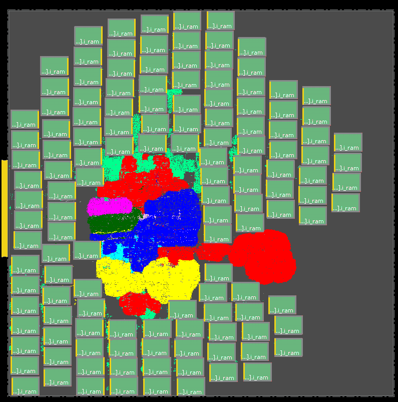
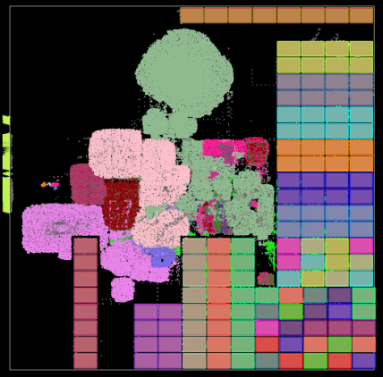

# **Synthesis, Place \& Route (SP\&R):**
Here we provide the setup to run SP&R of Ariane design with 133 macros on SKY130HD using commercial and open-source tools. First, we provide the steps for netlist preparation and then discuss the SP&R flow.
  - [**SP\&R Flow:**](#spr-flow)
    - [**Using Cadence Innovus:**](#using-cadence-innovus)
    - [**Using OpenROAD-flow-scripts:**](#using-openroad-flow-scripts)

## **SP\&R Flow:**
We implement the Ariane design on the SKY130HD platform using the proprietary (commercial) tools **Cadence Genus** (Synthesis) and **Cadence Innovus** (P&R), and the open-source tools **Yosys** (Synthesis) and **OpenROAD** (P&R). The required *.lef* and *.lib* files are downloaded from the OpenROAD-flow-scripts (ORFS) [GitHub](https://github.com/The-OpenROAD-Project/OpenROAD-flow-scripts/tree/master/flow/platforms/sky130hd). We use the [fakeram](https://github.com/jjcherry56/bsg_fakeram) generator for the SKY130HD platform to generate the 16-bit (256x16, single-ported SRAM) memory. All the required *.lib* and *.lef* files are copied into the [*Enablements/SKY130HD*](../../../Enablements/SKY130HD/) directory.  
  
### **Using Cadence Innovus:**
All the required scripts are available in the [*./scripts/cadence/*](./scripts/cadence/) directory.  
We use an unnamed commercial logic synthesis tool to synthesize the Ariane 133-macro version from Verilog RTL. The synthesized gate-level (standard cells and SRAM macros) netlist is available in [*./netlist/*](./netlist/) directory.
  
**P\&R:** [run_innovus.tcl](./scripts/cadence/run_invs.tcl) contains the setup for the P&R run using Innvous. It reads the gate-level netlist provided in [*./netlist/*](./netlist/) directory. To launch the P\&R run please use the below command.
```
innovus -64 -init run_invs.tcl -log log/run.log
```  
Innovus requires a configuration file to run the macro placement flow. For this we use *proto_design -constraints mp_config.tcl* command. The configuration file [*mp_config.tcl*](./scripts/cadence//mp_config.tcl) is available in the [*./scripts/cadence/*](./scripts/cadence/) directory. Some details of the configuration files are as follows:
1. Provide the memory hierarchy name under the **SEED** section. If you do not provide the memory hierarchy here, then the macro placement constraints (e.g., cell orientation, spacing, etc.) related to that memory may be overlooked.
2. For each macro, valid orientation and spacing rules can be provided under the **MACRO** section. For example, we set valid macro orientation as *R0* for our run, horizontal spacing as *10um*, and vertical spacing as *5um*. Also, when you provide the cell name (ref name, not instance name) add the *isCell=true* option.

Below is the screenshot of the Ariane SP\&R database with 133 memory macros using the Cadence flow.  
  

This script was written and developed by ABKGroup students at UCSD; however, the underlying commands and reports are copyrighted by Cadence. We thank Cadence for granting permission to share our research to help promote and foster the next generation of innovators.

<!--
### **Using OpenROAD-flow-scripts:**
Clone ORFS and build OpenROAD tools following the steps given [here](https://github.com/The-OpenROAD-Project/OpenROAD-flow-scripts). To run SP&R using OpenROAD tools follow the below mentioned steps:  
1. Copy [*./scripts/OpenROAD/ariane.tar.gz*](./scripts/OpenROAD/ariane.tar.gz) file to *{ORFS Clone Directory}/OpenROAD-flow-scripts/flow/designs/nangate45* area.
2. Use command *tar -xvf ariane.tar.gz* to untar *ariane.tar.gz*. This will generate *ariane133* directory which contains all the files required to run SP&R using ORFS. The config file contains the *set_dont_touch* (it is called PRESERVE_CELLS in ORFS) for the memory macros.
3. To launch the SP&R job go to the flow directory and use the below command
  ```
  make DESIGN_CONFIG=./designs/nangate45/ariane133/config_hier.mk
  ```
4. config_hier.mk uses the **RTL-MP** for macro placement. To run macro placement using **Triton Macro Placer** use the below command
  ```
  make DESIGN_CONFIG=./designs/nangate45/ariane133/config.mk
  ```  
  
Below is a screenshot of the Ariane SP\&R database with 133 memory macros using ORFS (RTL-MP) flow.  

-->
