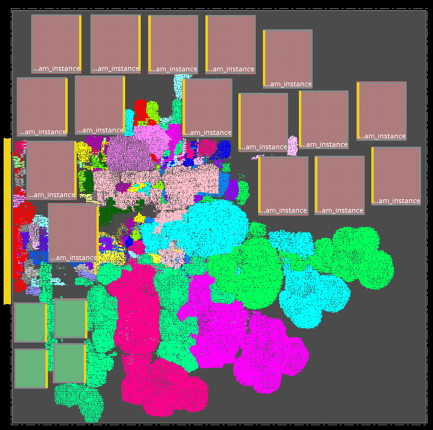
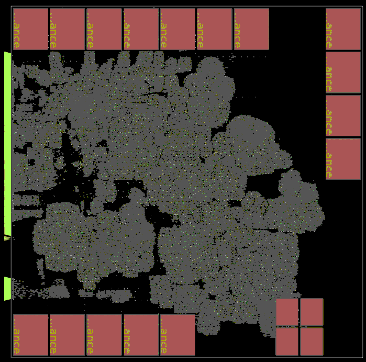

We implement [Mempool tile](../../../Testcases/mempool) on the [SKY130HD FakeStack](../../../Enablements/SKY130HD) platform using the proprietary (commercial) tools **Cadence Genus** (Synthesis) and **Cadence Innovus** (P&R), and the open-source tools **Yosys** (Synthesis) and **OpenROAD** (P&R). 

The screenshot of the design using Cadence Flow-1 on SKY130HD FakeStack enablement is shown below   

  
The screenshot of the design using ORFS on SKY130HD FakeStack enablement is shown below  

