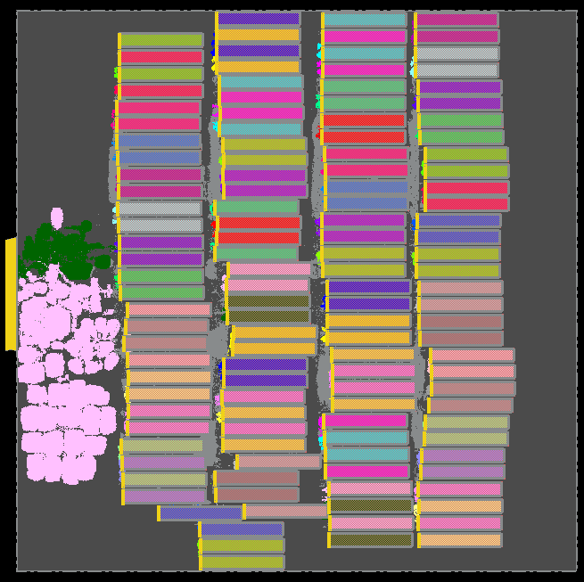

We implement [NVDLA](../../../Testcases/nvdla) on the [SKY130HD FakeStack](../../../Enablements/SKY130HD) platform using the proprietary (commercial) tools **Cadence Genus** (Synthesis) and **Cadence Innovus** (P&R), and the open-source tools **Yosys** (Synthesis) and **OpenROAD** (P&R).

The screenshot of the design using Cadence Flow-1 on SKY130HD FakeStack enablement is shown below. The 256x64 SRAM memory dimension is weird. This is the memory we have generated using the [bsg_fakeram](https://github.com/jjcherry56/bsg_fakeram) memory compiler.
  
  
<!-- The screenshot of the design using ORFS on ASAP7 enablement is shown below  
 -->
