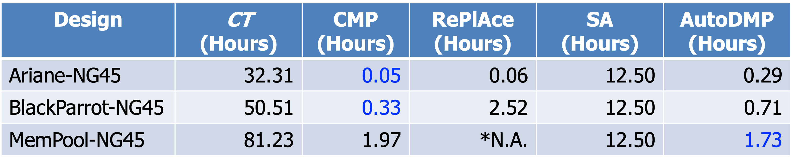
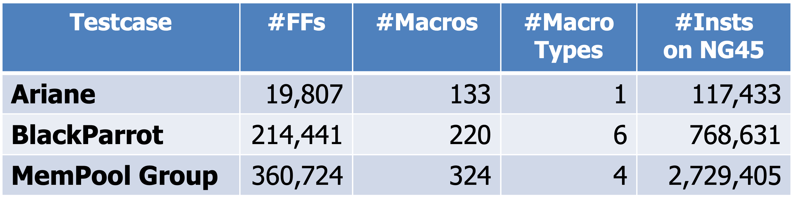
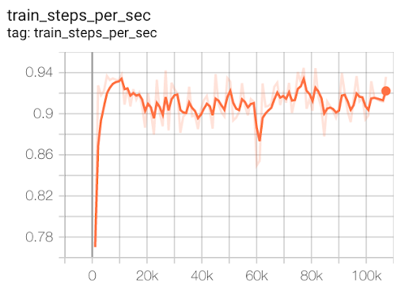
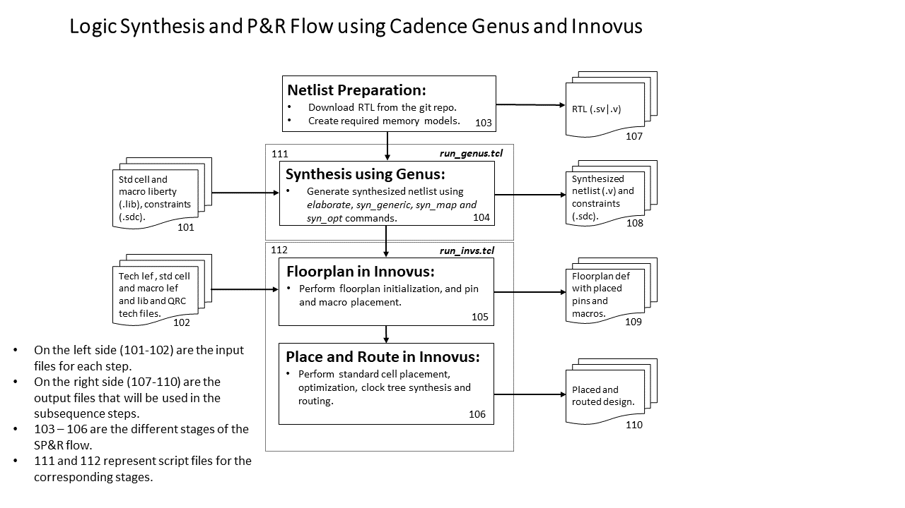
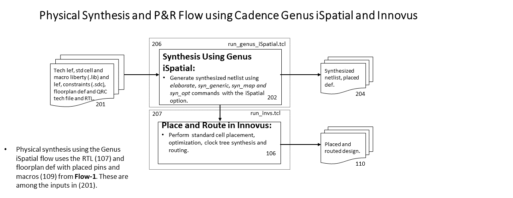
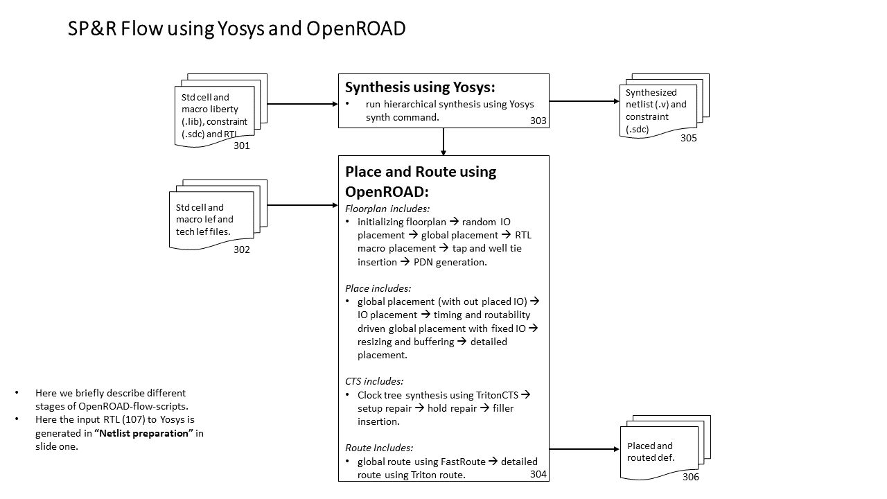
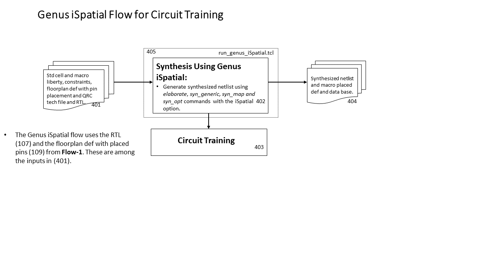

# **MacroPlacement**

## **What’s New?**
- **18 March 2025**: We have (1) updated our ASAP7 testcases; (2) improved our
SA baseline implementation for faster and better results; and (3) generated
macro placement solutions using the latest Circuit Training (dubbed as
AlphaChip) for all of our testcases, including the scaled 7nm Ariane testcases
announced on 3 Nov 2024. See the full release notes in the march_updates branch:
[here](https://github.com/TILOS-AI-Institute/MacroPlacement/tree/march_updates?tab=readme-ov-file#recent-updates).

## **Introduction**
**MacroPlacement** is an open, transparent effort to provide a public, baseline implementation of [Google Brain's Circuit Training](https://github.com/google-research/circuit_training) (Morpheus) deep RL-based placement method. We will provide (1) testcases in open enablements, along with multiple EDA tool flows; (2) implementations of missing or binarized elements of Circuit Training; (3) reproducible example macro placement solutions produced by our implementation; and (4) post-routing results obtained by full completion of the synthesis-place-and-route flow using both proprietary and open-source tools.

## **Materials for the Broad Audience**
 - A ["For the Record"](https://docs.google.com/document/d/1vkPRgJEiLIyT22AkQNAxO8JtIKiL95diVdJ_O4AFtJ8/edit) and ensuing series of updates ([#1](https://docs.google.com/document/d/1c-uweo3DHiCWZyBzAdNCqqcOrAbKq1sVIfY0_4bFCYE/edit), [#2](https://docs.google.com/document/d/1ibqf9LKQwR5BwYnWWLgvSwOz547VXoFhXHQzMzk7PbY/edit), [#3](https://docs.google.com/document/d/1IezovfF_Eq10Pumvl9Rb8oN7E9X7ALg73DFNsmoTlAc/edit), [#4](https://docs.google.com/document/d/1b0LyF72fytthaL827ZPQGjOJwCgnFq_tOTAiSpV49Ms/edit)) have since June 2022 provided added context for our efforts.
 - [ISPD-2023 paper](https://vlsicad.ucsd.edu/Publications/Conferences/396/c396.pdf) and [arXiv version](https://arxiv.org/abs/2302.11014)
 - ISPD-2023 short [video](https://vlsicad.ucsd.edu/Publications/Conferences/396/396short.mp4) and [pptx slides](https://vlsicad.ucsd.edu/Publications/Conferences/396/396short.pptx) (long [video](https://vlsicad.ucsd.edu/Publications/Conferences/396/396.mp4) and [pptx slides](https://vlsicad.ucsd.edu/Publications/Conferences/396/396.pptx))
 - [FAQs](#faqs)

## **Table of Contents**
  <!-- - [Reproducible Example Solutions](#reproducible-example-solutions) -->
  - [Recent Updates](#recent-updates)
  - [FAQs](#faqs)
  - [Testcases](#testcases) contains open-source designs such as Ariane, MemPool and NVDLA.
  - [Enablements](#enablements) contains PDKs for open-source enablements such as NanGate45, ASAP7 and SKY130HD with FakeStack. Memories required by the designs are also included.
  - [Flows](#flows) contains tool setups and runscripts for both proprietary and open-source SP&R tools such as Cadence Genus/Innovus and OpenROAD.
  - [Code Elements](#code-elements) contains implementation of engines such as Clustering, Grouping, Gridding as well as Format translators required by Circuit Training flow.
  - [Baseline for Circuit Training](#baseline-for-circuit-training) provides a baseline for [Google Brain's Circuit Training](https://github.com/google-research/circuit_training).
  - Links to Further Technical Details and Chronology
    - [Our Progress: A Chronology](https://tilos-ai-institute.github.io/MacroPlacement/Docs/OurProgress/) provides latest updates.
    - [Proxy Cost](https://tilos-ai-institute.github.io/MacroPlacement/Docs/ProxyCost/) documentation gives implementation details to enable reproduction of the wirelength, density and congestion costs used by [Circuit Training](https://github.com/google-research/circuit_training).
  - [Other Links](#other-links)

## **Recent Updates**
- **18 March 2025**: We have (1) updated our ASAP7 testcases; (2) improved our
SA baseline implementation for faster and better results; and (3) generated
macro placement solutions using the latest Circuit Training (dubbed as
AlphaChip) for all of our testcases, including the scaled 7nm Ariane testcases
announced on 3 Nov 2024. The details are as follows.
  - Updated ASAP7 [tech lef](./Enablements/ASAP7/lef/asap7_tech_1x_201209.lef) (following the update in [OpenROAD-flow-scripts](https://github.com/The-OpenROAD-Project/OpenROAD-flow-scripts)) to enable routing up to M9. We have rerun the [Ariane133](./Flows/ASAP7/ariane133) testcases and added [BlackParrot](./Flows/ASAP7/bp_quad) and [MemPoolGroup](./Flows/ASAP7/mempool_group/) testcases.
  - We strengthen our Simulated Annealing (SA) baseline by adding multithreading and a “go-with-the-winners” metaheuristic, while also ensuring reproducibility of its execution. We provide docker environment scripts to ensure reproducibility of the results obtained by SA. For more details, please refer to the [SA README](CodeElements/SimulatedAnnealingGWTW/README.md).
  - The hMETIS binary used in Circuit Training does not take any seed as input and the outputs are non-deterministic. We provide a CPP wrapper that uses the hMETIS C API and calls the hMETIS library to cluster the netlist for a given seed, ensuring reproducibility of the clustering results. For more details, please refer to the [Clustering README](CodeElements/Clustering/src/README.md).
  - We train Google’s AlphaChip from scratch, and fine-tune AlphaChip (from the pre-trained checkpoint released in August 2024), for all our testcases. A revised experimental protocol – for both training from scratch and fine-tuning – affords more opportunity for CT to converge: we increase the number of iterations from 200 to 400, and make multiple trials before declaring non-convergence. We provide the tensorboard links for the pre-training, training from scratch, and fine-tuning of AlphaChip [here](./Docs/OurProgress/README.md#03182025).
  
- **3 Nov 2024**: We have posted a new [Protobuf-to-LEF/DEF converter](CodeElements/FormatTranslators/README.md), along with scaled versions of Google Brain's Ariane design in both Protobuf and LEF/DEF formats, as described in the [IEEE DATC RDF update paper](https://vlsicad.ucsd.edu/Publications/Conferences/412/c412.pdf) ([https://doi.org/10.1145/3676536.3697136](https://doi.org/10.1145/3676536.3697136)) at ICCAD-2024. Some [new calibration results](./Docs/OurProgress/README.md#Oct26102024) (HPWL and runtime) for RePlAce and Cadence CMP are also provided in our Our Progress chronology.

## **FAQs**
**1. Why are you doing this?**
- The challenges of data and benchmarking in EDA research have, in our view, been contributing factors in the controversy regarding the Nature work. The mission of the [TILOS AI Institute](https://tilos.ai/) includes finding solutions to these challenges -- in high-stakes applied optimization domains (such as IC EDA), and at community-scale. We hope that our effort will become an existence proof for transparency, reproducibility, and democratization of research in EDA. [We applaud and thank Cadence Design Systems for allowing their tool runscripts to be shared openly by researchers, enabling reproducibility of results obtained via use of Cadence tools.]
- We do understand that Google has been working hard to complete the open-sourcing of Morpheus, and that this effort continues today. However, as pointed out in [this Doc](https://docs.google.com/document/d/1vkPRgJEiLIyT22AkQNAxO8JtIKiL95diVdJ_O4AFtJ8/edit?usp=sharing), updated [here](https://docs.google.com/document/d/1c-uweo3DHiCWZyBzAdNCqqcOrAbKq1sVIfY0_4bFCYE/edit?usp=sharing), it has been more than a year since "Data and Code Availability" was committed with publication of the [Nature paper](https://www.nature.com/articles/s41586-021-03544-w). We consider our work a "backstop" or "safety net" for Google's internal efforts, and a platform for researchers to build on. 

**2. What can others contribute?**
- Our shopping list (updated March 2023) includes the following. Please join in!  
  <!-- - simulated annealing on the gridded canvas: documentation and implementation - force-directed placement: documentation and implementation -->
  - Donated cloud resources (credits) for experimental studies.
  - Relevant testcases with reference implementations and implementation flows (note that scripts for major EDA tools can now be shared in GitHub for research purposes, enabling reproducibility of associated results).
  - Improved "fakeram" generator for the [ASAP7](https://github.com/The-OpenROAD-Project/asap7) research PDK; design enablement for the recently-released [ASAP5](https://github.com/The-OpenROAD-Project/asap5) research PDK is also very welcome.
  - Additional open experimental questions, along with experimental designs and/or efforts to resolve these questions.

**3. What is your timeline?**
- We showed our [progress](https://open-source-eda-birds-of-a-feather.github.io/doc/slides/MacroPlacement-SpecPart-DAC-BOF-v5.pdf) at the Open-Source EDA and Benchmarking Summit birds-of-a-feather [meeting](https://open-source-eda-birds-of-a-feather.github.io/) on July 12 at DAC-2022.
- During Summer 2022, we began studying benefits and limitations of the CT methodology itself, following a thread of experimental questions as noted [here](https://docs.google.com/document/d/1HHZNcid5CZvvRqj_njzF7hBhtNSpmRn3fCYniWNYBiY/edit?usp=sharing) and [here](https://docs.google.com/document/d/1c-uweo3DHiCWZyBzAdNCqqcOrAbKq1sVIfY0_4bFCYE/edit). Contributions of additional questions and efforts to resolve them are welcome.

### <b>New FAQs</b> after the release of our ISPD-2023 paper ([here](https://vlsicad.ucsd.edu/Publications/Conferences/396/c396.pdf) and on [arXiv](https://arxiv.org/abs/2302.11014#))

**4. How was the UCSD replication of CT validated?**  

We obtained **two separate confirmations** from Google engineers that our running of CT was correct. These were received on August 10, 2022 and October 3, 2022.
- **The first confirmation** was from Dr. Wenjie (Joe) Jiang on August 10, 2022.
  - We ran CT for the [Ariane netlist](https://github.com/google-research/circuit_training/tree/main/circuit_training/environment/test_data/ariane) available in the CT repository and shared the tensorboard [link](https://tensorboard.dev/experiment/a9Hnp0I9RpqSobfJYpZvig/#scalars) and the final [plc file](https://drive.google.com/file/d/1hY_kg2qJUdHRlO5Y-zj0z2DrNo2Cvavs/view?usp=sharing) (which contains the macro locations of the final solution) with Google engineers. 
  - **Our** proxy wirelength cost, proxy density cost and proxy congestion cost of the final solution are respectively 0.0913, 0.5290 and 0.9017. **The CT repo** gives this [link](https://github.com/google-research/circuit_training/blob/main/docs/ARIANE.md#circuit-training-for-ariane-risc-v) to Google’s training curve and final proxy cost for the same input netlist. The close match of training curves and final proxy cost values provided the desired confirmations.
  - We received this comment from Dr. Jiang after sharing the final [plc file](https://drive.google.com/file/d/1hY_kg2qJUdHRlO5Y-zj0z2DrNo2Cvavs/view?usp=sharing): “This plc (wirelength 0.0913, density 0.5290 and congestion 0.9017) is very close to ours (assuming they use the default congestion_weight=0.5). With more resources, their RL result could potentially improve further. This plc view (added on doc) also looks reasonable.” Indeed, our training runs that were communicated to Google used congestion weight=0.5.
- **The second confirmation** was from Mr. Guanhang Wu on October 3, 2022.
  - We shared the clustered netlist of Ariane design with 68% floorplan utilization on NanGate45 with Guanhang. Here is the [link](./Docs/OurProgress/README.md#October3) to the details of Guanhang’s run and our run. The close match of training curves, final proxy cost values and the Nature Table 1 metrics provided the desired confirmations.
  - We mention this confirmation in Slide 17 of the [ISPD-2023 talk](https://vlsicad.ucsd.edu/Publications/Conferences/396/396.pptx) and in Section 5.2.5 of [ISPD-2023 paper](https://vlsicad.ucsd.edu/Publications/Conferences/396/c396.pdf).  
  
The above-mentioned matches between our CT runs and Google engineers’ CT runs provided confirmation as of last Fall that our environment is correct. All of our code has been open-sourced and unchanged since mid-January 2023. There have been no suggestions that it is incorrect in any way.
  
**5. Was Circuit Training intended by Google to provide the code that was used in the Nature paper?**  

Google has stated this on a number of occasions. Of course, a key motivation for our MacroPlacement work has been that code to reproduce Nature has been only **partially** open-sourced in Circuit Training, and that the data used in Nature has not yet been made public.
- CT README.md: “This framework reproduces the methodology published in the Nature 2021 paper” ([link](https://github.com/google-research/circuit_training/blob/main/README.md))
- Author Correction (March 31, 2022) in the Nature paper: “The code used to generate these data is available in the following GitHub repository: [https://github.com/google-research/circuit_training](https://github.com/google-research/circuit_training)” ([link](https://www.nature.com/articles/s41586-022-04657-6))
- VP at Google (Zoubin Ghahramani) (April 7, 2022): “Google stands by this work published in Nature on ML for Chip Design, which has been independently replicated, open-sourced, and used in production at Google.” ([Twitter](https://twitter.com/ZoubinGhahrama1/status/1512203509646741507))
- Jeff Dean at NeurIPS 2022 (Dec. 2): “... Andrew Kahng’s lab, a strong chip design research group, and they also reproduced the results” ([Link](https://slideslive.com/38994456/machine-learning-for-computer-systems-at-google))

**6. Did you use pre-trained models? How much does pre-training matter?**  

We did not use pre-trained models in our study. Note that it is impossible to replicate the pre-training described in the Nature paper, for two reasons: (1) the data set used for pre-training consists of 20 TPU blocks which are not open-sourced, and (2) the code for pre-training is not released either.
- In the Circuit Training repo, Google engineers write:  “Our results training from scratch are comparable or better than the reported results in the paper (on page 22) which used fine-tuning from a pre-trained model. We are training from scratch because we cannot publish the pre-trained model at this time and the released code can provide comparable results.” ([link](https://github.com/google-research/circuit_training/blob/main/docs/ARIANE.md#results))
- The Stronger Baselines manuscript showed that a pre-trained model helped to improve proxy cost for the TPU blocks, but failed to improve HPWL and congestion for the ICCAD04 benchmarks. The SB authors pre-trained their model for 48 hours using 200 CPUs and 20 GPUs with a training dataset of 20 TPU blocks.
- The Nature paper did not show benefits from pre-training for Table 1 metrics. The Nature paper only shows benefits (from the pre-trained model) in terms of runtime and final proxy cost.

**7. What are the runtimes (wall times) of different macro placers that you studied?**  

- The above table is from Slide 29 of the [ISPD-2023 talk](https://vlsicad.ucsd.edu/Publications/Conferences/396/396.pptx). We note the following.
- CT: only includes CT training time
- SA: stopped after 12.5 hours automatically
- CMP: only the runtime of place_design -concurrent_macros command
- Resources required for different macro placers
  - CT: Training and evaluation jobs run on (8 NVIDIA-V100 GPU, 96 CPU thread, Memory: 354 GB) machine and 13 collector jobs on each of two (96 CPU thread, Memory: 354 GB) machines
  - SA: 320 parallel jobs where each job used 1 thread
  - RePlAce: used 1 thread
  - CMP: Innovus launched with 8 threads
  - AutoDMP: run on NVIDIA DGX-A100 machine with two GPU workers

**8. In your experiments how do the results of Simulated Annealing (SA) and Reinforcement Learning (i.e., Circuit Training) compare?**

- The solutions typically produced by human experts and SA are superior to those generated by the RL framework in the majority of cases we tested.
- Furthermore, in our experiments, SA in nearly all cases produces better results than Circuit Training, **using less computational resources**, across both benchmark sets that we studied.

<table>
<thead>
  <tr>
    <th>Testcases</th>
    <th>Proxy cost</th>
    <th>Wirelength (WL)</th>
  </tr>
</thead>
<tbody>
  <tr>
    <td>ICCAD04 (IBM)</td>
    <td>SA wins over CT 17/17</td>
    <td>SA wins over CT 16/17 (HPWL)</td>
  </tr>
  <tr>
    <td>Modern IC designs</td>
    <td>SA wins over CT 4/6</td>
    <td>SA wins over CT 5/6 (routed WL)</td>
  </tr>
</tbody>
</table>

**9. Did the work by Prof. David Pan show that Google open-source code was sufficient?**

- No. The arXiv paper “Delving into Macro Placement with Reinforcement Learning” was published in September 2021, before the open-sourcing of Circuit Training. To our understanding, the work focused on use of DREAMPlace instead of force-directed placement.

**10. Which conclusions did you confirm from the Nature paper and from Stronger Baselines?**
  
- For the Nature paper: We confirmed that Circuit Training (narrowly) beats RePlAce **on modern testcases** with respect to both proxy cost and Nature Table 1 metrics. (Out of 6 head-to-head comparisons for each available metric, RePlAce wins only 3/6 routed wirelength comparisons and 2/6 total power comparisons.) But human experts and some other baselines beat CT.
- For Stronger Baselines: We confirmed that SA outperforms Circuit Training on ICCAD04 benchmarks. Out of 17 head-to-head comparisons for each available metric, Circuit Training wins 1/17 HPWL comparisons. 
  - The results are mixed for modern testcases, e.g., SA beats Circuit Training 5/6 times for routed wirelength, but Circuit Training beats SA 4/6 times (BlackParrot GF12 is a tie) for timing, i.e., TNS.
- For Stronger Baselines: We confirmed that RePlAce beats Circuit Training **on ICCAD04 benchmarks**. Out of 17 head-to-head comparisons for each available metric, Circuit Training did not win any proxy cost or HPWL comparisons.
- We were not able to confirm other conclusions of Nature or Stronger Baselines.

**11. Did it matter that Circuit Training used an initial placement from a physical synthesis tool?**  
  
Yes. Circuit Training benefits **substantially** from its use of the placement locations that it obtains from physical synthesis. 
- An ablation study is reported in Section 5.2.1 of our [ISPD-2023 paper](https://vlsicad.ucsd.edu/Publications/Conferences/396/c396.pdf). To test the effect of initial placement on CT outcomes, we generated three “vacuous” input placements for the Ariane-NG45 design. These three cases (1), (2) and (3) respectively have all standard cells and macros located at (600, 600), at the lower-left corner (0, 0), and at the upper-right corner (1347.1, 1346.8) of the layout canvas. For each case, we generate the clustered netlist, run CT and collect Nature Table 1 metrics ([Link](https://github.com/TILOS-AI-Institute/MacroPlacement/tree/main/Docs/OurProgress#Question1) to all three Nature Table 1 metrics). 
- **We find that placement information in the input provides significant benefit to CT**. When given locations from (Cadence CMP + Genus iSpatial) physical synthesis, CT’s routed wirelength **decreases** by 10.32%, 7.24% and 8.17% compared to Cases (1), (2) and (3), respectively. See the [Link](https://github.com/TILOS-AI-Institute/MacroPlacement/tree/main/Docs/OurProgress#circuit-training-baseline-result-on-our-ariane133-nangate45_68) to Nature Table 1 metrics.

**12. Are the benchmarks (testcases) that you use adequate to test modern macro placement techniques?**  

We believe so. We developed new, modern testcases that are mapped to modern, open technologies with full routing and timing information. The table below summarizes the numbers of flip-flops, macros, distinct macro sizes, and standard-cell instances in these testcases.

BlackParrot and MemPool Group are larger and have multiple sizes of macros. They are significantly more challenging than the Ariane testcase used by Google, as confirmed by a shuffling experiment described in Section 5.2.6 of [our paper](https://vlsicad.ucsd.edu/Publications/Conferences/396/c396.pdf).

We also use the ICCAD04 academic benchmarks studied by Stronger Baselines; these are heavily used and well-known in the academic literature. All the ICCAD04 and modern benchmarks are fully available for download. We welcome additional testcases that target criteria not covered by our existing testcases.
  
**13. Are the resources used to run Circuit Training good enough to reproduce the Nature result?**  

We believe the answer is Yes.  We refer to the ISPD-2022 paper by Google authors S. Yu, E. Songhori, W. Jiang, T. Boyd, A. Goldie, A. Mirhoseini and S. Guadarrama, “[Scalability and Generalization of Circuit Training for Chip Floorplanning](https://dl.acm.org/doi/pdf/10.1145/3505170.3511478)”.

- **Training server.** In the ISPD-2022 paper, the authors state: “We think the 8-GPU setup is able to produce better results primarily because it uses a global batch size of 1024, which makes learning more stable and reduces the noise of the policy gradient estimator. Therefore, we recommend using the full batch size suggested in our open-source framework [2] in order to achieve optimal results.”
- Circuit Training itself shows the use of an 8-GPU setup to reproduce their published Ariane results [[link](https://github.com/google-research/circuit_training/blob/main/docs/ARIANE.md#reproduce-results)].
- We use eight NVIDIA-V100 GPUs to train the model for global batch size = 1024. The global batch size used in the Nature paper and the global batch size used in our runs are the same (i.e., global batch size = 1024). The Nature paper refers to the use of 16 GPUs. However, based on the statements given in Google’s ISPD-2022 paper, and what Circuit Training describes for “Reproduce results”, the final proxy cost achieved by our environment should not differ materially from what Nature’s environment achieves with 16 GPUs. 
- **Collect servers.** Again in the ISPD-2022 paper, the Google authors state: “With distributed collection, the user can run many (10s-1000s) Actor workers with each collecting experience for a given policy, speeding up the data collection process.” and, “As mentioned in Section 2.2, data collection and multi-GPU training in our framework are independent processes which can be optimized separately.”
- We use two collect servers each running 13 collect jobs, i.e., a total of 26 collect jobs are used for data collection. By contrast, the Nature authors run 512 collect jobs for data collection. The number of collect servers used to run 512 collect jobs is not clear from the description given in the Nature paper. We expect our runtimes to be higher than what Nature reports – **and we account for this in our experiments.**
- Train steps per second is the indicator of the CT training speed. The left plot below indicates the CT training speed for [Ariane](https://github.com/google-research/circuit_training/blob/main/docs/ARIANE.md#results) in our environment, i.e., ~0.9 steps/second. The right plot indicates the CT training speed for Ariane that is [posted in the CT](https://github.com/google-research/circuit_training/blob/main/docs/ARIANE.md#results) repo, i.e., ~2.3 steps/second. From this we infer that our runtime is expected to be ~2.6x times larger than the runtime when the suggested resource ([mentioned in the CT repo](https://github.com/google-research/circuit_training/blob/main/docs/ARIANE.md#reproduce-results)) is used.
- To make sure that we give the proper amount of resources to Circuit Training in our experiments, we observe from Google’s published [Tensorboard](https://tensorboard.dev/experiment/NRlmrDeOT2i4QV334hrywQ) that training of [Ariane](https://github.com/google-research/circuit_training/tree/main/circuit_training/environment) took **14** hours. We therefore give 14 * 2.6 = **~36** hours to our Circuit Training environment.  (This corresponds to 200 iterations, and this is [the number of iterations](https://github.com/google-research/circuit_training/blob/91e14fd1caa5b15d9bb1b58b6d5e47042ab244f3/circuit_training/learning/train_ppo.py#L55) that we uniformly give to Circuit Training in our experiments.)

**14. The [ISPD-2023 paper](https://vlsicad.ucsd.edu/Publications/Conferences/396/c396.pdf) includes results from Cadence’s Concurrent Macro Placer (in Innovus 21.1). What is the reasoning behind your use of CMP 21.1, which was not available to Google engineers when they wrote the Nature paper?**

We used Innovus version 21.1 since it was the latest version of our place-and-route **evaluator** of macro placement solutions. CMP 21.1 is part of Innovus 21.1.
- Using the latest version of CMP was also natural, given our starting assumption that RL from *Nature* would outperform the commercial state-of-the-art.
- We have now run further experiments using older versions of CMP and Innovus. The macro placements produced by CMP across versions 19.1, 20.1 and 21.1 lead to the same qualitative conclusions. Details are given [here](./Docs/OurProgress#Question16).
  
**15. What are the outcomes of CT when the training is continued until convergence?**  
  
To put this question in perspective, training “until convergence” is not described in any of the guidelines provided by the CT GitHub repo for reproducing the results in the Nature paper. For the [ISPD 2023 paper](https://vlsicad.ucsd.edu/Publications/Conferences/396/c396.pdf), we adhere to the guidelines given in the [CT GitHub repo](https://github.com/google-research/circuit_training/blob/main/docs/ARIANE.md#train-job), use the same number of iterations for Ariane as Google engineers demonstrate in the [CT GitHub repo](https://github.com/google-research/circuit_training/blob/main/docs/ARIANE.md#train-job), and obtain results that closely align with Google's outcomes for Ariane. (See FAQs #4 and #13.)

CT code **does not guarantee** convergence. This said, we have run CT training for an extended number (= 600, which is three times our default [value of 200](https://github.com/google-research/circuit_training/blob/main/docs/ARIANE.md#train-job)) of iterations, for each of Ariane, BlackParrot and MemPool Group, on NG45.  For MemPool Group, CT diverges (tensorboard [link](https://tensorboard.dev/experiment/w4txHNhAReCOV77LqvqkgQ/#scalars)). 

When convergence can be attained, the impact on key chip metrics is mixed. For instance, for Ariane, the chip metrics remain similar. In the case of BlackParrot, the routed wirelength significantly improves, but the TNS and WNS degrade. For Ariane and BlackParrot, the proxy cost improves significantly, but does not correlate with timing metrics. For more details, see [here](./Docs/OurProgress#Question17).

**In sum, training until convergence worsens some key chip metrics while improving others, highlighting the poor correlation between proxy cost and chip metrics. Overall, training until convergence does not qualitatively change comparisons to results of Simulated Annealing and human macro placements reported in the [ISPD 2023 paper](https://vlsicad.ucsd.edu/Publications/Conferences/396/c396.pdf).**

**Note:** We have not studied what happens if SA is given triple the runtime used in our reported experiments.
  
**16. The [ISPD-2023 paper](https://vlsicad.ucsd.edu/Publications/Conferences/396/c396.pdf) (Section 5.2.1, and Slide 17 of the ISPD-2023 [presentation](https://vlsicad.ucsd.edu/Publications/Conferences/396/396long.pdf)) concludes that CT benefits significantly from its use of initial placement. What is the reasoning behind giving CT “impossible” initial placements, where all instances are placed at the same location?**  
  
CT **requires** (x,y) locations – i.e., a placement – to run its grouping flow. Section 5.2.1 of our ISPD-2023 paper discusses the advantage that CT derives from its use of initial placement information from a commercial EDA tool. To measure this advantage, we study what happens when CT is deprived of this placement information.   

- In Section 5.2.1, we used “vacuous” placements where the same (x,y) location is given for all instances. This corresponds to the use of placements that have minimal information content.
- We have now performed a second study that gradually perturbs the EDA tool’s placement and measures the effect on CT outcomes. **In this second study, we always maintain legal placements: every placement that is fed to CT is “possible”**. 
- As detailed [here](./Docs/OurProgress/README.md#Question18), degrading the commercial placement information worsens all CT outcomes except for routed wirelength. Runtime is also worsened. 
- For the perturbed initial placements, SA in most cases yields better proxy cost and chip metrics compared to corresponding CT runs.
- **Our second study confirms our previous conclusion: CT obtains significant benefits by using placement information from a commercial EDA tool in its clustering step.**

**Note:** To be clear, in our [ISPD-2023 paper](https://vlsicad.ucsd.edu/Publications/Conferences/396/c396.pdf), all CT runs are given the benefit of an initial placement generated by CMP + Genus iSpatial flow. In Section 5.2.1 of the paper, vacuous (referred to as “impossible” in recent comments) placements are used solely to study the effect of the commercial initial placement on CT outcomes.

## **Testcases**  
The list of available [testcases](./Testcases) is as follows.
- Ariane (RTL)
  - [RTL files for Ariane design with 136 macros](./Testcases/ariane136/), which are generated by instantiating 16-bit memories in Ariane netlist available in the [lowRISC](https://github.com/lowRISC/ariane) GitHub repository.
  - [RTL files for Ariane design with 133 macros](./Testcases/ariane133/), which are generated by updating the memory connections of the 136 macro version.
- MemPool (RTL)
  - [RTL files for Mempool tile design](./Testcases/mempool/)
  - [RTL files for Mempool group design](./Testcases/mempool/)
- NVDLA (RTL)
  - [RTL files for NVDLA Partition *c*](./Testcases/nvdla/)
- BlackParrot (RTL)
  - [RTL files for BlackParrot](./Testcases/bp_quad)
  
In the [Nature Paper](https://www.nature.com/articles/s41586-021-03544-w), the authors report results for an Ariane design with 133 memory (256x16, single ported SRAM) macros. We observe that synthesizing from the available Ariane RTL in the [lowRISC](https://github.com/lowRISC/ariane) GitHub repository using 256x16 memories results in an Ariane design that has 136 memory macros. We outline the steps to instantiate the memories for Ariane 136 [here](./Testcases/ariane136/) and we show how we convert the Ariane 136 design to an Ariane 133 design that matches Google's memory macros count [here](./Testcases/ariane133/). 
  
We provide flop count, macro type and macro count for all the testcases in the following table.

<table class="tg">
<thead>
  <tr>
    <th class="tg-0lax">Testcase</th>
    <th class="tg-0lax">Flop Count</th>
    <th class="tg-0lax">Macro Details (macro type x macro count)</th>
  </tr>
</thead>
<tbody>
  <tr>
    <td class="tg-0lax"><a href="./Testcases/ariane136">Ariane136</a></td>
    <td class="tg-0lax">19839</td>
    <td class="tg-0lax">(256x16-bit SRAM) x 136</td>
  </tr>
  <tr>
    <td class="tg-0lax"><a href="./Testcases/ariane133">Ariane133</a></td>
    <td class="tg-0lax">19807</td>
    <td class="tg-0lax">(256x16-bit SRAM) x 133</td>
  </tr>
  <tr>
    <td class="tg-0lax"><a href="./Testcases/mempool">MemPool tile</a></td>
    <td class="tg-0lax">18278</td>
    <td class="tg-0lax">(256x32-bit SRAM) x 16 + (64x64-bit SRAM) x 4</td>
  </tr>
  <tr>
    <td class="tg-0lax"><a href="./Testcases/mempool">MemPool group</a></td>
    <td class="tg-0lax">360724</td>
    <td class="tg-0lax">(256x32-bit SRAM) x 256 + (64x64-bit SRAM) x 64 + (128x256-bit SRAM) x 2 + (128x32-bit SRAM) x 2</td>
  </tr>
  <tr>
    <td class="tg-0lax"><a href="./Testcases/nvdla">NVDLA</a></td>
    <td class="tg-0lax">45295</td>
    <td class="tg-0lax">(256x64-bit SRAM) x 128</td>
  </tr>
  <tr>
    <td class="tg-0lax"><a href="./Testcases/bp_quad">BlackParrot</a></td>
    <td class="tg-0lax">214441</td>
    <td class="tg-0lax">(512x64-bit SRAM) x 128 + (64x62-bit SRAM) x 32 + (32x32-bit SRAM) x 32 + (64x124-bit SRAM) x 16 + (128x16-bit SRAM) x 8 + (256x48-bit SRAM) x 4</td>
  </tr>
</tbody>
</table>

All the testcases are available in the [Testcases](./Testcases/) directory. Details of the sub-directories are  
  - *rtl*: directory contains all the required rtl files to synthesize the design.
  - *sv2v*: If the main repository contains multiple Verilog files or SystemVerilog files, then we convert it to a single synthesizable Verilog RTL. This is available in the *sv2v* sub-drectory.

## **Enablements**
The list of available enablements is as follows.
- [NanGate45](./Enablements/NanGate45/)
- [ASAP7](./Enablements/ASAP7/)
- [SKY130HD FakeStack](./Enablements/SKY130HD/)
  
Open-source enablements NanGate45, ASAP7 and SKY130HD are utilized in our SP&R flow. All the enablements are available under the [Enablements](./Enablements) directory. Details of the sub-directories are:
 - *lib* directory contains all the required liberty files for standard cells and hard macros.
 - *lef* directory contains all the required lef files.
 - *qrc* directory contains all the required qrc tech files.
  
We also provide the steps to generate the fakeram models for each of the enablements based on the required memory configurations.

## **Flows**
We provide multiple flows for each of the testcases and enablements. They are: (1) a logical synthesis-based SP&R flow using Cadence Genus and Innovus ([Flow-1](./Flows/figures/flow-1.PNG)), (2) a physical synthesis-based SP&R flow using Cadence Genus iSpatial and Innovus ([Flow-2](./Flows/figures/flow-2.PNG)), (3) a logical synthesis-based SP&R flow using Yosys and OpenROAD ([Flow-3](./Flows/figures/flow-3.PNG)), and (4) creation of input data for Physical synthesis-based Circuit Training using Genus iSpatial ([Flow-4](./Flows/figures/flow-4.PNG)).

The details of each flow are given in the following.
- **Flow-1:**  
  
- **Flow-2:**  
      
- **Flow-3:**  
    
- **Flow-4:**  
    

In the following table, we provide the status details of each testcase on each of the enablements for the different flows.
<table class="tg">
<thead>
  <tr>
    <th class="tg-0lax" rowspan="2">Test Cases</th>
    <th class="tg-0lax" colspan="4">Nangate45</th>
    <th class="tg-0lax" colspan="4">ASAP7</th>
    <th class="tg-0lax" colspan="4">SKY130HD FakeStack</th>
  </tr>
  <tr>
    <th class="tg-0lax">Flow-1</th>
    <th class="tg-0lax">Flow-2</th>
    <th class="tg-0lax">Flow-3</th>
    <th class="tg-0lax">Flow-4</th>
    <th class="tg-0lax">Flow-1</th>
    <th class="tg-0lax">Flow-2</th>
    <th class="tg-0lax">Flow-3</th>
    <th class="tg-0lax">Flow-4</th>
    <th class="tg-0lax">Flow-1</th>
    <th class="tg-0lax">Flow-2</th>
    <th class="tg-0lax">Flow-3</th>
    <th class="tg-0lax">Flow-4</th>
  </tr>
</thead>
<tbody>
  <tr>
    <td class="tg-0lax">Ariane 136</td>
    <td class="tg-0lax"><a href="./Flows/NanGate45/ariane136">Link</a></td>
    <td class="tg-0lax"><a href="./Flows/NanGate45/ariane136">Link</a></td>
    <td class="tg-0lax"><a href="./Flows/NanGate45/ariane136">Link</a></td>
    <td class="tg-0lax"><a href="./Flows/NanGate45/ariane136">Link</a></td>
    <td class="tg-0lax"><a href="./Flows/ASAP7/ariane136">Link</a></td>
    <td class="tg-0lax"><a href="./Flows/ASAP7/ariane136">Link</a></td>
    <td class="tg-0lax">N/A</td>
    <td class="tg-0lax"><a href="./Flows/ASAP7/ariane136">Link</a></td>
    <td class="tg-0lax"><a href="./Flows/SKY130HD/ariane136">Link</a></td>
    <td class="tg-0lax"><a href="./Flows/SKY130HD/ariane136">Link</a></td>
    <td class="tg-0lax"><a href="./Flows/SKY130HD/ariane136">Link</a></td>
    <td class="tg-0lax"><a href="./Flows/SKY130HD/ariane136">Link</a></td>
  </tr>
  <tr>
    <td class="tg-0lax">Ariane 133</td>
    <td class="tg-0lax"><a href="./Flows/NanGate45/ariane133">Link</a></td>
    <td class="tg-0lax"><a href="./Flows/NanGate45/ariane133">Link</a></td>
    <td class="tg-0lax"><a href="./Flows/NanGate45/ariane133">Link</a></td>
    <td class="tg-0lax"><a href="./Flows/NanGate45/ariane133">Link</a></td>
    <td class="tg-0lax"><a href="./Flows/ASAP7/ariane133">Link</a></td>
    <td class="tg-0lax"><a href="./Flows/ASAP7/ariane133">Link</a></td>
    <td class="tg-0lax">N/A</td>
    <td class="tg-0lax"><a href="./Flows/ASAP7/ariane133">Link</a></td>
    <td class="tg-0lax"><a href="./Flows/SKY130HD/ariane133">Link</a></td>
    <td class="tg-0lax"><a href="./Flows/SKY130HD/ariane133">Link</a></td>
    <td class="tg-0lax"><a href="./Flows/SKY130HD/ariane133">Link</a></td>
    <td class="tg-0lax"><a href="./Flows/SKY130HD/ariane133">Link</a></td>
  </tr>
  <tr>
    <td class="tg-0lax">MemPool tile</td>
    <td class="tg-0lax"><a href="./Flows/NanGate45/mempool_tile">Link</a></td>
    <td class="tg-0lax"><a href="./Flows/NanGate45/mempool_tile">Link</a></td>
    <td class="tg-0lax"><a href="./Flows/NanGate45/mempool_tile">Link</a></td>
    <td class="tg-0lax"><a href="./Flows/NanGate45/mempool_tile">Link</a></td>
    <td class="tg-0lax"><a href="./Flows/ASAP7/mempool_tile">Link</a></td>
    <td class="tg-0lax"><a href="./Flows/ASAP7/mempool_tile">Link</a></td>
    <td class="tg-0lax">N/A</td>
    <td class="tg-0lax"><a href="./Flows/ASAP7/mempool_tile">Link</a></td>
    <td class="tg-0lax"><a href="./Flows/SKY130HD/mempool_tile">Link</a></td>
    <td class="tg-0lax"><a href="./Flows/SKY130HD/mempool_tile">Link</a></td>
    <td class="tg-0lax"><a href="./Flows/SKY130HD/mempool_tile">Link</a></td>
    <td class="tg-0lax"><a href="./Flows/SKY130HD/mempool_tile">Link</a></td>
  </tr>
  <tr>
    <td class="tg-0lax">MemPool group</td>
    <td class="tg-0lax"><a href="./Flows/NanGate45/mempool_group">Link</a></td>
    <td class="tg-0lax"><a href="./Flows/NanGate45/mempool_group">Link</a></td>
    <td class="tg-0lax">N/A</td>
    <td class="tg-0lax"><a href="./Flows/NanGate45/mempool_group">Link</a></td>
    <td class="tg-0lax">N/A</td>
    <td class="tg-0lax">N/A</td>
    <td class="tg-0lax">N/A</td>
    <td class="tg-0lax">N/A</td>
    <td class="tg-0lax">N/A</td>
    <td class="tg-0lax">N/A</td>
    <td class="tg-0lax">N/A</td>
    <td class="tg-0lax">N/A</td>
  </tr>
  <tr>
    <td class="tg-0lax">NVDLA</td>
    <td class="tg-0lax"><a href="./Flows/NanGate45/nvdla">Link</a></td>
    <td class="tg-0lax"><a href="./Flows/NanGate45/nvdla">Link</a></td>
    <td class="tg-0lax">N/A</td>
    <td class="tg-0lax"><a href="./Flows/NanGate45/nvdla">Link</a></td>
    <td class="tg-0lax"><a href="./Flows/ASAP7/nvdla">Link</a></td>
    <td class="tg-0lax"><a href="./Flows/ASAP7/nvdla">Link</a></td>
    <td class="tg-0lax">N/A</td>
    <td class="tg-0lax"><a href="./Flows/ASAP7/nvdla">Link</a></td>
    <td class="tg-0lax"><a href="./Flows/SKY130HD/nvdla">Link</a></td>
    <td class="tg-0lax"><a href="./Flows/SKY130HD/nvdla">Link</a></td>
    <td class="tg-0lax">N/A</td>
    <td class="tg-0lax"><a href="./Flows/SKY130HD/nvdla">Link</a></td>
  </tr>
  <tr>
    <td class="tg-0lax">BlackParrot</td>
    <td class="tg-0lax"><a href="./Flows/NanGate45/bp_quad">Link</a></td>
    <td class="tg-0lax"><a href="./Flows/NanGate45/bp_quad">Link</a></td>
    <td class="tg-0lax">N/A</td>
    <td class="tg-0lax"><a href="./Flows/NanGate45/bp_quad">Link</a></td>
    <td class="tg-0lax">N/A</td>
    <td class="tg-0lax">N/A</td>
    <td class="tg-0lax">N/A</td>
    <td class="tg-0lax">N/A</td>
    <td class="tg-0lax">N/A</td>
    <td class="tg-0lax">N/A</td>
    <td class="tg-0lax">N/A</td>
    <td class="tg-0lax">N/A</td>
  </tr>
</tbody>
</table>

The directory structure is : *./Flows/\<enablement\>/\<testcase\>/<constraint\|def\|netlist\|scripts\|run>/*. Details of the sub-directories for each testcase on each enablement are as follows.
- *constraint* directory contains the *.sdc* file.
- *def* directory contains the def file with pin placement and die area information.
- *scripts* directory contains required scripts to run SP&R using the Cadence and OpenROAD tools.
- *netlist* directory contains the synthesized netlist. We provide a synthesized netlist that can be used to run P&R.
- *run* directory to run the scripts provided in the *scripts* directory.

## **Code Elements**
The code elements below are the most crucial undocumented portions of Circuit Training. We thank Google 
engineers for Q&A in a shared document, as well as live discussions on May 19, 2022, 
that have explained aspects of several of the following code elements used in Circuit Training. 
All errors of understanding and implementation are the authors'. 
We will rectify such errors as soon as possible after being made aware of them.

- [Gridding](./CodeElements/Gridding/) determines a dissection of the layout canvas into some number of rows (n_rows) and some number of columns (n_cols) of gridcells. In Circuit Training, the purpose of gridding is to control the size of the macro placement solution space, 
thus allowing RL to train within reasonable runtimes. Gridding enables hard macros to find locations consistent with high solution quality, 
while allowing soft macros (standard-cell clusters) to also find good locations. 
- [Grouping](./CodeElements/Grouping/) ensures that closely-related logic is kept close to hard macros and to clumps of IOs. The clumps of IOs are induced by IO locations with respect to the row and column coordinates in the gridded layout canvas.
- [Hypergraph clustering](./CodeElements/Clustering/) clusters millions of standard cells into a few thousand clusters.  In Circuit Training, the purpose of clustering is to enable an approximate but fast standard cell placement that facilitates policy network optimization.
- [Force-directed placement](./CodeElements/FDPlacement/) places the center of each standard cell cluster onto  centers of gridcells generated by [Gridding](./CodeElements/Gridding/).
- [Simulated annealing](./CodeElements/SimulatedAnnealing/) places the center of each macro onto centers of gridcells generated by [Gridding](./CodeElements/Gridding/).  In Circuit Training,  simulated annealing is used as a baseline to show the relative sample efficiency of RL.
- [LEF/DEF and Bookshelf (OpenDB, RosettaStone) translators](./CodeElements/FormatTranslators/) ease the translation between different representations of the same netlist.
- [Plc client](./CodeElements/Plc_client/) implements all three components of the proxy cost function: wirelength cost, density cost and congestion cost.

<!--## **Reproducible Example Solutions** -->

## **A Human Baseline for Circuit Training**
We provide a human-generated baseline for [Google Brain's Circuit Training](https://github.com/google-research/circuit_training) by placing macros manually following similar (grid-restricted location) rules as the RL agent. The example for Ariane133 implemented on NanGate45 is shown [here](https://github.com/TILOS-AI-Institute/MacroPlacement/tree/main/Flows/NanGate45/ariane133). We generate the manual macro placement in two steps:  
(1) we call the [gridding](https://github.com/TILOS-AI-Institute/MacroPlacement/tree/main/CodeElements/Gridding) scripts to generate grid cells (27 x 27 in our case); (2) we manually place macros on the centers of grid cells.

## **Other Links**
- C.-K. Cheng, A. B. Kahng, S. Kundu, Y. Wang and Z. Wang, "Assessment of Reinforcement Learning for Macro Placement", ([.pdf](https://vlsicad.ucsd.edu/Publications/Conferences/396/c396.pdf)), *Proc. ACM/IEEE Intl. Symp. on Physical Design*, 2023, to appear.
- F. -C. Chang, Y. -W. Tseng, Y. -W. Yu, S. -R. Lee, A. Cioba, et al., 
"Flexible multiple-objective reinforcement learning for chip placement",
*arXiv:2204.06407*, 2022. \[[paper](https://arxiv.org/pdf/2204.06407.pdf)\]
- S. Yue, E. M. Songhori, J. W. Jiang, T. Boyd, A. Goldie, A. Mirhoseini and S. Guadarrama, "Scalability and Generalization of Circuit Training for Chip Floorplanning", *ISPD*, 2022. \[[paper](https://dl.acm.org/doi/abs/10.1145/3505170.3511478)\]\[[ppt](http://www.ispd.cc/slides/2021/protected/2_2_Goldie_Mirhoseini.pdf)\]
- R. Cheng and J. Yan, "On joint learning for solving placement and routing in chip design",
*Proc. NeurIPS*, 2021. \[[paper](https://arxiv.org/pdf/2111.00234v1.pdf)\] \[[code](https://github.com/Thinklab-SJTU/EDA-AI)\]
- S. Guadarrama, S. Yue, T. Boyd, J. Jiang,  E. Songhori, et al.,
"Circuit training: an open-source framework for generating chip floor plans with distributed deep reinforcement learning", 2021. \[[code](https://github.com/google-research/circuit_training)\]
- A. Mirhoseini, A. Goldie, M. Yazgan, J. Jiang, E. Songhori, et al.,
"A graph placement methodology for fast chip design", *Nature*, 594(7862) (2021), pp. 207-212.
\[[paper](https://www.nature.com/articles/s41586-021-03544-w)\]
- A. Mirhoseini, A. Goldie, M. Yazgan, J. Jiang, E. Songhori, et al.,
"Chip Placement with Deep Reinforcement Learning",
*arXiv:2004.10746*, 2020. \[[paper](https://arxiv.org/pdf/2004.10746.pdf)\]
- Z. Jiang, E. Songhori, S. Wang, A. Goldie, A. Mirhoseini, et al., "Delving into Macro Placement with Reinforcement Learning", *MLCAD*, 2021. \[[paper](https://arxiv.org/pdf/2109.02587)\]
- A Gentle Introduction to Graph Neural Networks. [[Link](https://distill.pub/2021/gnn-intro/)]
- TILOS AI Institute. \[[link](https://tilos.ai/)\]
