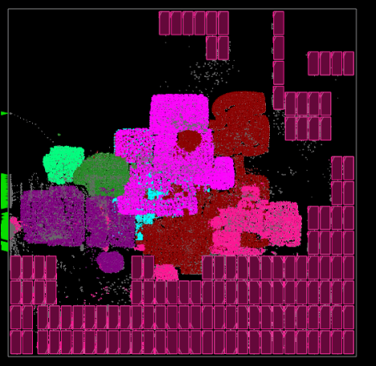

# **Synthesis, Place \& Route (SP\&R):**
Here we provide the setups to run SP&R of Ariane design with 136 macros on Nangate45 using commercial and open-source tools. First, we provide the steps for netlist preparation and then discuss the SP&R flow. Here is the content of the rest of the file:
  - [**Netlist Preparation**](#netlist-preparation)
    - [**Ariane design with 16bit memory macros**](#ariane-design-with-16bit-memory-macros)
  - [**SP\&R Flow**](#spr-flow)
    - [**Cadence tools**](#using-cadence-genus-and-innovus)
    - [**OpenROAD tools**](#using-openroad-flow-scripts)

## **Netlist Preparation:**

### **Ariane design with 16bit memory macros:**
We use the Ariane netlist available in [this](https://github.com/lowRISC/ariane) GitHub repository to synthesize the Ariane design. All the required System-Verilog (.sv) files are copied into the *./designs/ariane/rtl/* directory. For memory instantiation below steps are followed: 
1. In [sram.sv](https://github.com/lowRISC/ariane/blob/master/src/util/sram.sv) file, remove the instantiation of module *SyncSpRamBeNx64* and instantiate the 16bit sram. Here is an example of sram instantiation: 
```SystemVerilog
fakeram45_256x16 i_ram (.clk(clk_i), .rd_out(rdata_aligned[k*16 +: 16]),
                        .ce_in(req_i), .we_in(we_i), .addr_in(addr_i),
                        .wd_in(wdata_aligned[k*16 +: 16]));
```
2. As it is a 16bit memory the for loop is also required to be updated. Here is the snippet of the code before and after update:  

Code snippet before update:
```SystemVerilog
genvar k;
generate
    for (k = 0; k<(DATA_WIDTH+63)/64; k++) begin
        // unused byte-enable segments (8bits) are culled by the tool
        SyncSpRamBeNx64 #(
          .ADDR_WIDTH($clog2(NUM_WORDS)),
          .DATA_DEPTH(NUM_WORDS),
          .OUT_REGS (0),
          .SIM_INIT (2)
        ) i_ram (
           .Clk_CI    ( clk_i                     ),
           .Rst_RBI   ( rst_ni                    ),
           .CSel_SI   ( req_i                     ),
           .WrEn_SI   ( we_i                      ),
           .BEn_SI    ( be_aligned[k*8 +: 8]      ),  
           .WrData_DI ( wdata_aligned[k*64 +: 64] ),
           .Addr_DI   ( addr_i                    ),
           .RdData_DO ( rdata_aligned[k*64 +: 64] )
        );
    end 
endgenerate
```
Code snippet after update:
```SystemVerilog
genvar k;
generate
    for (k = 0; k<(DATA_WIDTH+15)/16; k++) begin :macro_mem
        fakeram45_256x16 i_ram (.clk(clk_i), .rd_out(rdata_aligned[k*16 +: 16]), 
                                .ce_in(req_i), .we_in(we_i), .addr_in(addr_i), 
                                .wd_in(wdata_aligned[k*16 +: 16]));
    end
endgenerate
```
Above code snippet initializes 16bit memory instances. To instantiate 64bit memory below code snippet can be used.
```SystemVerilog
genvar k;
generate
    for (k = 0; k<(DATA_WIDTH+63)/64; k++) begin :macro_mem
        fakeram45_256x64 i_ram (.clk(clk_i), .rd_out(rdata_aligned[k*64 +: 64]),
                                .ce_in(req_i), .we_in(we_i), .addr_in(addr_i),
                                .wd_in(wdata_aligned[k*64 +: 64]));
    end
endgenerate
```
sram.sv available in the *./designs/ariane/rtl/* directory already contains these changes. We used this .sv files for our synthesis run and the synthesized netlist contains 136 16bit memory macros. We also ran with 64bit configuration and in that scenario the synthesized netlist contains 37 64bit memory macros. As the Yosys does not support .sv files, we hack the verilog netlist available in the [ORFS](https://github.com/The-OpenROAD-Project/OpenROAD-flow-scripts/tree/master/flow/designs/src/ariane) GitHub and replace the 64bit memory macros with four or three 16bit memory macros based on the number of connected read-data pins. This hacked netlist is available in the *./designs/ariane/rtl/sv2v/* directory.

## **SP\&R Flow:**
We implement Ariane design on the Nangate45 platform using commercial tools Genus (Synthesis) and Innovus (P&R) and open-source tools Yosys (Synthesis) and OpenROAD (P&R). The required *.lef* and *.lib* files are downloaded from the OpenROAD-flow-scripts (ORFS) [GitHub](https://github.com/The-OpenROAD-Project/OpenROAD-flow-scripts/tree/master/flow/platforms/nangate45). We use the [fakeram](https://github.com/jjcherry56/bsg_fakeram) generator for the Nangate45 platform to generate the 16-bit memory. All the required *.lib* and *.lef* files are copied into the *./platforms/nangate45* directory.  
  
  
### **Using Cadence Genus and Innovus:**
All the required scripts are available for each *design* in the *./designs/<design_name>/scripts/cadence/* directory.  
**Synthesis:** run_genus.tcl contains the setup for synthesis using Genus. It reads the .sv files based on the list in *./designs/<design_name>/scripts/cadence/rtl_list.tcl* (changing the order of the file may cause errors in the run.). The timing constraints are provided in *./designs/<design_name>/scripts/constrains/<design_name>.sdc* file. To launch the synthesis run please use the below command
```
genus -overwrite -log log/genus.log -no_gui -files run_genus.tcl
```  
We also generated synthesized netlist using Synopsys Design compiler. This netlist is avaialbe in *./designs/<design_name>/netlist/* directory.  
  
**P\&R:** run_innovus.tcl contains the setup for the P&R run using Innvous. It reads the netlist provided in *./designs/<design_name>/netlist/* directory. To launch the P\&R run please use the below command.
```
innovus -64 -init run_invs.tcl -log log/run.log
```  
Innovus required a configuration file to run the macro placement flow. We use *proto_design -constraints mp_config.tcl* command to run the macro placement flow. The configuration file *mp_config.tcl* is available in the *./designs/ariane/scripts/cadence/* directory. Some details of the configuration files are given below
1. Provide the memory hierarchy name under the **SEED** section. If you do not provide the memory hierarchy here, then the macro placement rule related to that memory may be overlooked.
2. For each macro, valid orientation, and spacing rules can be provided under the **MACRO** section. For example, we set valid macro orientation as *R0* for our run, horizontal spacing as *10um*, and vertical spacing as *5um*. Also, when you provide the cell name (ref name, not instance name) add the *isCell=true* option.

Below is the screenshot of the Ariane SP\&R database with 136 memory macros using Cadence flow.  
  

### **Using OpenROAD-flow-scripts:**
Clone ORFS and build OpenROAD tools following the steps given [here](https://github.com/The-OpenROAD-Project/OpenROAD-flow-scripts). To run SP&R using OpenROAD tools follow the below mentioned steps:  
1. Copy *./designs/ariane/scripts/OpenROAD/ariane.tar.gz* directory to *{ORFS Clone Directory}/OpenROAD-flow-scripts/flow/designs/nangate45* area.
2. Use command *tar -xvf ariane.tar.gz* to untar *ariane.tar.gz*. This will generate *ariane136* directory which contains all the files required to run SP&R using ORFS.
3. To launch the SP&R job go to the flow directory and use the below command
  ```
  make DESIGN_CONFIG=./designs/nangate45/ariane136/config_hier.mk
  ```
4. config_hier.mk uses the **RTL-MP** for macro placement. To run macro placement using **Triton Macro Placer** use the below command
  ```
  make DESIGN_CONFIG=./designs/nangate45/ariane136/config.mk
  ```  
  
Below is the screenshot of the Ariane SP\&R database with 136 memory macros using ORFS flow.  
