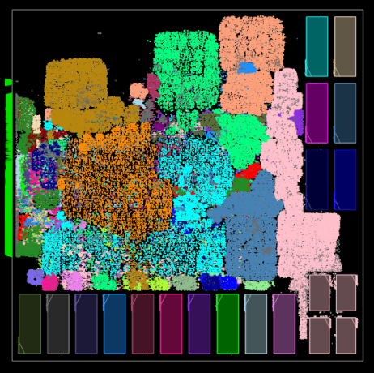

Here we provide the setup to run SP&R of MemPool_tile on Nangate45 using commercial and open-source tools. MemPool tile
is part of MemPool which is an open-source many-core system targeting image processing applications. It implements 256 RISC-V cores that can access a large, shared L1 memory in at most five cycles. It can be downloaded from https://github.com/pulp-platform/mempool

### **Using OpenROAD-flow-scripts:**
Clone ORFS and build OpenROAD tools following the steps given [here](https://github.com/The-OpenROAD-Project/OpenROAD-flow-scripts). To run SP&R using OpenROAD tools follow the below mentioned steps:  
1. Copy *./designs/mempool_tile/scripts/OpenROAD/mempool_tile.tar.gz* directory to *{ORFS Clone Directory}/OpenROAD-flow-scripts/flow/designs/nangate45* area.
2. Use command *tar -xvf mempool_tile.tar.gz* to untar *mempool_tile.tar.gz*. This will generate *mempool_tile* directory which contains all the files required to run SP&R using ORFS.
3. To launch the SP&R job go to the flow directory and use the below command
  ```
  make DESIGN_CONFIG=./designs/nangate45/mempool_tile/config.mk
  ```
Below is the screenshot of the mempool_tile SP\&R database.  

